# ESP32-P4 BLE HID 터치패드 구현 및 설계 명세서 (C++ 사양)

본 문서는 M5Stack Tab5 (ESP32-P4 메인 칩 탑재) 플랫폼에서 **NimBLE 스택**과 **ESP-Hosted SDIO 코프로세서** 모델을 사용하여 Windows Precision Touchpad (PTP) 규격의 블루투스 장치를 구현하기 위한 아키텍처 및 C++ 코드 설계 명세입니다.

---

## 1. 하드웨어 아키텍처 및 무선 연결 구조

ESP32-P4는 내부에 Wi-Fi 및 Bluetooth RF 회로를 가지고 있지 않은 고성능 애플리케이션 MCU입니다. 무선 기능을 제공하기 위해 외부 무선 칩셋(보통 ESP32-C6 또는 ESP32-S3 슬레이브 칩)과 SDIO 버스를 통해 링크를 맺는 **ESP-Hosted-MCU** 아키텍처를 채택하고 있습니다.

```mermaid
graph LR
    subgraph "M5Stack Tab5 (Main)"
        Application[사용자 애플리케이션] -->|C++ 인터페이스| BleTouchPad[BleTouchPad 클래스]
        BleTouchPad -->|NimBLE Host Stack| NimBLE[NimBLE 호스트 라이브러리]
        NimBLE -->|HCI over SDIO Driver| SDIO_Driver[SDIO 호스트 드라이버]
    end

    SDIO_Driver <===>|SDIO Bus / GPIO Reset| Coprocessor[무선 코프로세서 SLAVE 칩]

    subgraph "External Coprocessor"
        Coprocessor -->|HCI Controller| Radio[BLE RF Controller]
    end

    Radio <.->|BLE Wireless Link| HostPC[호스트 PC / Windows / macOS]
```



- **메인 프로세서 (ESP32-P4)**: NimBLE 블루투스 프로토콜 스택(L2CAP, ATT, GATT, GAP, SMP 등)을 호스트 모드로 구동하며, BLE HID 장치로서의 데이터 제어와 GUI 처리(LVGL)를 담당합니다.
- **무선 코프로세서 (Slave)**: BLE 컨트롤러 레이어를 담당하며 실제 무선 신호의 송수신을 대행합니다. 두 프로세서 간은 고속 SDIO 물리 버스를 기반으로 가동됩니다.

---

## 2. 필수 빌드 및 프로젝트 설정 (`sdkconfig` & `CMakeLists.txt`)

무선 통신 기능과 NimBLE 스택을 정상 컴파일하고 링킹하기 위해 아래 설정들이 필수적으로 프로젝트 빌드 환경에 선언되어야 합니다.

### A. `sdkconfig.defaults` 설정 명세

이 옵션들은 프로젝트 루트의 `sdkconfig.defaults` 파일에 입력되어 타겟 컴파일 빌드에 적용되어야 블루투스 스택이 활성화됩니다.

```ini
# 블루투스 컨트롤러 및 호스트 스택 활성화
CONFIG_BT_ENABLED=y
CONFIG_BT_NIMBLE_ENABLED=y

# ESP-Hosted SDIO를 통한 NimBLE 바인딩 활성화 (ESP32-P4 전용 옵션)
CONFIG_ESP_HOSTED_ENABLE_BT_NIMBLE=y
CONFIG_BT_NIMBLE_TRANSPORT_UART=n
```

### B. `main/CMakeLists.txt` 의존성 추가

NimBLE 헤더들(`#include "host/ble_hs.h"` 등)을 코드 상에서 가져와 컴파일하기 위해서는 빌드 시스템에 블루투스 공통 컴포넌트인 `bt` 컴포넌트 요구사항을 명시해야 합니다. (ESP-IDF에서는 NimBLE이 독립 컴포넌트가 아닌 `bt` 컴포넌트 내부 서브셋으로 통합되어 있습니다.)

```cmake
set(REQUIRES nvs_flash
        esp_netif
        esp_wifi_remote
        esp_wifi
        bt            # <--- 블루투스(NimBLE 포함) 컴포넌트 의존성 추가
)
```

> [!WARNING]
> 설정 파일들과 의존성 변경 사항을 적용하려면 캐시를 무효화해야 합니다. 설정을 수정한 후 터미널에서 `idf.py fullclean` 및 `idf.py reconfigure` 명령을 차례대로 구동하여 빌드 환경을 재구성하십시오.

---

## 3. BLE HID C++ 클래스 헤더 명세 (`ble_touchpad.hpp`)

GATT 서비스 데이터 전송 효율성과 유지보수성을 극대화하기 위해, 기존의 불안정한 C 스타일 원시 바이트 배열 선언을 제거하고 **모던 C++ 구조체 패킹과 명시적 상수**로 설계하였습니다.

```cpp
#pragma once

#include <cstdint>
#include "host/ble_hs.h"

/**
 * @brief BLE HID 터치패드 제어 클래스 (싱글톤)
 * NimBLE 스택의 C API 콜백을 static 멤버 함수로 래핑하여 객체지향 인터페이스를 제공합니다.
 */
class BleTouchPad {
public:
    // 싱글톤 인스턴스 반환
    static BleTouchPad& get_instance() {
        static BleTouchPad instance;
        return instance;
    }

    /**
     * @brief BLE 스택 초기화 및 HIDS GATT 서비스 등록
     * @return 성공 여부 (true/false)
     */
    bool initialize();

    /**
     * @brief BLE 브로드캐스팅(Advertising)을 시작하여 호스트 PC에 검색되도록 함
     */
    void start_advertising();

    /**
     * @brief 터치 리포트 전송 (Report ID 1)
     * @param x X 좌표 (0 ~ 720)
     * @param y Y 좌표 (0 ~ 640)
     * @param is_touched 터치 상태 여부
     * @param finger_id 멀티터치 식별용 아이디 (0 ~ 4)
     */
    void send_touch_report(uint16_t x, uint16_t y, bool is_touched, uint8_t finger_id);

    /**
     * @brief 미디어 제어 리포트 전송 (Report ID 2)
     * @param media_mask 미디어 제어 마스크값 (Play/Pause, Vol Up/Down 등)
     */
    void send_consumer_report(uint8_t media_mask);

    /**
     * @brief 키보드 입력 리포트 전송 (Report ID 3)
     * @param modifiers 모디파이어 키 (Ctrl, Shift, Alt, GUI)
     * @param key_codes 동시에 눌린 최대 6개의 키 스캔 코드 배열
     */
    void send_keyboard_report(uint8_t modifiers, uint8_t key_codes[6]);

    /**
     * @brief 현재 연결 상태 확인
     */
    bool is_connected() const { return conn_handle_ != BLE_HS_CONN_HANDLE_NONE; }

    // BLE HID 사양 상의 표준 정의 상수들
    static constexpr uint8_t HID_INFO_FLAG_REMOTE_WAKEUP        = 0x01; // 원격 깨우기 지원
    static constexpr uint8_t HID_INFO_FLAG_NORMALLY_CONNECTABLE = 0x02; // 항상 연결 대기 상태

    static constexpr uint8_t PNP_VENDOR_SOURCE_BLUETOOTH        = 0x02; // SIG 등록 벤더 구분자

    static constexpr uint8_t HID_REPORT_TYPE_INPUT              = 0x01;
    static constexpr uint8_t HID_REPORT_TYPE_OUTPUT             = 0x02;
    static constexpr uint8_t HID_REPORT_TYPE_FEATURE            = 0x03;

private:
    BleTouchPad() = default;
    ~BleTouchPad() = default;
    BleTouchPad(const BleTouchPad&) = delete;
    BleTouchPad& operator=(const BleTouchPad&) = delete;

    // NimBLE 스택 콜백 연동용 정적 래퍼 함수들
    static int gap_event_cb(struct ble_gap_event *event, void *arg);
    static int chr_access_dis_cb(uint16_t conn_handle, uint16_t attr_handle, struct ble_gatt_access_ctxt *ctxt, void *arg);
    static int chr_access_hids_cb(uint16_t conn_handle, uint16_t attr_handle, struct ble_gatt_access_ctxt *ctxt, void *arg);

    // 연결 세션 핸들 및 특성(Characteristic) 인덱스 핸들러
    uint16_t conn_handle_ = BLE_HS_CONN_HANDLE_NONE;
    uint16_t report_input_1_handle_ = 0; // Touchpad (ID 1)
    uint16_t report_input_2_handle_ = 0; // Consumer Control (ID 2)
    uint16_t report_input_3_handle_ = 0; // Keyboard (ID 3)

    // Bluetooth SIG GATT 사양서에 따른 패킹 구조체 정의 (바이너리 레이아웃 보장)
#pragma pack(push, 1)
    struct HidInformation {
        uint16_t bcdHID;       // HID 릴리즈 버전 (0x0111 = v1.11)
        uint8_t  bCountryCode; // 국가 코드 (없음 = 0x00)
        uint8_t  flags;        // HID 장치 플래그 (Remote Wakeup)
    };

    struct PnpId {
        uint8_t  vendor_id_source; // 벤더 할당처
        uint16_t vendor_id;        // 벤더 ID (VID)
        uint16_t product_id;       // 제품 ID (PID)
        uint16_t product_version;  // 제품 버전 번호
    };

    struct ReportReference {
        uint8_t report_id;         // HID Report ID
        uint8_t report_type;       // Input / Output / Feature 구분
    };
#pragma pack(pop)

    // 정적 규격 인코딩 매핑 테이블 객체들
    static const HidInformation hid_info_data_;
    static const PnpId pnp_id_data_;
    static const ReportReference report_ref_input_1_;
    static const ReportReference report_ref_input_2_;
    static const ReportReference report_ref_input_3_;
};
```

---

## 4. BLE HID C++ 클래스 소스 코드 명세 (`ble_touchpad.cpp`)

```cpp
#include "ble_touchpad.hpp"
#include "host/ble_uuid.h"
#include "services/gap/ble_svc_gap.h"
#include "services/gatt/ble_svc_gatt.h"
#include "esp_log.h"
#include "touchpad.h" // Waratah 컴파일 결과 포함 헤더 (hidReportDescriptor 선언부)
#include <cstring>

static const char* TAG = "BleTouchPad";

// 블루투스 규격에 따른 구조체 정적 초기화 (매직 넘버 제거)
const BleTouchPad::HidInformation BleTouchPad::hid_info_data_ = {
    .bcdHID = 0x0111, // HID v1.11 스펙
    .bCountryCode = 0x00,
    .flags = BleTouchPad::HID_INFO_FLAG_REMOTE_WAKEUP
};

const BleTouchPad::PnpId BleTouchPad::pnp_id_data_ = {
    .vendor_id_source = BleTouchPad::PNP_VENDOR_SOURCE_BLUETOOTH,
    .vendor_id = 0x0D0A,             // 임의 벤더 코드 (사용자 변경 가능)
    .product_id = 0x0001,            // 임의 제품 식별자
    .product_version = 0x0100        // v1.0.0 (0x0100)
};

// 각 Report ID의 인풋 용도 지정 (Report Reference Descriptor)
const BleTouchPad::ReportReference BleTouchPad::report_ref_input_1_ = { 1, BleTouchPad::HID_REPORT_TYPE_INPUT };
const BleTouchPad::ReportReference BleTouchPad::report_ref_input_2_ = { 2, BleTouchPad::HID_REPORT_TYPE_INPUT };
const BleTouchPad::ReportReference BleTouchPad::report_ref_input_3_ = { 3, BleTouchPad::HID_REPORT_TYPE_INPUT };

// NimBLE GATT 서비스 구성 테이블
static const struct ble_gatt_svc_def gatt_svr_svcs[] = {
    // 1. Device Information Service (DIS) - 기본 기기 식별 정보
    {
        .type = BLE_GATT_SVC_TYPE_PRIMARY,
        .uuid = BLE_UUID16_DECLARE(BLE_UUID_DEVICE_INFO_SERVICE),
        .characteristics = (struct ble_gatt_chr_def[]) { {
            .uuid = BLE_UUID16_DECLARE(BLE_UUID_DIS_MANUFACTURER_NAME),
            .access_cb = BleTouchPad::chr_access_dis_cb,
            .flags = BLE_GATT_CHR_F_READ,
        }, {
            .uuid = BLE_UUID16_DECLARE(BLE_UUID_DIS_PNP_ID),
            .access_cb = BleTouchPad::chr_access_dis_cb,
            .flags = BLE_GATT_CHR_F_READ,
        }, {
            0,
        } }
    },
    // 2. Human Interface Device Service (HIDS) - HID 규격 실데이터 전달 채널
    {
        .type = BLE_GATT_SVC_TYPE_PRIMARY,
        .uuid = BLE_UUID16_DECLARE(BLE_UUID_HID_SERVICE),
        .characteristics = (struct ble_gatt_chr_def[]) { {
            .uuid = BLE_UUID16_DECLARE(BLE_UUID_HID_INFO),
            .access_cb = BleTouchPad::chr_access_hids_cb,
            .flags = BLE_GATT_CHR_F_READ,
        }, {
            .uuid = BLE_UUID16_DECLARE(BLE_UUID_HID_REPORT_MAP),
            .access_cb = BleTouchPad::chr_access_hids_cb,
            .flags = BLE_GATT_CHR_F_READ,
        }, {
            .uuid = BLE_UUID16_DECLARE(BLE_UUID_HID_CTRL_POINT),
            .access_cb = BleTouchPad::chr_access_hids_cb,
            .flags = BLE_GATT_CHR_F_WRITE_NO_RSP,
        }, {
            // Input Report 1: 멀티터치 정밀 트랙패드 데이터 (Report ID 1)
            .uuid = BLE_UUID16_DECLARE(BLE_UUID_HID_REPORT),
            .access_cb = BleTouchPad::chr_access_hids_cb,
            .flags = BLE_GATT_CHR_F_READ | BLE_GATT_CHR_F_NOTIFY | BLE_GATT_CHR_F_READ_ENC,
            .val_handle = &BleTouchPad::get_instance().report_input_1_handle_,
            .descriptors = (struct ble_gatt_dsc_def[]) { {
                .uuid = BLE_UUID16_DECLARE(BLE_UUID_DSC_REPORT_REF),
                .att_flags = BLE_ATT_F_READ,
                .access_cb = BleTouchPad::chr_access_hids_cb,
            }, {
                0,
            } }
        }, {
            // Input Report 2: 볼륨 및 곡 제어 Consumer Control (Report ID 2)
            .uuid = BLE_UUID16_DECLARE(BLE_UUID_HID_REPORT),
            .access_cb = BleTouchPad::chr_access_hids_cb,
            .flags = BLE_GATT_CHR_F_READ | BLE_GATT_CHR_F_NOTIFY | BLE_GATT_CHR_F_READ_ENC,
            .val_handle = &BleTouchPad::get_instance().report_input_2_handle_,
            .descriptors = (struct ble_gatt_dsc_def[]) { {
                .uuid = BLE_UUID16_DECLARE(BLE_UUID_DSC_REPORT_REF),
                .att_flags = BLE_ATT_F_READ,
                .access_cb = BleTouchPad::chr_access_hids_cb,
            }, {
                0,
            } }
        }, {
            // Input Report 3: 계산기용 키패드 및 단축키 제어 (Report ID 3)
            .uuid = BLE_UUID16_DECLARE(BLE_UUID_HID_REPORT),
            .access_cb = BleTouchPad::chr_access_hids_cb,
            .flags = BLE_GATT_CHR_F_READ | BLE_GATT_CHR_F_NOTIFY | BLE_GATT_CHR_F_READ_ENC,
            .val_handle = &BleTouchPad::get_instance().report_input_3_handle_,
            .descriptors = (struct ble_gatt_dsc_def[]) { {
                .uuid = BLE_UUID16_DECLARE(BLE_UUID_DSC_REPORT_REF),
                .att_flags = BLE_ATT_F_READ,
                .access_cb = BleTouchPad::chr_access_hids_cb,
            }, {
                0,
            } }
        }, {
            0,
        } }
    },
    {
        0, // 서비스 레이아웃 종단자
    }
};

bool BleTouchPad::initialize() {
    ble_svc_gap_init();
    ble_svc_gatt_init();

    // GATT 서비스 카운팅 및 로드
    int rc = ble_gatts_count_cfg(gatt_svr_svcs);
    if (rc != 0) {
        ESP_LOGE(TAG, "Failed to count GATT configuration size (rc = %d)", rc);
        return false;
    }

    rc = ble_gatts_add_svcs(gatt_svr_svcs);
    if (rc != 0) {
        ESP_LOGE(TAG, "Failed to register GATT HIDS services (rc = %d)", rc);
        return false;
    }

    // 보안 및 페어링 매개변수 설정 (HOGP 규격 충족)
    ble_hs_cfg.sm_io_cap = BLE_HS_IO_NO_INPUT_NO_OUTPUT; // 입출력 불가 화면 페어링 (Just Works)
    ble_hs_cfg.sm_bonding = 1;                           // NVS 영역 페어링 키 보존 허용
    ble_hs_cfg.sm_mitm = 0;                              // 중간자공격 비활성
    ble_hs_cfg.sm_sc = 1;                                // Secure Connections 보안 표준

    return true;
}

void BleTouchPad::start_advertising() {
    struct ble_gap_adv_params adv_params = {};
    adv_params.conn_mode = BLE_GAP_CONN_MODE_UND;
    adv_params.disc_mode = BLE_GAP_DISC_MODE_GEN;

    struct ble_hs_adv_fields fields = {};
    fields.flags = BLE_HS_ADV_F_DISC_GEN | BLE_HS_ADV_F_BREDR_UNSP;

    // 블루투스 기기 외형(Appearance): Pointing Device (Mouse - 0x03C2)
    fields.appearance = 0x03C2;
    fields.appearance_is_present = 1;

    fields.name = (uint8_t *)"M5Stack Touchpad";
    fields.name_len = 17;
    fields.name_is_complete = 1;

    ble_gap_adv_set_fields(&fields);
    ble_gap_adv_start(BLE_OWN_ADDR_PUBLIC, NULL, BLE_HS_FOREVER, &adv_params, BleTouchPad::gap_event_cb, NULL);
    ESP_LOGI(TAG, "BLE Advertising 브로드캐스트가 시작되었습니다.");
}

// 터치 리포트 전송 (Report ID 1)
void BleTouchPad::send_touch_report(uint16_t x, uint16_t y, bool is_touched, uint8_t finger_id) {
    if (conn_handle_ == BLE_HS_CONN_HANDLE_NONE) {
        return;
    }

    HidReportInput1 report;
    std::memset(report.Payload, 0, sizeof(report.Payload));

    // payload[0]: [Tip Switch (Bit 0)] | [Touch Valid (Bit 1)] | [Contact ID (Bit 2-5)]
    uint8_t tip_switch = is_touched ? 1 : 0;
    uint8_t touch_valid = is_touched ? 1 : 0;
    report.Payload[0] = (tip_switch & 0x01) | ((touch_valid & 0x01) << 1) | ((finger_id & 0x0F) << 2);

    // payload[1]: Contact Count (현재 터치된 총 개수)
    report.Payload[1] = is_touched ? 1 : 0;

    // payload[2~3]: X 좌표 인코딩 (최대값 720 정렬)
    report.Payload[2] = x & 0xFF;
    report.Payload[3] = (x >> 8) & 0x03;

    // payload[4~5]: Y 좌표 인코딩 (최대값 640 정렬)
    report.Payload[4] = y & 0xFF;
    report.Payload[5] = (y >> 8) & 0x03;

    // Report Packet 생성: [Report ID] [19-byte Payload]
    uint8_t packet[20];
    packet[0] = report.ReportId;
    std::memcpy(&packet[1], report.Payload, sizeof(report.Payload));

    struct os_mbuf *om = ble_hs_mbuf_from_flat(packet, sizeof(packet));
    if (om != nullptr) {
        ble_gatts_notify_custom(conn_handle_, report_input_1_handle_, om);
    }
}

// 미디어 제어 리포트 전송 (Report ID 2)
void BleTouchPad::send_consumer_report(uint8_t media_mask) {
    if (conn_handle_ == BLE_HS_CONN_HANDLE_NONE) return;

    uint8_t packet[2] = { HID_REPORT_INPUT2_ID, media_mask };
    struct os_mbuf *om = ble_hs_mbuf_from_flat(packet, sizeof(packet));
    if (om != nullptr) {
        ble_gatts_notify_custom(conn_handle_, report_input_2_handle_, om);
    }
}

// C-style Callback 위임 처리
int BleTouchPad::gap_event_cb(struct ble_gap_event *event, void *arg) {
    auto& self = BleTouchPad::get_instance();
    switch (event->type) {
        case BLE_GAP_EVENT_CONNECT:
            if (event->connect.status == 0) {
                self.conn_handle_ = event->connect.conn_handle;
                // 연결 완료 시점 보안 계층 구동 (Windows 연결 드롭 방지)
                ble_gap_security_initiate(self.conn_handle_);
                ESP_LOGI(TAG, "호스트 PC 연결 성공. 보안 암호화를 초기화합니다.");
            } else {
                self.start_advertising();
            }
            break;

        case BLE_GAP_EVENT_DISCONNECT:
            self.conn_handle_ = BLE_HS_CONN_HANDLE_NONE;
            ESP_LOGW(TAG, "호스트 PC와의 연결이 종료되었습니다. 다시 검색 모드로 진입합니다.");
            self.start_advertising();
            break;

        case BLE_GAP_EVENT_ENC_CHANGE:
            if (event->enc_change.status == 0) {
                ESP_LOGI(TAG, "보안 보안 채널 수립 완료. BLE HID 기능 활성화.");
            }
            break;

        case BLE_GAP_EVENT_REPEAT_PAIRING:
            // 이전 페어링 기록 정보 불일치 예외 처리 (NVS 무효 키 청소)
            struct ble_gap_conn_desc desc;
            ble_gap_conn_find(event->repeat_pairing.conn_handle, &desc);
            ble_store_util_delete_peer(&desc.peer_id_addr);
            return BLE_GAP_REPEAT_PAIRING_RETRY;
    }
    return 0;
}

int BleTouchPad::chr_access_dis_cb(uint16_t conn_handle, uint16_t attr_handle,
                                   struct ble_gatt_access_ctxt *ctxt, void *arg) {
    uint16_t uuid16 = ble_uuid_u16(ctxt->chr->uuid);
    if (uuid16 == BLE_UUID_DIS_MANUFACTURER_NAME) {
        return os_mbuf_append(ctxt->om, "Espressif", 9);
    } else if (uuid16 == BLE_UUID_DIS_PNP_ID) {
        return os_mbuf_append(ctxt->om, &pnp_id_data_, sizeof(pnp_id_data_));
    }
    return BLE_ATT_ERR_UNSUPPORTED_REQ;
}

int BleTouchPad::chr_access_hids_cb(uint16_t conn_handle, uint16_t attr_handle,
                                    struct ble_gatt_access_ctxt *ctxt, void *arg) {
    uint16_t uuid16 = ble_uuid_u16(ctxt->chr->uuid);
    auto& self = BleTouchPad::get_instance();

    // Descriptor 읽기 요청에 매칭되는 참조 리포트 데이터 반환
    if (ctxt->op == BLE_GATT_ACCESS_OP_READ_DSC) {
        uint16_t dsc_uuid = ble_uuid_u16(ctxt->dsc->uuid);
        if (dsc_uuid == BLE_UUID_DSC_REPORT_REF) {
            if (attr_handle == self.report_input_1_handle_ + 1) {
                return os_mbuf_append(ctxt->om, &report_ref_input_1_, sizeof(report_ref_input_1_));
            } else if (attr_handle == self.report_input_2_handle_ + 1) {
                return os_mbuf_append(ctxt->om, &report_ref_input_2_, sizeof(report_ref_input_2_));
            } else if (attr_handle == self.report_input_3_handle_ + 1) {
                return os_mbuf_append(ctxt->om, &report_ref_input_3_, sizeof(report_ref_input_3_));
            }
        }
    }

    if (uuid16 == BLE_UUID_HID_REPORT_MAP) {
        return os_mbuf_append(ctxt->om, hidReportDescriptor, sizeof(hidReportDescriptor));
    } else if (uuid16 == BLE_UUID_HID_INFO) {
        return os_mbuf_append(ctxt->om, &hid_info_data_, sizeof(hid_info_data_));
    } else if (uuid16 == BLE_UUID_HID_REPORT) {
        uint8_t zero_payload[19] = {0};
        return os_mbuf_append(ctxt->om, zero_payload, sizeof(zero_payload));
    }
    return 0;
}
```

---

## 5. 핵심 설계 패턴 및 작동 원리 분석

### 1) 구조체 패킹 (`#pragma pack`)

바이트 얼라인먼트(Padding)로 인해 C++ 컴파일러가 임의로 구조체 멤버 사이에 채우는 더미 메모리를 차단하기 위해 `#pragma pack(push, 1)` 옵션을 부여했습니다.
이를 통해 구조체 멤버 변수의 크기가 그대로 데이터 바이트 버퍼 크기(`PnpId` = 7바이트, `ReportReference` = 2바이트 등)로 매칭되어 블루투스 사양서 규격을 완벽하게 따르게 됩니다.

### 2) C++ 정적 함수를 이용한 콜백 델리게이트 패턴

NimBLE의 GATT 정의 테이블과 이벤트 감지기는 순수 C언어 포인터를 필요로 합니다.
클래스 내 `static int gap_event_cb`와 같은 정적 멤버 함수를 작성하여 포인터 자격을 획득하고, 내부에서는 객체 지향적으로 안전하게 접근할 수 있도록 싱글톤 `BleTouchPad::get_instance()`와 바인딩하여 복잡한 시스템 이벤트 분기 처리를 클래스 내부에서 수행하게 합니다.

### 3) PC 운영체제 암호화(Pairing & Security) 규격 수렴

일반적인 마우스 기기와 달리, Windows Precision Touchpad 디스크립터를 수용하려면 강화된 SMP 보안 레벨이 요구됩니다.
이를 위해 `sm_sc = 1`을 통해 BLE Secure Connection으로 본딩 정보를 암호화 저장하며, 기기가 페어링 유실 혹은 중복 요청 상태일 때 안전하게 피어의 정보를 지우고 재기록하기 위한 `BLE_GAP_REPEAT_PAIRING_RETRY` 처리가 동적 이벤트 콜백에 내장되어 오동작을 예방합니다.

---

## 6. 좌표계 논리 매핑 연동 가이드

기기의 전체 스크린 크기는 가로 720px, 세로 1280px입니다.
그중 상단은 미디어 컨트롤러나 Spotify 화면 등으로 할당되며, 하단 영역이 터치패드로 활용됩니다.

- **UI 레이아웃 좌표**:
  - 화면 폭 (`SCREEN_W`): **720 px**
  - 터치패드 시작 높이 (`SPLIT_Y`): **640 px**
  - 터치패드 영역 세로 크기 (`Touchpad::HEIGHT`): **640 px**
- **Waratah HID 디스크립터 상의 입력 한계 영역 (Logical Bounds)**:
  - X축 최대 한계치 (`LogicalMaximum(720)`): **720**
  - Y축 최대 한계치 (`LogicalMaximum(640)`): **640**

이처럼 UI 영역 픽셀의 레이아웃 해상도가 **1:1 비율**로 완벽하게 매칭되도록 디스크립터 및 상수가 일치 설계되어 있습니다. 터치 스크린 드라이버로부터 획득한 터치 좌표의 오프셋 보정 처리는 다음과 같이 처리하여 전송합니다.

```cpp
void handle_screen_touch(uint16_t touch_x, uint16_t touch_y, bool touched, uint8_t id) {
    if (touch_y >= Display::UI::Global::SPLIT_Y) {
        // Y좌표를 터치패드 영역(하단 640px) 안으로 정규화
        uint16_t local_y = touch_y - Display::UI::Global::SPLIT_Y;

        // 정밀 터치패드 리포트 전송
        BleTouchPad::get_instance().send_touch_report(touch_x, local_y, touched, id);
    }
}
```

위 코드를 기반으로 기존 터치 이벤트 드라이버에서 획득된 물리 정보가 그대로 PC에 윈도우 프리시전 트랙패드 신호로 인코딩되어 무선 스트리밍됩니다.
