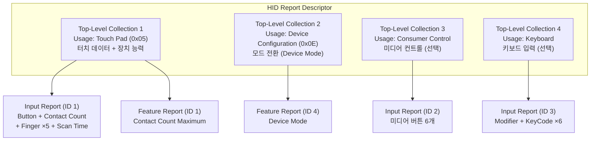
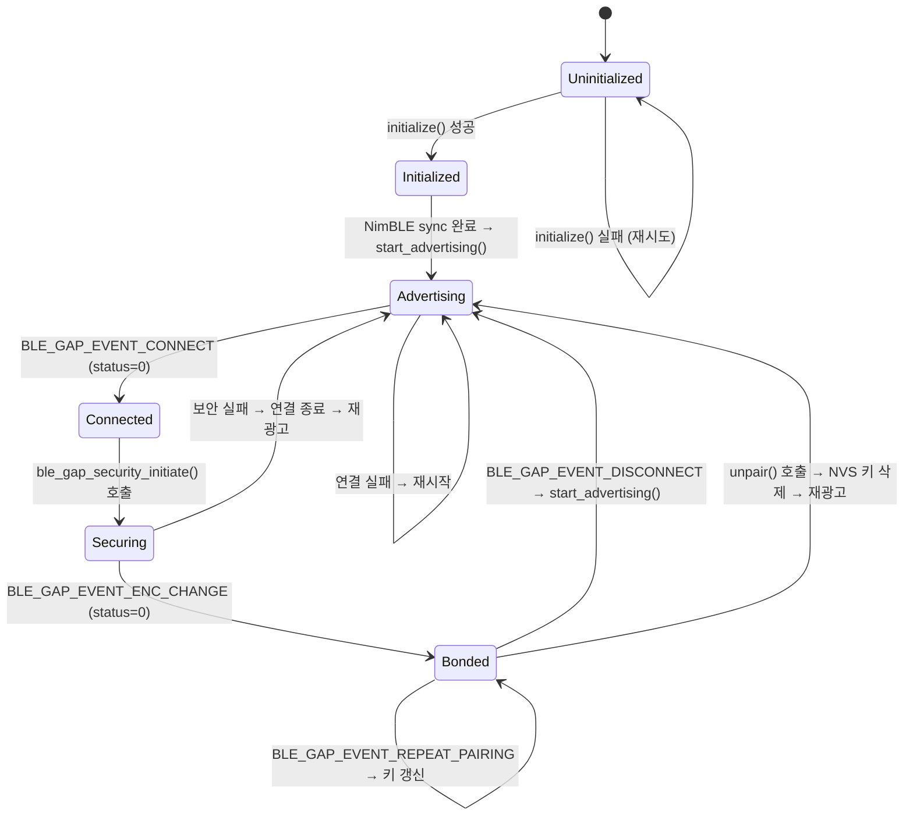
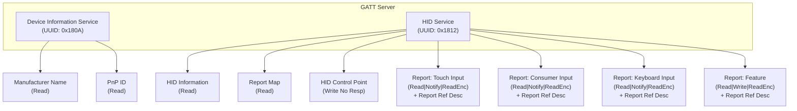
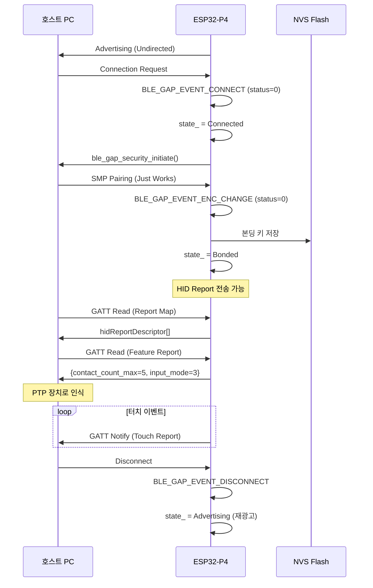
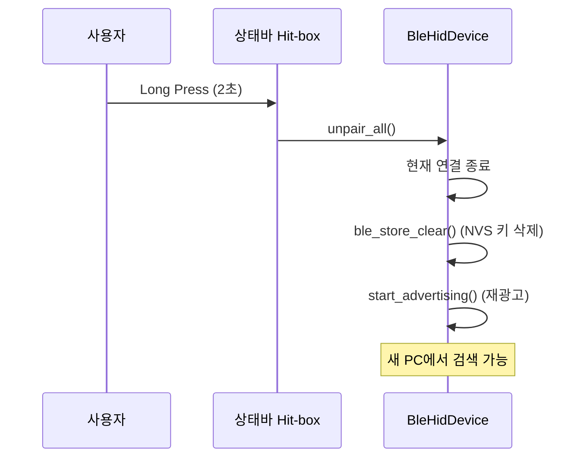

# ESP32-P4 BLE HID Precision Touchpad 구현 및 설계 명세서 v2

본 문서는 M5Stack Tab5 (ESP32-P4) 플랫폼에서 **NimBLE 스택**과 **ESP-Hosted SDIO 코프로세서**를 사용하여 **Windows Precision Touchpad (PTP)** 규격의 BLE HID 장치를 구현하기 위한 완전한 설계 명세서입니다.

이 문서는 다음을 목표로 합니다:

- **왜** 그렇게 설계하는지 (BLE/HID/PTP 스펙 근거)
- **어떻게** 동작하는지 (상태 전이, 데이터 흐름)
- **무엇을** 구현하는지 (파일 구조, 클래스, 함수, 자료형)

문서를 순서대로 따라가면 처음부터 끝까지 구현할 수 있도록 구성하였습니다.

---

## 목차

1. [하드웨어 아키텍처](#1-하드웨어-아키텍처)
2. [Windows Precision Touchpad (PTP) 스펙 요구사항](#2-windows-precision-touchpad-ptp-스펙-요구사항)
3. [Waratah HID Descriptor 설계](#3-waratah-hid-descriptor-설계)
4. [Report ID 1 비트 레이아웃 정밀 분석](#4-report-id-1-비트-레이아웃-정밀-분석)
5. [빌드 환경 설정](#5-빌드-환경-설정)
6. [BLE 장치 상태 머신](#6-ble-장치-상태-머신)
7. [파일 구조 및 모듈 설계](#7-파일-구조-및-모듈-설계)
8. [자료형 및 상수 설계](#8-자료형-및-상수-설계)
9. [BitWriter 유틸리티](#9-bitwriter-유틸리티)
10. [GATT 서비스 테이블 설계](#10-gatt-서비스-테이블-설계)
11. [BLE 라이프사이클 구현](#11-ble-라이프사이클-구현)
12. [GAP 이벤트 처리](#12-gap-이벤트-처리)
13. [GATT 콜백 구현](#13-gatt-콜백-구현)
14. [HID Report 인코딩 및 전송](#14-hid-report-인코딩-및-전송)
15. [터치 데이터 파이프라인](#15-터치-데이터-파이프라인)
16. [언페어링 및 재접속](#16-언페어링-및-재접속)
17. [기존 코드와의 통합](#17-기존-코드와의-통합)
18. [검증 및 디버깅 가이드](#18-검증-및-디버깅-가이드)
19. [크로스 플랫폼 호환성 분석](#19-크로스-플랫폼-호환성-분석)
20. [전력 소비 분석 (M5Stack Tab5 특화)](#20-전력-소비-분석-m5stack-tab5-특화)
21. [구현 현황 분석 및 알려진 문제점](#21-구현-현황-분석-및-알려진-문제점)

- [부록 A: NimBLE UUID 및 Report Type 상수 참조](#부록-a-nimble-uuid-및-report-type-상수-참조)
- [부록 B: Consumer Control 비트 매핑](#부록-b-consumer-control-비트-매핑)
- [부록 C: Device Mode 값 정의 상세](#부록-c-device-mode-값-정의-상세)

---

## 1. 하드웨어 아키텍처

### 1.1 ESP32-P4 + 코프로세서 구조

ESP32-P4는 Wi-Fi/Bluetooth RF 회로가 **내장되지 않은** 고성능 애플리케이션 MCU입니다. 무선 통신을 위해 외부 코프로세서(ESP32-C6)와 SDIO 버스로 연결하는 **ESP-Hosted-MCU** 아키텍처를 사용합니다.

```mermaid
graph LR
    subgraph "M5Stack Tab5 (ESP32-P4 Main)"
        TouchIC["터치 IC<br/>(GT911/ST7123)"] -->|I2C| App["사용자 애플리케이션"]
        App -->|"C++ API"| BLE["BleHidDevice 클래스"]
        BLE -->|"NimBLE Host API"| NimBLE["NimBLE Host Stack<br/>(GAP, GATT, SMP, L2CAP)"]
        NimBLE -->|"HCI Commands"| SDIO["SDIO Host Driver"]
    end

    SDIO <====>|"SDIO Bus<br/>GPIO Reset"| CoPro["무선 코프로세서<br/>(ESP32-C6 Slave)"]

    subgraph "Coprocessor"
        CoPro -->|"HCI Controller"| Radio["BLE RF<br/>Controller"]
    end

    Radio <-.->|"BLE Wireless Link"| PC["호스트 PC<br/>Windows / macOS"]
```



**역할 분담:**

| 구성요소           | 역할                                                              |
| :----------------- | :---------------------------------------------------------------- |
| ESP32-P4 (Main)    | NimBLE 호스트 스택 구동, GATT/GAP 제어, HID Report 생성, LVGL GUI |
| 코프로세서 (Slave) | BLE Controller Layer, RF 송수신, HCI 명령 처리                    |
| SDIO Bus           | 두 프로세서 간 고속 HCI 통신 채널                                 |

### 1.2 터치 컨트롤러

M5Stack Tab5는 제조 배치에 따라 **GT911** 또는 **ST7123** 터치 IC가 혼용됩니다 (I2C Auto-probe 작동).

**터치 IC 공통 사양:**

| 항목           | 값                                                          |
| :------------- | :---------------------------------------------------------- |
| 최대 동시 터치 | 5점                                                         |
| 좌표 범위      | X: 0~720, Y: 0~1280 (전체 화면)                             |
| 물리적 버튼    | **없음** (정전식 capacitive)                                |
| 데이터 구조    | `esp_lcd_touch_point_data_t` → `{track_id, x, y, strength}` |
| 인터페이스     | `esp_lcd_touch_get_data()` (ESP-IDF 추상화 API)             |

> **중요:** 특정 칩셋의 레지스터를 직접 조작하면 다른 칩셋 탑재 기기에서 충돌합니다. 반드시 ESP-IDF의 추상화된 `esp_lcd_touch_handle_t` API만 사용합니다.

### 1.3 터치패드 영역 매핑

화면(720×1280)의 하반부(720×640)를 터치패드로 사용합니다:

```
┌──────────────────────────────────┐ Y=0
│                                  │
│    상단 UI 영역 (720 × 640)      │
│    Mode 1: 미디어 컨트롤         │
│    Mode 2: Spotify 플레이어      │
│                                  │
├──────────────────────────────────┤ Y=640 (SPLIT_Y)
│                                  │
│    터치패드 영역 (720 × 640)     │
│    → BLE PTP Report 전송         │
│    HID X: 0~720                  │
│    HID Y: 0~640                  │
│                                  │
└──────────────────────────────────┘ Y=1280
```

**좌표 변환:**

```
HID_X = Raw_X                          (그대로)
HID_Y = Raw_Y - SPLIT_Y(640)           (오프셋 보정)
```

**물리 치수** (Waratah PhysicalValueRange):

- X축: 62mm (physicalMax = 620, 단위 0.1mm)
- Y축: 55mm (physicalMax = 550, 단위 0.1mm)

---

## 2. Windows Precision Touchpad (PTP) 스펙 요구사항

Windows가 장치를 Precision Touchpad로 인식하려면 다음 조건을 **모두** 충족해야 합니다. 하나라도 빠지면 마우스 모드로 폴백되거나 장치를 거부합니다.

### 2.1 필수 Top-Level Collection 구조

> **핵심:** Microsoft PTP 규격은 **2개의 필수 Top-Level Application Collection**을 요구합니다. 이 구조가 올바르지 않으면 Windows PTP 드라이버가 장치를 인식하지 못합니다.



**왜 분리해야 하는가?**

- HID Usage Tables 1.6 섹션 16.7에서 `Device Configuration` (Usage 0x0E)은 **CA (Application Collection) 타입**으로 정의됩니다. 즉, 자체적으로 Top-Level Collection이 되어야 합니다.
- Microsoft PTP 문서: _"A Windows Precision Touchpad should provide a top-level collection that makes the device appear as a digitizer with configuration options (Page 0x0D, Usage 0x0E)"_
- `Device Mode`를 Touch Pad collection(0x05) 안에 넣으면, Windows PTP 드라이버가 Configuration Collection을 찾지 못해 **Mouse 모드로 폴백**됩니다.

### 2.2 필수 Report 구조

**Touch Pad Collection (0x05)의 Report:**

| Report                  | ID  | 용도                             | 필수 여부 |
| :---------------------- | :-- | :------------------------------- | :-------- |
| Input Report (Touch)    | 1   | 멀티터치 좌표 데이터 + Scan Time | **필수**  |
| Feature Report (Config) | 1   | Contact Count Maximum            | **필수**  |

**Device Configuration Collection (0x0E)의 Report:**

| Report                | ID  | 용도                         | 필수 여부 |
| :-------------------- | :-- | :--------------------------- | :-------- |
| Feature Report (Mode) | 4   | Device Mode (입력 모드 전환) | **필수**  |

### 2.3 필수 Usage 목록

**Input Report에 반드시 포함되어야 하는 Usage:**

| Usage                                | 설명                               | 왜 필요한가?                       |
| :----------------------------------- | :--------------------------------- | :--------------------------------- |
| Touch Pad (0x0005)                   | Application Collection의 Usage     | Windows가 장치를 터치패드로 분류   |
| Button 1                             | ClickPad 물리 버튼 (없으면 항상 0) | PTP 인증 필수 필드                 |
| Contact Count (0x0054)               | 현재 활성 finger 수                | OS가 멀티터치 프레임 동기화에 사용 |
| Finger (0x0022) + Logical Collection | 각 finger의 데이터 그룹            | 멀티터치 데이터 구조               |
| Tip Switch (0x0042)                  | finger가 표면에 닿아 있는지        | 터치 시작/끝 판별                  |
| Touch Valid (0x0047)                 | 이 finger 데이터가 유효한지        | 잘못된 좌표 필터링                 |
| Contact Identifier (0x0051)          | finger 추적 ID                     | 동일 finger 연속 추적              |
| X (0x0030) / Y (0x0031)              | 좌표                               | 커서 위치                          |
| Scan Time (0x0056)                   | 100µs 단위 타임스탬프              | 속도 기반 제스처 (스와이프, 핀치)  |

**Touch Pad Feature Report (ID 1)에 포함되어야 하는 Usage:**

| Usage                          | 설명                  | 왜 필요한가?                      |
| :----------------------------- | :-------------------- | :-------------------------------- |
| Contact Count Maximum (0x0055) | 최대 지원 터치 수 (5) | Windows가 멀티터치 지원 수준 판단 |

**Device Configuration Feature Report (ID 4)에 포함되어야 하는 Usage:**

| Usage                | 설명                            | 왜 필요한가?                         |
| :------------------- | :------------------------------ | :----------------------------------- |
| Device Mode (0x0052) | 입력 모드 (0=Mouse, 3=Touchpad) | **이 값이 없으면 Mouse 모드로 동작** |

> **용어 참고:** HID Usage Tables 1.6 스펙에서 Usage 0x52의 공식 이름은 `Device Mode`입니다. Microsoft PTP 문서에서는 이 기능을 `Input Mode`라 부르지만, HID Descriptor(WARA)에서는 반드시 `Device Mode`를 사용해야 합니다.

> **Device Mode 값 정의:** HID Usage Tables 1.6에서는 0=Mouse, 1=Single Input, 2=Multi-Input 세 값만 정의합니다. **값 3 (Touchpad)은 Microsoft가 PTP 규격에서 독자 확장한 값**입니다. `logicalValueRange = [0, 3]`은 이 확장 값을 수용하기 위함입니다. 자세한 비교는 [부록 C](#부록-c-device-mode-값-정의-상세)를 참조하십시오.

> **핵심:** `Device Mode`가 누락되거나 잘못된 Collection에 배치되면 Windows는 장치를 마우스로 취급합니다. 터치패드 설정 패널에 나타나지 않고, PTP 제스처(3-finger swipe, pinch-to-zoom 등)가 전혀 작동하지 않습니다.

### 2.4 GATT 서비스 요구사항

BLE HID over GATT Protocol (HOGP) 규격:

| GATT Service                   | UUID   | 필수 여부   |
| :----------------------------- | :----- | :---------- |
| Human Interface Device Service | 0x1812 | **필수**    |
| Device Information Service     | 0x180A | **필수**    |
| Battery Service                | 0x180F | 권장 (선택) |

| HIDS Characteristic           | 필수 여부 | 설명                                    |
| :---------------------------- | :-------- | :-------------------------------------- |
| HID Information               | 필수      | HID 버전, 국가 코드, 플래그             |
| Report Map                    | 필수      | HID Report Descriptor 전체 바이트       |
| HID Control Point             | 필수      | Suspend/Exit Suspend 제어               |
| Report (Input)                | 필수      | Input Report 전송 채널 (Notify)         |
| Report (Feature) — Touch      | 필수      | Contact Count Maximum 읽기 채널         |
| Report (Feature) — Config     | 필수      | Device Mode 읽기/쓰기 채널              |
| Report Reference (Descriptor) | 필수      | 각 Report Characteristic의 ID/Type 매핑 |

### 2.5 보안 요구사항

| 항목               | 설정                                         |
| :----------------- | :------------------------------------------- |
| I/O Capability     | NoInputNoOutput (Just Works)                 |
| Bonding            | 활성화 (NVS에 키 저장)                       |
| MITM Protection    | 비활성화                                     |
| Secure Connections | 활성화 (LE Secure Connections)               |
| Encryption         | 필수 (Input Report 읽기에 `READ_ENC` 플래그) |

---

## 3. Waratah HID Descriptor 설계

### 3.1 기존 `touchpad.wara`의 문제점과 수정

기존 파일에서 **문제가 있었던 항목**:

1. **`Device Mode`가 Touch Pad collection 안에 배치됨** — Microsoft PTP는 `Device Configuration` (Usage 0x0E)이라는 별도의 Top-Level Collection에 Device Mode를 배치하도록 요구합니다. Touch Pad collection(0x05) 안에 넣으면 Windows가 Configuration Collection을 찾지 못합니다.
2. **`Device Mode` Feature Report** — Windows PTP 필수. 이것 없이는 마우스 모드로 동작
3. **Feature Report `id` 명시** — 의도를 명확히 하기 위해 명시적 선언 권장

### 3.2 수정된 `touchpad.wara` (완전판)

변경 부분에 `# ★` 주석을 표기합니다. 핵심 변경: **Device Configuration을 4번째 Top-Level Collection으로 분리** (Report ID 4).

```toml
[[settings]]
generateCpp = true

# ==============================================================================
# 1. Windows Precision Touch Pad (PTP) - 5-Point Digitizer
# ==============================================================================
[[applicationCollection]]
usage = ['Digitizers', 'Touch Pad']

    # --------------------------------------------------------------------------
    # INPUT REPORT (터치 데이터 — ESP32 → PC 방향)
    # --------------------------------------------------------------------------
    [[applicationCollection.inputReport]]
        id = 1

        # 1. Button Status (PTP 인증 필수, capacitive이므로 항상 0 전송)
        [[applicationCollection.inputReport.variableItem]]
        usage = ['Button', 'Button 1']
        logicalValueRange = [0, 1]

        # 2. Contact Count (현재 활성 터치 수)
        [[applicationCollection.inputReport.variableItem]]
        usage = ['Digitizers', 'Contact Count']
        logicalValueRange = [0, 5]

        # 3. Finger 1
        [[applicationCollection.inputReport.logicalCollection]]
        usage = ['Digitizers', 'Finger']
            [[applicationCollection.inputReport.logicalCollection.variableItem]]
            usage = ['Digitizers', 'Tip Switch']
            logicalValueRange = [0, 1]
            [[applicationCollection.inputReport.logicalCollection.variableItem]]
            usage = ['Digitizers', 'Touch Valid']
            logicalValueRange = [0, 1]
            [[applicationCollection.inputReport.logicalCollection.variableItem]]
            usage = ['Digitizers', 'Contact Identifier']
            logicalValueRange = [0, 15]
            [[applicationCollection.inputReport.logicalCollection.variableItem]]
            usage = ['Generic Desktop', 'X']
            logicalValueRange = [0, 720]
            physicalValueRange = [0, 620]
            [[applicationCollection.inputReport.logicalCollection.variableItem]]
            usage = ['Generic Desktop', 'Y']
            logicalValueRange = [0, 640]
            physicalValueRange = [0, 550]

        # 4~7. Finger 2~5 (구조 동일, 반복 — 지면 절약을 위해 생략)
        # 실제 touchpad.wara 파일에는 Finger 2~5가 모두 포함되어 있습니다.
        # 각 Finger는 Finger 1과 동일한 구조입니다.

        # 8. Scan Time (속도 기반 제스처에 필수)
        [[applicationCollection.inputReport.variableItem]]
        usage = ['Digitizers', 'Scan Time']
        logicalValueRange = [0, 65535]

    # --------------------------------------------------------------------------
    # FEATURE REPORT (Touch Pad 장치 능력 — Windows가 연결 직후 읽음)
    # --------------------------------------------------------------------------
    [[applicationCollection.featureReport]]
        id = 1                                      # Touch Pad Feature Report

        # 최대 동시 터치 수
        [[applicationCollection.featureReport.variableItem]]
        usage = ['Digitizers', 'Contact Count Maximum']
        logicalValueRange = [0, 5]

# ==============================================================================
# ★ Device Configuration Collection (Report ID 4) — 별도 Top-Level Collection
# ==============================================================================
# Microsoft PTP 규격은 Device Mode를 별도의 Top-Level Collection에 배치하도록
# 요구합니다. HID Usage Tables 1.6 섹션 16.7의 Device Configuration(0x0E)은
# CA (Application Collection) 타입이며, Device Mode(0x52)를 포함합니다.
#
# 이 collection이 없으면 Windows PTP 드라이버가 Configuration Collection을
# 찾지 못해 장치를 Precision Touchpad로 인식하지 않습니다.
#
# Device Mode 값 정의:
#   HID 스펙 (Usage Tables 1.6):  0=Mouse, 1=Single Input, 2=Multi-Input
#   Microsoft PTP 확장:           3=Windows Precision Touchpad
#   → logicalValueRange = [0, 3]은 MS PTP 확장 값을 포함하기 위함
[[applicationCollection]]
usage = ['Digitizers', 'Device Configuration']

    [[applicationCollection.featureReport]]
        id = 4                                      # Configuration Feature Report

        [[applicationCollection.featureReport.variableItem]]
        usage = ['Digitizers', 'Device Mode']
        logicalValueRange = [0, 3]

# ==============================================================================
# 2. Multimedia Control Collection (Report ID 2)
# ==============================================================================
[[applicationCollection]]
usage = ['Consumer', 'Consumer Control']

    [[applicationCollection.inputReport]]
        id = 2
        [[applicationCollection.inputReport.variableItem]]
        usage = ['Consumer', 'Play/Pause']
        logicalValueRange = [0, 1]
        [[applicationCollection.inputReport.variableItem]]
        usage = ['Consumer', 'Scan Next Track']
        logicalValueRange = [0, 1]
        [[applicationCollection.inputReport.variableItem]]
        usage = ['Consumer', 'Scan Previous Track']
        logicalValueRange = [0, 1]
        [[applicationCollection.inputReport.variableItem]]
        usage = ['Consumer', 'Volume Increment']
        logicalValueRange = [0, 1]
        [[applicationCollection.inputReport.variableItem]]
        usage = ['Consumer', 'Volume Decrement']
        logicalValueRange = [0, 1]
        [[applicationCollection.inputReport.variableItem]]
        usage = ['Consumer', 'Mute']
        logicalValueRange = [0, 1]

# ==============================================================================
# 3. Standard Keyboard Collection (Report ID 3)
# ==============================================================================
[[applicationCollection]]
usage = ['Generic Desktop', 'Keyboard']

    [[applicationCollection.inputReport]]
        id = 3
        [[applicationCollection.inputReport.variableItem]]
        usageRange = ['Keyboard/Keypad', 'Keyboard LeftControl', 'Keyboard Right GUI']
        logicalValueRange = [0, 1]
        [[applicationCollection.inputReport.arrayItem]]
        usageRange = ['Keyboard/Keypad', 'ErrorRollOver', 'Keyboard Application']
        count = 6
```

### 3.3 Waratah 컴파일 방법

수정된 `.wara` 파일로 `touchpad.h`를 재생성합니다:

```bash
# Windows에서 (Waratah 도구)
WaratahCmd.exe touchpad.wara -o main/touchpad.h

# 또는 .NET 글로벌 도구로 설치된 경우
waratah touchpad.wara -o main/touchpad.h
```

재생성 후 `touchpad.h`의 Report 크기 요약 테이블을 확인합니다:

```
// 예상되는 결과:
// +----------+---------+-------------------+------------------------------------+
// | ReportId | Kind    | ReportSizeInBytes | 설명                                |
// +----------+---------+-------------------+------------------------------------+
// |        1 | Input   |                19 | 터치 데이터 (5-finger + Scan Time) |
// +----------+---------+-------------------+------------------------------------+
// |        1 | Feature |                 1 | Contact Count Maximum (3비트+패딩) |
// +----------+---------+-------------------+------------------------------------+
// |        2 | Input   |                 1 | 미디어 컨트롤 (6비트+패딩)        |
// +----------+---------+-------------------+------------------------------------+
// |        3 | Input   |                 7 | 키보드 (Modifier 1B + Keys 6B)    |
// +----------+---------+-------------------+------------------------------------+
// |        4 | Feature |                 1 | Device Mode (2비트+패딩)          |
// +----------+---------+-------------------+------------------------------------+
```

> **주의:** Report ID 1의 Feature Report (Contact Count Maximum)와 Report ID 4의 Feature Report (Device Mode)는 **서로 다른 GATT Characteristic**으로 등록해야 합니다. 각각 다른 Report Reference Descriptor를 가집니다.

---

## 4. Report ID 1 비트 레이아웃 정밀 분석

### 4.1 왜 비트 레이아웃 분석이 필요한가?

HID Report Descriptor는 각 필드를 **비트 단위**로 정의합니다. X좌표가 10비트, Contact ID가 4비트처럼, 필드들이 바이트 경계를 걸쳐서 패킹됩니다. 따라서 `payload[0] = x & 0xFF` 같은 바이트 단위 접근은 **틀립니다**.

### 4.2 HID 파서의 글로벌 상태 추적

HID 파서는 **상태 머신**입니다. `ReportCount`, `ReportSize`, `LogicalMaximum` 등의 글로벌 아이템은 새로 선언될 때까지 이전 값이 유지됩니다. 이 규칙을 이해해야 비트 레이아웃을 올바로 추적할 수 있습니다.

Report ID 1의 디스크립터를 순서대로 추적합니다:

```
ReportId(1)

Button 1:       ReportCount=1, ReportSize=1   →  1 bit
Contact Count:   ReportCount=1, ReportSize=3   →  3 bits
  (주의: ReportCount는 이전 값 1이 유지됨)

─── Finger 1 Logical Collection ───
Tip Switch:     ReportCount=2, ReportSize=1    →  1 bit  ┐
Touch Valid:     (위의 ReportCount=2에 포함)     →  1 bit  ┘ 2개 선언, 2비트
Contact ID:      ReportCount=1, ReportSize=4   →  4 bits
X:               ReportCount=1, ReportSize=10  → 10 bits
Y:               (ReportSize=10 유지)           → 10 bits

소계: 2 + 4 + 10 + 10 = 26 bits per finger

─── Finger 2~5: 동일 구조 반복, 각 26 bits ───

Scan Time:       ReportCount=1, ReportSize=16  → 16 bits
Padding:         ReportCount=1, ReportSize=2   →  2 bits (Constant)
```

**합계:** 1 + 3 + (26 × 5) + 16 + 2 = **152 bits = 19 bytes** ✓

### 4.3 완전한 비트 매핑 테이블

비트는 **LSB-first** (Little-endian bit order)로 패킹됩니다. 각 바이트의 Bit 0이 최하위 비트입니다.

```
Byte 0:  [Button1] [ContactCount 2:0] [F1.TipSw] [F1.Valid] [F1.ContactID 1:0]
         bit0      bit1-3              bit4       bit5       bit6-7

Byte 1:  [F1.ContactID 3:2] [F1.X 5:0]
         bit0-1              bit2-7

Byte 2:  [F1.X 9:6] [F1.Y 3:0]
         bit0-3      bit4-7

Byte 3:  [F1.Y 9:4] [F2.TipSw] [F2.Valid]
         bit0-5      bit6       bit7

Byte 4:  [F2.ContactID 3:0] [F2.X 3:0]
         bit0-3              bit4-7

Byte 5:  [F2.X 9:4] [F2.Y 1:0]
         bit0-5      bit6-7

Byte 6:  [F2.Y 9:2]
         bit0-7

Byte 7:  [F3.TipSw] [F3.Valid] [F3.ContactID 3:0] [F3.X 1:0]
         bit0       bit1       bit2-5              bit6-7

Byte 8:  [F3.X 9:2]
         bit0-7

Byte 9:  [F3.Y 7:0]
         bit0-7

Byte 10: [F3.Y 9:8] [F4.TipSw] [F4.Valid] [F4.ContactID 3:0]
         bit0-1      bit2       bit3       bit4-7

Byte 11: [F4.X 7:0]
         bit0-7

Byte 12: [F4.X 9:8] [F4.Y 5:0]
         bit0-1      bit2-7

Byte 13: [F4.Y 9:6] [F5.TipSw] [F5.Valid] [F5.ContactID 1:0]
         bit0-3      bit4       bit5       bit6-7

Byte 14: [F5.ContactID 3:2] [F5.X 5:0]
         bit0-1              bit2-7

Byte 15: [F5.X 9:6] [F5.Y 3:0]
         bit0-3      bit4-7

Byte 16: [F5.Y 9:4] [ScanTime 1:0]
         bit0-5      bit6-7

Byte 17: [ScanTime 9:2]
         bit0-7

Byte 18: [ScanTime 15:10] [Padding]
         bit0-5            bit6-7
```

### 4.4 왜 수동 비트 시프트가 위험한가?

위 테이블에서 보듯, Finger 1의 `Contact ID`는 Byte 0의 상위 2비트와 Byte 1의 하위 2비트에 걸쳐 있습니다. 이런 교차 패킹을 수동으로 `|=`와 `<<` 연산자로 구현하면:

- 오프셋 실수 한 비트로 전체 리포트가 깨짐
- 5개 finger × 5개 필드 = 25개 교차 패킹을 오류 없이 수동 관리해야 함
- 디버깅이 극히 어려움

**해결책:** 비트스트림 라이터(BitWriter) 유틸리티를 만들어 `write(value, bit_count)` 형태로 순차 패킹합니다 (섹션 9에서 상세 설명).

---

## 5. 빌드 환경 설정

### 5.1 `sdkconfig.defaults` 필수 설정

```ini
# 블루투스 활성화
CONFIG_BT_ENABLED=y
CONFIG_BT_NIMBLE_ENABLED=y

# ESP-Hosted SDIO를 통한 NimBLE 연동 (ESP32-P4 전용)
CONFIG_ESP_HOSTED_ENABLE_BT_NIMBLE=y
CONFIG_BT_NIMBLE_TRANSPORT_UART=n
```

이 설정들은 이미 프로젝트의 `sdkconfig.defaults`에 포함되어 있습니다. NimBLE 스택이 SDIO 기반 코프로세서를 통해 HCI 통신하도록 바인딩합니다.

### 5.2 `main/CMakeLists.txt` 의존성

```cmake
set(REQUIRES nvs_flash
        esp_netif
        esp_wifi_remote
        esp_wifi
        bt              # NimBLE은 bt 컴포넌트의 서브셋
)
```

`bt` 컴포넌트가 포함되어야 `#include "host/ble_hs.h"` 등 NimBLE 헤더를 사용할 수 있습니다.

> **설정 변경 후:** `idf.py fullclean && idf.py reconfigure` 실행 필수.

---

## 6. BLE 장치 상태 머신

### 6.1 상태 정의

BLE HID 장치는 명확한 생명주기를 가집니다. 각 상태에서 허용되는 동작과 전이 조건을 정의합니다.



### 6.2 상태별 허용 동작

| 상태          | HID Report 전송 | Advertising | 보안 요청   |
| :------------ | :-------------- | :---------- | :---------- |
| Uninitialized | ✗               | ✗           | ✗           |
| Initialized   | ✗               | ✗           | ✗           |
| Advertising   | ✗               | ● (활성)    | ✗           |
| Connected     | ✗ (암호화 전)   | ✗           | ●           |
| Securing      | ✗ (대기 중)     | ✗           | ● (진행 중) |
| Bonded        | ● (전송 가능)   | ✗           | ✗           |

> **핵심:** HID Report(Notification)는 **Bonded 상태에서만** 전송합니다. 암호화되지 않은 상태에서 전송하면 Windows가 연결을 끊습니다.

### 6.3 상태 열거형

```cpp
enum class BleState : uint8_t {
    Uninitialized,   // NimBLE 미초기화
    Initialized,     // NimBLE 초기화 완료, sync 대기
    Advertising,     // 브로드캐스팅 중, 연결 대기
    Connected,       // 연결됨, 보안 미수립
    Securing,        // SMP 핸드셰이크 진행 중
    Bonded           // 보안 채널 수립 완료, HID 전송 가능
};
```

---

## 7. 파일 구조 및 모듈 설계

### 7.1 설계 원칙

| 원칙               | 설명                                                    |
| :----------------- | :------------------------------------------------------ |
| **1파일 1역할**    | BLE 라이프사이클, GATT 테이블, Report 인코딩을 분리     |
| **1함수 1기능**    | 함수명으로 무엇을 하는지 직관적으로 파악 가능           |
| **적정 파일 길이** | 한 파일이 300줄을 크게 넘지 않도록 분할                 |
| **C++ 23 스타일**  | `constexpr`, `std::array`, `enum class` 적극 활용       |
| **IDF 상수 활용**  | 하드코딩된 매직 넘버 대신 NimBLE/ESP-IDF 정의 상수 사용 |

### 7.2 파일 구조

```
main/
├── ble/
│   ├── ble_constants.hpp          # BLE/HID 관련 상수 및 자료형 정의
│   ├── ble_hid_device.hpp         # BleHidDevice 클래스 헤더 (상태 관리, 라이프사이클)
│   ├── ble_hid_device.cpp         # 초기화, Advertising, GAP 이벤트, NimBLE sync
│   ├── ble_gatt_services.hpp      # GATT 서비스/특성 테이블 선언
│   ├── ble_gatt_services.cpp      # GATT 콜백 구현 (DIS, HIDS Read/Write)
│   ├── ble_hid_report.hpp         # BitWriter, Report 인코딩 유틸리티, FingerData
│   └── ble_hid_report.cpp         # send_touch_report, send_consumer_report 등
├── touchpad.h                     # Waratah 자동 생성 (수정 금지)
├── app_state.hpp                  # 기존 앱 상태 (변경 없음)
├── main.cpp                       # 진입점 (BLE 초기화 추가)
└── ...                            # display/, wifi 등 기존 파일
```

### 7.3 각 파일의 역할

| 파일                        | 역할                                          | 변경 빈도                     |
| :-------------------------- | :-------------------------------------------- | :---------------------------- |
| `ble_constants.hpp`         | 상수, 열거형, 구조체 — 프로젝트 전체에서 참조 | 초기 설정 후 거의 변하지 않음 |
| `ble_hid_device.hpp/cpp`    | BLE 스택 초기화, 상태 전이, GAP 이벤트 루프   | 안정화 후 거의 변하지 않음    |
| `ble_gatt_services.hpp/cpp` | GATT 테이블 정의, DIS/HIDS 읽기 콜백          | Descriptor 변경 시에만        |
| `ble_hid_report.hpp/cpp`    | Report 데이터 인코딩, 비트 패킹, BLE Notify   | 입력 처리 로직 변경 시        |

---

## 8. 자료형 및 상수 설계

### 8.1 `ble_constants.hpp` — 상수 및 자료형

```cpp
// ble/ble_constants.hpp
#pragma once

#include <array>
#include <cstdint>

#include "host/ble_hs.h"
#include "sdkconfig.h"     // CONFIG_ESP_LCD_TOUCH_MAX_POINTS
#include "touchpad.h"      // HidReportInput1 (Waratah 자동 생성)

namespace Ble {

// ─── BLE 장치 상태 ───
enum class State : uint8_t {
    Uninitialized,
    Initialized,
    Advertising,
    Connected,
    Securing,
    Bonded
};

// ─── 장치 식별 정보 ───
namespace DeviceInfo {
    // PnP ID Vendor ID Source (Bluetooth GATT PnP ID Characteristic 스펙)
    // 0x01 = Bluetooth SIG Assigned Company Identifier
    // 0x02 = USB Implementer's Forum Assigned Vendor ID
    constexpr uint8_t kPnpVendorSourceBluetooth = 0x01;

    // ── Vendor ID / Product ID 참고사항 ──
    //
    // ▸ Vendor ID (kVendorId):
    //   - Vendor Source = 0x01 (Bluetooth SIG)인 경우, 이 값은 Bluetooth SIG가
    //     공식 할당한 Company Identifier여야 합니다 (유료 SIG 멤버십 필요).
    //   - 참고: Espressif의 공식 Bluetooth SIG Company ID = 0x02E5
    //   - 현재 값 0x0D0A는 공식 할당 ID가 아닌 임의 값입니다.
    //   - 개인/학습/프로토타입 프로젝트에서는 임의 값을 사용해도 BLE 연결 및
    //     HID 동작에 영향이 없습니다.
    //   - ⚠ 상용 제품 출시 시에는 Bluetooth SIG 인증(Qualification)을 받아야 하며,
    //     정식 할당된 Vendor ID를 사용해야 합니다.
    //
    // ▸ Product ID (kProductId):
    //   - Vendor가 자유롭게 부여하는 값입니다 (공식 등록 절차 없음).
    //   - 같은 Vendor ID 내에서 제품을 구분하는 용도로 사용합니다.
    //
    // ▸ Product Version (kProductVersion):
    //   - Vendor가 자유롭게 지정합니다. 0xJJMN 형식 (Major.Minor.Patch).
    //
    constexpr uint16_t kVendorId       = 0x0D0A;  // 임의 값 (비공식, 개인 프로젝트용)
    constexpr uint16_t kProductId      = 0x0001;   // Vendor 자유 할당
    constexpr uint16_t kProductVersion = 0x0100;   // v1.0.0

    constexpr auto kManufacturerName = "Espressif";
    constexpr auto kDeviceName       = "M5Stack Touchpad";
}

// ─── HID 사양 상수 ───
namespace Hid {
    // HID Information: v1.11, 국가 코드 없음
    constexpr uint16_t kBcdHid       = 0x0111;
    constexpr uint8_t  kCountryCode  = 0x00;

    // HID Information Flags
    constexpr uint8_t kFlagRemoteWakeup       = 0x01;
    constexpr uint8_t kFlagNormallyConnectable = 0x02;

    // Report Type (Report Reference Descriptor에서 사용)
    // NimBLE에 이미 정의되어 있으므로 직접 사용:
    //   BLE_SVC_HID_RPT_TYPE_INPUT   (0x01)
    //   BLE_SVC_HID_RPT_TYPE_OUTPUT  (0x02)
    //   BLE_SVC_HID_RPT_TYPE_FEATURE (0x03)
    // → #include "services/hid/ble_svc_hid.h" 필요

    // Report ID
    // Waratah가 자동 생성한 touchpad.h의 매크로에서 파생.
    // .wara 파일에서 Report ID를 변경하면 자동 반영됩니다.
    constexpr uint8_t kReportIdTouch    = HID_REPORT_INPUT1_ID;    // 터치 데이터
    constexpr uint8_t kReportIdConsumer      = HID_REPORT_INPUT2_ID;    // 미디어 컨트롤
    constexpr uint8_t kReportIdKeyboard      = HID_REPORT_INPUT3_ID;    // 키보드
    constexpr uint8_t kReportIdTouchFeature  = HID_REPORT_FEATURE1_ID;  // Contact Count Maximum
    constexpr uint8_t kReportIdConfig        = HID_REPORT_FEATURE4_ID;  // Device Configuration
    // 주의: kReportIdTouch(Input)와 kReportIdTouchFeature(Feature)는 같은 ID 값(=1)이지만
    // Report Type(Input vs Feature)이 다르므로 GATT에서 별개의 Characteristic으로 등록됩니다.
    // Report Reference Descriptor의 {Report ID, Report Type} 쌍으로 구분됩니다.

    // PTP Device Mode (Feature Report ID 4에 사용)
    // Windows가 이 Feature Report를 읽어서 장치의 입력 모드를 판별합니다.
    //   - 값 3이면 → Windows PTP 드라이버 활성화 (제스처, 설정 패널)
    //   - 값 0이면 → 일반 마우스로 동작
    //
    // HID Usage Tables 1.6 정의:  0=Mouse, 1=Single Input, 2=Multi-Input
    // Microsoft PTP 독자 확장:     3=Windows Precision Touchpad
    // → logicalValueRange = [0, 3]은 이 확장 값을 수용하기 위함
    constexpr uint8_t kInputModeMouse    = 0;  // HID 표준
    constexpr uint8_t kInputModeTouchpad = 3;  // MS PTP 확장

    // HID Control Point (Suspend/Exit Suspend)
    // BLE HOGP (HID over GATT Profile) 1.0, Section 6.1 정의.
    // 호스트가 HID 장치에게 절전 모드 진입/해제를 요청할 때 사용합니다.
    //
    // ⚠ Classic BT HID_CONTROL의 값(Suspend=3, Exit=4)과 다릅니다.
    //    BLE HOGP에서는 0과 1만 사용합니다.
    //    ESP-IDF Bluedroid의 BTA_HH_CTRL_SUSPEND(=3)는 Classic BT용이므로
    //    BLE 프로젝트에서 사용하면 안 됩니다.
    //
    // NimBLE에 이 값의 정의가 없으므로 직접 선언합니다.
    constexpr uint8_t kCtrlSuspend     = 0x00;  // HOGP 표준
    constexpr uint8_t kCtrlExitSuspend = 0x01;  // HOGP 표준

    // 최대 동시 터치 수
    // sdkconfig의 CONFIG_ESP_LCD_TOUCH_MAX_POINTS에서 파생.
    // menuconfig에서 터치 포인트 수를 변경하면 자동 반영됩니다.
    constexpr uint8_t kMaxFingers = CONFIG_ESP_LCD_TOUCH_MAX_POINTS;

    // Touch Report Payload 크기
    // Waratah가 자동 생성한 touchpad.h의 HidReportInput1 구조체에서 파생.
    // .wara 파일 수정 후 touchpad.h를 재생성하면 자동 반영됩니다.
    constexpr size_t kTouchPayloadSize = sizeof(HidReportInput1::Payload);
}

// ─── BLE Connection Parameter 상수 ───
// 터치 입력의 반응성과 BLE 안정성을 위한 최적 파라미터.
// Connection Interval은 터치 리포트 주기와 맞춰야 합니다.
namespace ConnParam {
    // ─── 1. BLE 규격 기본 환산 단위 ───
    constexpr uint32_t kBleConnIntervalUnitUs       = 1250; // 1.25ms = 1250µs (BLE Core Spec)
    constexpr uint32_t kBleSupervisionTimeoutUnitMs = 10;   // 10ms (BLE Core Spec)

    // ─── 2. 물리 설정 시간 및 상세 설명 ───

    // Connection Interval (연결 주기) 설정
    // 
    // ※ BLE 규격(Bluetooth Core Specification)상 Connection Interval의 설정 기본 단위는 1.25ms입니다.
    // 따라서 실제 주기는 [설정값 × 1.25ms]로 계산됩니다.
    // 터치 입력의 반응성 확보 및 일정한 보고 주기(Jitter 최소화)를 위해 15ms(15000µs)를 선호합니다.
    //
    // ⚠ Min과 Max 값을 동일하게 설정하면 호스트(Central)에 정확한 15ms 주기를 고정 요청하는 효과가 있습니다.
    // 하지만 macOS, iOS 등 일부 OS의 경우 Bluetooth 연결 파라미터 가이드라인(예: Max - Min >= 20ms 등)을 엄격히 적용하며,
    // 이 기준을 충족하지 못하면 연결 파라미터 업데이트 요청을 거부(Reject)할 수 있습니다.
    // 거부 시 OS의 기본 커넥션 인터벌(예: 30ms ~ 48.75ms 이상)이 적용되어 터치 스터터링이 발생할 수 있습니다.
    //
    // - Windows/PTP 전용 기기로서 15ms 고정이 확실히 동작하는 환경인 경우: Min=15000, Max=15000 (15ms 고정)
    // - macOS/Android 등 다양한 OS와의 호환성이 필요한 경우: Min=15000(15ms), Max=20000(20ms) 또는 Max=30000(30ms) 범위 설정 권장
    constexpr uint32_t kIntervalMinUs = 15000;  // 15ms
    constexpr uint32_t kIntervalMaxUs = 15000;  // 15ms

    // Slave Latency: 0 (모든 연결 이벤트에 응답)
    // 터치 입력 중에는 지연 없이 즉시 응답해야 합니다.
    constexpr uint16_t kLatency = 0;

    // Supervision Timeout (링크 유실 감지 타임아웃) 설정
    //
    // ※ BLE 규격상 Supervision Timeout의 설정 기본 단위는 10ms입니다.
    // 따라서 실제 타임아웃 시간은 [설정값 × 10ms]로 계산됩니다.
    // 여기서는 5초(5000ms)를 설정하여 무선 혼선 등으로 일시적 패킷 손실이 있더라도
    // 링크가 즉시 끊어지지 않고 대기하도록 합니다.
    constexpr uint32_t kSupervisionTimeoutMs = 5000; // 5초 (5000ms)

    // ─── 3. 컴파일 타임 검증 (static_assert) ───
    //
    // ⚠ 구현 시 주의: static_assert 내의 상수 이름이 위 선언과 완전히 일치해야 합니다.
    // 예를 들어 위에서 kBleConnIntervalUnitUs 로 선언했다면, 아래에서도 동일한 이름을 사용해야 합니다.
    // 이름 불일치(kBleConnIntervalUnitUs vs kBleConnectionIntervalUnitUs 등)는
    // 컴파일 시 "undeclared identifier" 에러를 유발합니다.
    static_assert(kIntervalMinUs % kBleConnIntervalUnitUs == 0, "Connection Interval Min must be a multiple of 1.25ms");
    static_assert(kIntervalMaxUs % kBleConnIntervalUnitUs == 0, "Connection Interval Max must be a multiple of 1.25ms");
    static_assert(kSupervisionTimeoutMs % kBleSupervisionTimeoutUnitMs == 0, "Supervision Timeout must be a multiple of 10ms");

    // ─── 4. 외부 API 매핑용 최종 상수 (기존 변수명 보존) ───
    constexpr uint16_t kIntervalMin = kIntervalMinUs / kBleConnIntervalUnitUs;
    constexpr uint16_t kIntervalMax = kIntervalMaxUs / kBleConnIntervalUnitUs;
    constexpr uint16_t kSupervisionTimeout = kSupervisionTimeoutMs / kBleSupervisionTimeoutUnitMs;

    // Report Rate 제한: 터치 리포트 최소 전송 간격 (µs)
    // BLE Connection Interval보다 짧은 간격으로 보내면 mbuf 오버플로우 발생.
    // 12ms = 12000µs (CI 15ms보다 약간 짧게 설정)
    constexpr int64_t kMinReportIntervalUs = 12000;
}

// ─── BLE Appearance (Bluetooth SIG Assigned Numbers) ───
// Bluetooth SIG Appearance 값 목록:
//   0x03C0 = Generic HID        (NimBLE: BLE_SVC_GAP_APPEARANCE_GEN_HID = 960)
//   0x03C1 = Keyboard
//   0x03C2 = Mouse
//   0x03C5 = Digitizer Tablet   ← 주의: 이것은 Wacom 같은 펜 태블릿용
//   0x03C9 = Touchpad           ← 우리 장치는 이것
// NimBLE에는 서브카테고리 상수가 없으므로 직접 정의합니다.
constexpr uint16_t kAppearanceTouchpad = 0x03C9;

// ─── 터치 좌표 자료형 ───
struct FingerData {
    bool     tip_switch  = false;   // 표면 접촉 여부
    bool     touch_valid = false;   // 데이터 유효성
    uint8_t  contact_id  = 0;       // finger 추적 ID (0~15)
    uint16_t x           = 0;       // X 좌표 (0~720)
    uint16_t y           = 0;       // Y 좌표 (0~640)
};

// ─── GATT 바이너리 구조체 (바이트 패킹 필수) ───
#pragma pack(push, 1)
struct HidInformation {
    uint16_t bcd_hid;        // HID 릴리즈 버전
    uint8_t  country_code;   // 국가 코드
    uint8_t  flags;          // HID 장치 플래그
};

struct PnpId {
    uint8_t  vendor_id_source;
    uint16_t vendor_id;
    uint16_t product_id;
    uint16_t product_version;
};

struct ReportReference {
    uint8_t report_id;
    uint8_t report_type;   // Input / Output / Feature
};
#pragma pack(pop)

}  // namespace Ble
```

**설계 근거:**

- `#pragma pack(push, 1)`: GATT Read 시 구조체를 그대로 바이트 버퍼로 전송하므로, 컴파일러가 패딩을 삽입하면 안 됩니다. `PnpId`는 정확히 7바이트여야 합니다.
- `constexpr` 상수: 매직 넘버를 제거하고, 이름으로 의도를 명확히 합니다.
- `FingerData` 구조체: `send_touch_report()`의 파라미터로 사용되어, 함수 인터페이스를 명확히 합니다.

---

## 9. BitWriter 유틸리티

### 9.1 왜 BitWriter가 필요한가?

섹션 4에서 분석한 대로, Report ID 1의 필드들은 바이트 경계를 걸쳐 패킹됩니다. 수동 비트 조작 대신, 범용 비트스트림 라이터를 사용하면:

- 비트 오프셋 계산 실수를 원천 차단
- 코드가 Report Descriptor의 필드 순서와 1:1 대응
- Descriptor가 변경되어도 `write()` 호출 순서만 수정

### 9.2 구현 (`ble_hid_report.hpp` 일부)

```cpp
// ble/ble_hid_report.hpp
#pragma once

#include <array>
#include <cstdint>
#include <cstring>

#include "ble_constants.hpp"

namespace Ble {

/**
 * @brief 바이트 배열에 임의 비트 폭의 값을 순차적으로 패킹하는 유틸리티.
 *
 * HID Report는 비트 단위로 필드가 정의되며, 바이트 경계를 걸치는 경우가 빈번합니다.
 * 이 클래스를 사용하면 비트 오프셋 계산 실수를 원천 차단할 수 있습니다.
 *
 * 사용법:
 *   uint8_t buffer[19]{};
 *   BitWriter writer(buffer, sizeof(buffer));
 *   writer.write(0, 1);      // Button 1: 1비트
 *   writer.write(count, 3);  // Contact Count: 3비트
 *   writer.write(tip, 1);    // Tip Switch: 1비트
 *   // ... 순서대로 호출
 */
class BitWriter {
public:
    BitWriter(uint8_t* buffer, size_t buffer_size)
        : buffer_(buffer), buffer_size_(buffer_size) {
        std::memset(buffer_, 0, buffer_size_);
    }

    /**
     * @brief 현재 비트 위치에 지정된 비트 수만큼 값을 기록합니다.
     * @param value 기록할 값 (하위 bit_count 비트만 사용됨)
     * @param bit_count 기록할 비트 수 (1~16)
     *
     * LSB-first: value의 bit 0이 먼저 기록됩니다.
     * 이는 HID Report의 비트 패킹 순서와 일치합니다.
     */
    void write(uint16_t value, uint8_t bit_count) {
        for (uint8_t i = 0; i < bit_count; ++i) {
            if (bit_pos_ >= buffer_size_ * 8) return;

            const size_t byte_idx = bit_pos_ / 8;
            const uint8_t bit_idx = bit_pos_ % 8;

            if (value & (1u << i)) {
                buffer_[byte_idx] |= (1u << bit_idx);
            }
            ++bit_pos_;
        }
    }

    /** @brief 지금까지 기록된 총 비트 수 */
    size_t bits_written() const { return bit_pos_; }

private:
    uint8_t* buffer_;
    size_t buffer_size_;
    size_t bit_pos_ = 0;
};

}  // namespace Ble
```

### 9.3 동작 예시

```
write(0, 1)     → bit0 = 0              (Button 1)
write(3, 3)     → bit1=1, bit2=1, bit3=0 (Contact Count = 3)
write(1, 1)     → bit4 = 1              (F1 Tip Switch)
write(1, 1)     → bit5 = 1              (F1 Touch Valid)
write(2, 4)     → bit6=0, bit7=1, bit8=0, bit9=0  (F1 Contact ID = 2)
write(350, 10)  → bit10~19 = 350의 하위 10비트    (F1 X = 350)
write(200, 10)  → bit20~29 = 200의 하위 10비트    (F1 Y = 200)
...
```

바이트 경계를 걸치는 부분(bit6~9의 Contact ID가 Byte 0과 Byte 1에 걸침)도 BitWriter가 자동 처리합니다.

---

## 10. GATT 서비스 테이블 설계

### 10.1 서비스 구조 개요



### 10.2 구현 (`ble_gatt_services.hpp`)

```cpp
// ble/ble_gatt_services.hpp
#pragma once

#include <cstdint>

#include "host/ble_hs.h"

namespace Ble::Gatt {

// GATT 서비스 테이블 (NimBLE C API에 전달)
extern const struct ble_gatt_svc_def kServiceTable[];

// 각 Report Characteristic의 Value Handle을 저장할 변수
// NimBLE가 서비스 등록 시 자동으로 할당합니다.
extern uint16_t touch_report_handle;
extern uint16_t consumer_report_handle;
extern uint16_t keyboard_report_handle;
extern uint16_t feature_report_handle;         // Touch Feature (Report ID 1)
extern uint16_t config_feature_report_handle;   // ★ Config Feature (Report ID 4)

// HID Suspend 상태 (HID Control Point에 의해 설정됨)
extern bool is_suspended;

// GATT 서비스 초기화 (ble_gatts_count_cfg + ble_gatts_add_svcs)
bool register_services();

}  // namespace Ble::Gatt
```

### 10.3 구현 (`ble_gatt_services.cpp`)

```cpp
// ble/ble_gatt_services.cpp
#include "ble_gatt_services.hpp"

#include "ble_constants.hpp"
#include "host/ble_uuid.h"
#include "services/gap/ble_svc_gap.h"
#include "services/gatt/ble_svc_gatt.h"
#include "services/dis/ble_svc_dis.h"   // DIS UUID 상수
#include "services/hid/ble_svc_hid.h"   // HID UUID 및 Report Type 상수
#include "touchpad.h"  // Waratah 생성 — hidReportDescriptor
#include "esp_log.h"

static const char* TAG = "BleGatt";

namespace Ble::Gatt {

// ─── GATT Characteristic Value Handle 변수 ───
uint16_t touch_report_handle          = 0;
uint16_t consumer_report_handle       = 0;
uint16_t keyboard_report_handle       = 0;
uint16_t feature_report_handle        = 0;  // Touch Feature (Report ID 1)
uint16_t config_feature_report_handle = 0;  // ★ Config Feature (Report ID 4)

// HID Suspend 상태
bool is_suspended = false;

// ─── 정적 데이터 (GATT Read 시 반환할 바이너리) ───
static const HidInformation kHidInfo = {
    .bcd_hid      = Hid::kBcdHid,
    .country_code = Hid::kCountryCode,
    .flags        = Hid::kFlagRemoteWakeup
};

static const PnpId kPnpId = {
    .vendor_id_source = DeviceInfo::kPnpVendorSourceBluetooth,
    .vendor_id        = DeviceInfo::kVendorId,
    .product_id       = DeviceInfo::kProductId,
    .product_version  = DeviceInfo::kProductVersion
};

// Report Reference Descriptor 데이터
static const ReportReference kRefTouchInput    = { Hid::kReportIdTouch,    BLE_SVC_HID_RPT_TYPE_INPUT };
static const ReportReference kRefConsumerInput = { Hid::kReportIdConsumer, BLE_SVC_HID_RPT_TYPE_INPUT };
static const ReportReference kRefKeyboardInput = { Hid::kReportIdKeyboard, BLE_SVC_HID_RPT_TYPE_INPUT };
static const ReportReference kRefFeature       = { Hid::kReportIdTouchFeature, BLE_SVC_HID_RPT_TYPE_FEATURE };
static const ReportReference kRefFeatureConfig = { Hid::kReportIdConfig,   BLE_SVC_HID_RPT_TYPE_FEATURE };  // ★ 추가

// ─── GATT Read 콜백 (DIS) ───
static int dis_access_cb(uint16_t conn_handle, uint16_t attr_handle,
                          struct ble_gatt_access_ctxt* ctxt, void* arg) {
    const uint16_t uuid = ble_uuid_u16(ctxt->chr->uuid);

    if (uuid == BLE_SVC_DIS_CHR_UUID16_MANUFACTURER_NAME) {
        return os_mbuf_append(ctxt->om,
                              DeviceInfo::kManufacturerName,
                              std::strlen(DeviceInfo::kManufacturerName));
    }
    if (uuid == BLE_SVC_DIS_CHR_UUID16_PNP_ID) {
        return os_mbuf_append(ctxt->om, &kPnpId, sizeof(kPnpId));
    }
    return BLE_ATT_ERR_UNLIKELY;
}

// ─── Feature Report 상태 ───
static uint8_t feature_contact_count_max = Hid::kMaxFingers;
static uint8_t feature_device_mode       = Hid::kInputModeTouchpad;

// ─── GATT Read/Write 콜백 (HIDS) ───
static int hids_access_cb(uint16_t conn_handle, uint16_t attr_handle,
                           struct ble_gatt_access_ctxt* ctxt, void* arg) {
    const uint16_t uuid = ble_uuid_u16(ctxt->chr->uuid);

    // ── Report Reference Descriptor 읽기 ──
    if (ctxt->op == BLE_GATT_ACCESS_OP_READ_DSC) {
        const uint16_t dsc_uuid = ble_uuid_u16(ctxt->dsc->uuid);
        if (dsc_uuid == BLE_SVC_HID_DSC_UUID16_RPT_REF) {
            const auto* ref = static_cast<const ReportReference*>(arg);
            if (ref != nullptr) {
                return os_mbuf_append(ctxt->om, ref, sizeof(ReportReference));
            }
        }
        return BLE_ATT_ERR_UNLIKELY;
    }

    // ── HID Information 읽기 ──
    if (uuid == BLE_SVC_HID_CHR_UUID16_HID_INFO) {
        return os_mbuf_append(ctxt->om, &kHidInfo, sizeof(kHidInfo));
    }

    // ── Report Map 읽기 (HID Descriptor 전체 바이트) ──
    if (uuid == BLE_SVC_HID_CHR_UUID16_REPORT_MAP) {
        return os_mbuf_append(ctxt->om, hidReportDescriptor, sizeof(hidReportDescriptor));
    }

    // ── HID Control Point 쓰기 (Suspend / Exit Suspend) ──
    // ★ PC가 절전 모드에 진입할 때 Suspend(0x00)를 보내고,
    //    복귀 시 Exit Suspend(0x01)를 보냅니다.
    //    Suspend 상태에서는 터치 스캔 및 BLE 전송을 중단하여 전력을 절약합니다.
    if (uuid == BLE_SVC_HID_CHR_UUID16_HID_CTRL_PT) {
        if (ctxt->op == BLE_GATT_ACCESS_OP_WRITE_CHR) {
            uint8_t val = 0;
            uint16_t len = OS_MBUF_PKTLEN(ctxt->om);
            if (len >= 1) {
                os_mbuf_copydata(ctxt->om, 0, 1, &val);
            }
            if (val == Hid::kCtrlSuspend) {
                is_suspended = true;
                ESP_LOGI(TAG, "HID Control Point: Suspend — 터치 전송 중단");
            } else if (val == Hid::kCtrlExitSuspend) {
                is_suspended = false;
                ESP_LOGI(TAG, "HID Control Point: Exit Suspend — 터치 전송 재개");
            }
        }
        return 0;
    }

    // ── Report Characteristic 읽기/쓰기 ──
    if (uuid == BLE_SVC_HID_CHR_UUID16_RPT) {
        if (ctxt->op == BLE_GATT_ACCESS_OP_READ_CHR) {
            // ── Touch Feature Report 읽기 (Report ID 1, Type=Feature) ──
            // Contact Count Maximum만 반환 (1바이트: 3비트 + 패딩)
            if (attr_handle == feature_report_handle) {
                uint8_t payload = feature_contact_count_max & 0x07;
                return os_mbuf_append(ctxt->om, &payload, 1);
            }

            // ── ★ Config Feature Report 읽기 (Report ID 4, Type=Feature) ──
            // Device Mode 반환 (1바이트: 2비트 + 패딩)
            if (attr_handle == config_feature_report_handle) {
                uint8_t payload = feature_device_mode & 0x03;
                return os_mbuf_append(ctxt->om, &payload, 1);
            }

            // ── Input Report 읽기: 초기값 0 반환 ──
            uint8_t zero_payload[Hid::kTouchPayloadSize] = {};
            return os_mbuf_append(ctxt->om, zero_payload, sizeof(zero_payload));
        }
        if (ctxt->op == BLE_GATT_ACCESS_OP_WRITE_CHR) {
            // ── ★ Config Feature Report 쓰기 (Report ID 4) ──
            // Windows가 Device Mode를 설정합니다.
            // 0=Mouse, 3=Touchpad (MS PTP 확장)
            if (attr_handle == config_feature_report_handle) {
                uint16_t len = OS_MBUF_PKTLEN(ctxt->om);
                if (len >= 1) {
                    uint8_t buf = 0;
                    os_mbuf_copydata(ctxt->om, 0, 1, &buf);
                    feature_device_mode = buf & 0x03;
                    ESP_LOGI(TAG, "Device Mode 설정: %d (%s)",
                             feature_device_mode,
                             feature_device_mode == Hid::kInputModeTouchpad
                                 ? "Touchpad" : "Mouse");
                }
                return 0;
            }
        }
    }

    return 0;
}

// ─── GATT 서비스 테이블 ───
const struct ble_gatt_svc_def kServiceTable[] = {
    // ═══ 1. Device Information Service (DIS) ═══
    {
        .type = BLE_GATT_SVC_TYPE_PRIMARY,
        .uuid = BLE_UUID16_DECLARE(BLE_SVC_DIS_UUID16),
        .characteristics = (struct ble_gatt_chr_def[]) {
            {
                .uuid = BLE_UUID16_DECLARE(BLE_SVC_DIS_CHR_UUID16_MANUFACTURER_NAME),
                .access_cb = dis_access_cb,
                .flags = BLE_GATT_CHR_F_READ,
            },
            {
                .uuid = BLE_UUID16_DECLARE(BLE_SVC_DIS_CHR_UUID16_PNP_ID),
                .access_cb = dis_access_cb,
                .flags = BLE_GATT_CHR_F_READ,
            },
            { 0 }  // 종단자
        }
    },

    // ═══ 2. Human Interface Device Service (HIDS) ═══
    {
        .type = BLE_GATT_SVC_TYPE_PRIMARY,
        .uuid = BLE_UUID16_DECLARE(BLE_SVC_HID_UUID16),
        .characteristics = (struct ble_gatt_chr_def[]) {
            // ── HID Information ──
            {
                .uuid = BLE_UUID16_DECLARE(BLE_SVC_HID_CHR_UUID16_HID_INFO),
                .access_cb = hids_access_cb,
                .flags = BLE_GATT_CHR_F_READ,
            },
            // ── Report Map ──
            {
                .uuid = BLE_UUID16_DECLARE(BLE_SVC_HID_CHR_UUID16_REPORT_MAP),
                .access_cb = hids_access_cb,
                .flags = BLE_GATT_CHR_F_READ,
            },
            // ── HID Control Point ──
            {
                .uuid = BLE_UUID16_DECLARE(BLE_SVC_HID_CHR_UUID16_HID_CTRL_PT),
                .access_cb = hids_access_cb,
                .flags = BLE_GATT_CHR_F_WRITE_NO_RSP,
            },
            // ── Input Report 1: Touch (Report ID 1) ──
            {
                .uuid = BLE_UUID16_DECLARE(BLE_SVC_HID_CHR_UUID16_RPT),
                .access_cb = hids_access_cb,
                .arg = const_cast<ReportReference*>(&kRefTouchInput),
                .flags = BLE_GATT_CHR_F_READ | BLE_GATT_CHR_F_NOTIFY | BLE_GATT_CHR_F_READ_ENC,
                .val_handle = &touch_report_handle,
                .descriptors = (struct ble_gatt_dsc_def[]) {
                    {
                        .uuid = BLE_UUID16_DECLARE(BLE_SVC_HID_DSC_UUID16_RPT_REF),
                        .att_flags = BLE_ATT_F_READ,
                        .access_cb = hids_access_cb,
                        .arg = const_cast<ReportReference*>(&kRefTouchInput),
                    },
                    { 0 }
                }
            },
            // ── Input Report 2: Consumer Control (Report ID 2) ──
            {
                .uuid = BLE_UUID16_DECLARE(BLE_SVC_HID_CHR_UUID16_RPT),
                .access_cb = hids_access_cb,
                .arg = const_cast<ReportReference*>(&kRefConsumerInput),
                .flags = BLE_GATT_CHR_F_READ | BLE_GATT_CHR_F_NOTIFY | BLE_GATT_CHR_F_READ_ENC,
                .val_handle = &consumer_report_handle,
                .descriptors = (struct ble_gatt_dsc_def[]) {
                    {
                        .uuid = BLE_UUID16_DECLARE(BLE_SVC_HID_DSC_UUID16_RPT_REF),
                        .att_flags = BLE_ATT_F_READ,
                        .access_cb = hids_access_cb,
                        .arg = const_cast<ReportReference*>(&kRefConsumerInput),
                    },
                    { 0 }
                }
            },
            // ── Input Report 3: Keyboard (Report ID 3) ──
            {
                .uuid = BLE_UUID16_DECLARE(BLE_SVC_HID_CHR_UUID16_RPT),
                .access_cb = hids_access_cb,
                .arg = const_cast<ReportReference*>(&kRefKeyboardInput),
                .flags = BLE_GATT_CHR_F_READ | BLE_GATT_CHR_F_NOTIFY | BLE_GATT_CHR_F_READ_ENC,
                .val_handle = &keyboard_report_handle,
                .descriptors = (struct ble_gatt_dsc_def[]) {
                    {
                        .uuid = BLE_UUID16_DECLARE(BLE_SVC_HID_DSC_UUID16_RPT_REF),
                        .att_flags = BLE_ATT_F_READ,
                        .access_cb = hids_access_cb,
                        .arg = const_cast<ReportReference*>(&kRefKeyboardInput),
                    },
                    { 0 }
                }
            },
            // ── Feature Report: Touch (Report ID 1, Type=Feature) ──
            // Contact Count Maximum 읽기 전용
            {
                .uuid = BLE_UUID16_DECLARE(BLE_SVC_HID_CHR_UUID16_RPT),
                .access_cb = hids_access_cb,
                .arg = const_cast<ReportReference*>(&kRefFeature),
                .flags = BLE_GATT_CHR_F_READ | BLE_GATT_CHR_F_READ_ENC,
                .val_handle = &feature_report_handle,
                .descriptors = (struct ble_gatt_dsc_def[]) {
                    {
                        .uuid = BLE_UUID16_DECLARE(BLE_SVC_HID_DSC_UUID16_RPT_REF),
                        .att_flags = BLE_ATT_F_READ,
                        .access_cb = hids_access_cb,
                        .arg = const_cast<ReportReference*>(&kRefFeature),
                    },
                    { 0 }
                }
            },
            // ── ★ Feature Report: Config (Report ID 4, Type=Feature) ──
            // Device Mode 읽기/쓰기 — Windows가 PTP 모드를 설정하는 데 사용
            {
                .uuid = BLE_UUID16_DECLARE(BLE_SVC_HID_CHR_UUID16_RPT),
                .access_cb = hids_access_cb,
                .arg = const_cast<ReportReference*>(&kRefFeatureConfig),
                .flags = BLE_GATT_CHR_F_READ | BLE_GATT_CHR_F_WRITE | BLE_GATT_CHR_F_READ_ENC,
                .val_handle = &config_feature_report_handle,
                .descriptors = (struct ble_gatt_dsc_def[]) {
                    {
                        .uuid = BLE_UUID16_DECLARE(BLE_SVC_HID_DSC_UUID16_RPT_REF),
                        .att_flags = BLE_ATT_F_READ,
                        .access_cb = hids_access_cb,
                        .arg = const_cast<ReportReference*>(&kRefFeatureConfig),
                    },
                    { 0 }
                }
            },
            { 0 }  // 종단자
        }
    },

    { 0 }  // 서비스 테이블 종단자
};

bool register_services() {
    ble_svc_gap_init();
    ble_svc_gatt_init();

    int rc = ble_gatts_count_cfg(kServiceTable);
    if (rc != 0) {
        ESP_LOGE(TAG, "GATT count_cfg 실패 (rc=%d)", rc);
        return false;
    }

    rc = ble_gatts_add_svcs(kServiceTable);
    if (rc != 0) {
        ESP_LOGE(TAG, "GATT add_svcs 실패 (rc=%d)", rc);
        return false;
    }

    ESP_LOGI(TAG, "GATT 서비스 등록 완료");
    return true;
}

}  // namespace Ble::Gatt
```

**v1 대비 핵심 변경점:**

| 항목                            | v1 (기존)                           | v2 (수정)                                             |
| :------------------------------ | :---------------------------------- | :---------------------------------------------------- |
| Feature Report Characteristic   | **누락**                            | 2개 분리 — Touch Feature(ID 1) + Config Feature(ID 4) |
| Device Mode 배치                | Touch Pad collection 내부           | Device Configuration TLC (별도)                       |
| Report Reference 식별           | `handle + 1` 오프셋 가정            | `arg` 포인터로 안전하게 식별                          |
| 콜백 접근 제한자                | `private` 클래스 멤버 (컴파일 에러) | 파일 스코프 `static` 함수                             |
| Touch Feature Report 응답       | 누락                                | `Contact Count Maximum` 반환 (1바이트)                |
| Config Feature Report 읽기/쓰기 | 누락                                | `Device Mode` 읽기/쓰기 (1바이트)                     |
| HID Control Point Suspend       | 무시                                | Suspend/Exit Suspend 상태 관리                        |

---

## 11. BLE 라이프사이클 구현

### 11.1 `BleHidDevice` 클래스 헤더

```cpp
// ble/ble_hid_device.hpp
#pragma once

#include <array>
#include <cstdint>

#include "ble_constants.hpp"

namespace Ble {

/**
 * @brief BLE HID 장치의 전체 라이프사이클을 관리하는 클래스.
 *
 * NimBLE 스택의 C 콜백을 래핑하여 상태 머신 기반으로 제어합니다.
 * 싱글톤으로 구현합니다 — NimBLE C API가 단일 인스턴스를 전제하기 때문입니다.
 */
class HidDevice {
public:
    static HidDevice& instance();

    // ─── 라이프사이클 ───
    bool initialize();           // NimBLE 초기화 + GATT 등록 + 보안 설정
    void start_advertising();    // Undirected Advertising 시작
    void stop_advertising();     // Advertising 중지

    // ─── 상태 조회 ───
    State state() const { return state_; }
    bool is_report_ready() const { return state_ == State::Bonded; }
    uint16_t conn_handle() const { return conn_handle_; }

    // ─── 언페어링 ───
    void unpair_all();           // NVS의 모든 본딩 키 삭제 + 재광고

private:
    HidDevice() = default;
    ~HidDevice() = default;
    HidDevice(const HidDevice&) = delete;
    HidDevice& operator=(const HidDevice&) = delete;

    // ─── NimBLE 콜백 (static → 싱글톤 위임) ───
    static void on_stack_sync();
    static void on_stack_reset(int reason);
    static int on_gap_event(struct ble_gap_event* event, void* arg);

    // ─── GAP 이벤트 개별 처리 ───
    void handle_connect(const struct ble_gap_event* event);
    void handle_disconnect(const struct ble_gap_event* event);
    void handle_encryption_change(const struct ble_gap_event* event);
    void handle_repeat_pairing(const struct ble_gap_event* event);

    // ─── 보안 설정 ───
    void configure_security();

    // ─── 상태 ───
    State state_ = State::Uninitialized;
    uint16_t conn_handle_ = BLE_HS_CONN_HANDLE_NONE;
};

}  // namespace Ble
```

### 11.2 구현 (`ble_hid_device.cpp`)

```cpp
// ble/ble_hid_device.cpp
#include "ble_hid_device.hpp"

#include "ble_gatt_services.hpp"
#include "esp_log.h"
#include "host/ble_hs.h"
#include "host/ble_uuid.h"
#include "nimble/nimble_port.h"
#include "nimble/nimble_port_freertos.h"
#include "services/gap/ble_svc_gap.h"

static const char* TAG = "BleHid";

namespace Ble {

HidDevice& HidDevice::instance() {
    static HidDevice dev;
    return dev;
}

// ─── 초기화 ───
bool HidDevice::initialize() {
    ESP_LOGI(TAG, "BLE HID 장치 초기화 시작...");

    // 1. GATT 서비스 등록
    if (!Gatt::register_services()) {
        ESP_LOGE(TAG, "GATT 서비스 등록 실패");
        return false;
    }

    // 2. 보안 매개변수 설정
    configure_security();

    // 3. NimBLE 호스트 콜백 설정
    ble_hs_cfg.sync_cb  = on_stack_sync;    // 스택 준비 완료 시
    ble_hs_cfg.reset_cb = on_stack_reset;   // 스택 리셋 시

    // 4. 장치 이름 설정
    ble_svc_gap_device_name_set(DeviceInfo::kDeviceName);

    // 5. NimBLE 포트 초기화 및 FreeRTOS 태스크 생성
    nimble_port_init();
    nimble_port_freertos_init([](void*) {
        nimble_port_run();      // NimBLE 이벤트 루프 (블로킹)
        nimble_port_freertos_deinit();
    });

    state_ = State::Initialized;
    ESP_LOGI(TAG, "BLE HID 장치 초기화 완료, NimBLE sync 대기...");
    return true;
}

// ─── 보안 설정 (HOGP 규격 충족) ───
void HidDevice::configure_security() {
    ble_hs_cfg.sm_io_cap  = BLE_HS_IO_NO_INPUT_NO_OUTPUT;  // Just Works
    ble_hs_cfg.sm_bonding = 1;     // 본딩 키를 NVS에 저장
    ble_hs_cfg.sm_mitm    = 0;     // MITM 보호 비활성
    ble_hs_cfg.sm_sc      = 1;     // LE Secure Connections
    ble_hs_cfg.sm_our_key_dist   = BLE_SM_PAIR_KEY_DIST_ENC | BLE_SM_PAIR_KEY_DIST_ID;
    ble_hs_cfg.sm_their_key_dist = BLE_SM_PAIR_KEY_DIST_ENC | BLE_SM_PAIR_KEY_DIST_ID;
}

// ─── NimBLE 스택 동기화 완료 콜백 ───
// NimBLE가 코프로세서와 HCI sync를 완료하면 호출됩니다.
// 이 시점에서야 BLE 기능을 사용할 수 있습니다.
void HidDevice::on_stack_sync() {
    ESP_LOGI(TAG, "NimBLE 스택 sync 완료 — Advertising 시작");
    instance().start_advertising();
}

// ─── NimBLE 스택 리셋 콜백 ───
void HidDevice::on_stack_reset(int reason) {
    ESP_LOGW(TAG, "NimBLE 스택 리셋 (reason=%d)", reason);
    instance().state_ = State::Initialized;
}

// ─── Advertising 시작 ───
void HidDevice::start_advertising() {
    // Advertising 데이터 설정
    struct ble_hs_adv_fields fields = {};

    // Flags: General Discoverable + BR/EDR 미지원
    fields.flags = BLE_HS_ADV_F_DISC_GEN | BLE_HS_ADV_F_BREDR_UNSP;

    // Appearance: Touchpad (0x03C9)
    fields.appearance = kAppearanceTouchpad;
    fields.appearance_is_present = 1;

    // 장치 이름
    const char* name = ble_svc_gap_device_name();
    fields.name = reinterpret_cast<const uint8_t*>(name);
    fields.name_len = static_cast<uint8_t>(std::strlen(name));
    fields.name_is_complete = 1;

    int rc = ble_gap_adv_set_fields(&fields);
    if (rc != 0) {
        ESP_LOGE(TAG, "Advertising 데이터 설정 실패 (rc=%d)", rc);
        return;
    }

    // Advertising 파라미터
    struct ble_gap_adv_params adv_params = {};
    adv_params.conn_mode = BLE_GAP_CONN_MODE_UND;   // Undirected Connectable
    adv_params.disc_mode = BLE_GAP_DISC_MODE_GEN;   // General Discoverable

    rc = ble_gap_adv_start(BLE_OWN_ADDR_PUBLIC, nullptr, BLE_HS_FOREVER,
                            &adv_params, on_gap_event, nullptr);
    if (rc != 0) {
        ESP_LOGE(TAG, "Advertising 시작 실패 (rc=%d)", rc);
        return;
    }

    state_ = State::Advertising;
    ESP_LOGI(TAG, "BLE Advertising 시작 — '%s' 으로 검색됩니다.", name);
}

void HidDevice::stop_advertising() {
    ble_gap_adv_stop();
    if (state_ == State::Advertising) {
        state_ = State::Initialized;
    }
}

// ─── 언페어링 ───
void HidDevice::unpair_all() {
    ESP_LOGW(TAG, "모든 본딩 키 삭제 요청");

    // 현재 연결 종료
    // ⚠ Race Condition 주의: ble_gap_terminate()는 비동기입니다.
    //   실제 연결 종료는 BLE_GAP_EVENT_DISCONNECT 콜백에서 발생하며,
    //   그 콜백에서 start_advertising()이 다시 호출됩니다.
    //   따라서 아래의 ble_store_clear()와 start_advertising() 호출 시점에는
    //   아직 연결이 살아 있을 수 있습니다.
    //
    //   개선 방안: is_unpairing_ 플래그를 두고, BLE_GAP_EVENT_DISCONNECT
    //   콜백에서 플래그를 확인한 후 ble_store_clear() + start_advertising()을
    //   수행하는 방식으로 순서를 보장해야 합니다.
    if (conn_handle_ != BLE_HS_CONN_HANDLE_NONE) {
        ble_gap_terminate(conn_handle_, BLE_ERR_REM_USER_CONN_TERM);
    }

    // NVS에 저장된 모든 피어 키 삭제
    ble_store_clear();

    // 재광고 시작
    start_advertising();
}

}  // namespace Ble
```

**v1에서 누락되었던 부분:**

| 항목                            | 설명                                                  |
| :------------------------------ | :---------------------------------------------------- |
| `nimble_port_init()`            | NimBLE 포트 초기화 — 이것 없이는 스택이 시작되지 않음 |
| `nimble_port_freertos_init()`   | NimBLE 이벤트 루프를 FreeRTOS 태스크로 생성           |
| `ble_hs_cfg.sync_cb`            | 스택 준비 완료 시 Advertising 시작하는 콜백           |
| `ble_hs_cfg.reset_cb`           | 스택 리셋 시 상태 초기화                              |
| `ble_svc_gap_device_name_set()` | GAP 서비스에 장치 이름 등록                           |
| `unpair_all()`                  | NVS 키 삭제 + 재광고                                  |

---

## 12. GAP 이벤트 처리

### 12.1 이벤트 흐름



### 12.2 구현 (GAP 이벤트 디스패처)

```cpp
// ble/ble_hid_device.cpp (계속)

int HidDevice::on_gap_event(struct ble_gap_event* event, void* arg) {
    auto& self = instance();
    switch (event->type) {
        case BLE_GAP_EVENT_CONNECT:
            self.handle_connect(event);
            break;
        case BLE_GAP_EVENT_DISCONNECT:
            self.handle_disconnect(event);
            break;
        case BLE_GAP_EVENT_ENC_CHANGE:
            self.handle_encryption_change(event);
            break;
        case BLE_GAP_EVENT_REPEAT_PAIRING:
            self.handle_repeat_pairing(event);
            return BLE_GAP_REPEAT_PAIRING_RETRY;
        default:
            break;
    }
    return 0;
}

void HidDevice::handle_connect(const struct ble_gap_event* event) {
    if (event->connect.status == 0) {
        conn_handle_ = event->connect.conn_handle;
        state_ = State::Connected;
        ESP_LOGI(TAG, "호스트 PC 연결 성공 (handle=%d)", conn_handle_);

        // ★ Connection Parameter Update 요청
        // 터치 입력의 반응성을 위해 15ms Connection Interval을 요청합니다.
        // 호스트 OS가 이 파라미터를 거부할 수 있으므로, 실패해도 계속 진행합니다.
        struct ble_gap_upd_params params = {
            .itvl_min = ConnParam::kIntervalMin,            // 15ms
            .itvl_max = ConnParam::kIntervalMax,            // 15ms
            .latency = ConnParam::kLatency,                 // 0 (매 이벤트 응답)
            .supervision_timeout = ConnParam::kSupervisionTimeout,  // 5초
            .min_ce_len = 0,
            .max_ce_len = 0,
        };
        int rc = ble_gap_update_params(conn_handle_, &params);
        if (rc != 0) {
            ESP_LOGW(TAG, "Connection Parameter Update 요청 실패 (rc=%d) — 기본값 사용", rc);
        }

        // 연결 직후 보안 채널 수립 요청
        // Windows HOGP 드라이버는 암호화 없이는 HID 데이터를 수용하지 않음
        //
        // ⚠ 설계 주의: State::Connected는 이 시점에서 State::Securing으로 즉시 덮어쓰입니다.
        // Connected 상태는 외부에서 관찰될 시간이 없는 과도 상태입니다.
        // 상태 머신상 Connected를 별도로 관찰해야 한다면, Securing 전환을
        // 별도 콜백(예: BLE_GAP_EVENT_NOTIFY_TX)으로 지연시켜야 합니다.
        state_ = State::Securing;
        rc = ble_gap_security_initiate(conn_handle_);
        if (rc != 0) {
            ESP_LOGE(TAG, "보안 초기화 실패 (rc=%d)", rc);
        }
    } else {
        ESP_LOGW(TAG, "연결 실패 (status=%d), 재광고", event->connect.status);
        start_advertising();
    }
}

void HidDevice::handle_disconnect(const struct ble_gap_event* event) {
    conn_handle_ = BLE_HS_CONN_HANDLE_NONE;
    state_ = State::Advertising;
    ESP_LOGW(TAG, "연결 종료 (reason=0x%02x), 재광고",
             event->disconnect.reason);
    start_advertising();
}

void HidDevice::handle_encryption_change(const struct ble_gap_event* event) {
    if (event->enc_change.status == 0) {
        state_ = State::Bonded;
        ESP_LOGI(TAG, "보안 채널 수립 완료 — HID Report 전송 가능");
    } else {
        ESP_LOGE(TAG, "암호화 변경 실패 (status=%d)", event->enc_change.status);
    }
}

void HidDevice::handle_repeat_pairing(const struct ble_gap_event* event) {
    // 이전 페어링 기록과 불일치 — 구 키를 삭제하고 재시도
    struct ble_gap_conn_desc desc;
    ble_gap_conn_find(event->repeat_pairing.conn_handle, &desc);
    ble_store_util_delete_peer(&desc.peer_id_addr);
    ESP_LOGW(TAG, "페어링 키 불일치 — 기존 키 삭제 후 재시도");
}
```

---

## 13. GATT 콜백 구현

GATT 콜백의 핵심 역할은 **호스트 OS가 요청하는 데이터를 올바른 형식으로 반환**하는 것입니다.

### 13.1 Report Reference Descriptor 식별 방법

v1에서는 `handle + 1` 오프셋으로 Descriptor를 식별했는데, 이는 CCC(Client Characteristic Configuration) Descriptor가 끼어들면 깨집니다.

v2에서는 NimBLE의 `arg` 포인터를 활용합니다:

```cpp
// GATT 테이블 정의 시:
.arg = const_cast<ReportReference*>(&kRefTouchInput),

// Descriptor 콜백에서:
const auto* ref = static_cast<const ReportReference*>(arg);
return os_mbuf_append(ctxt->om, ref, sizeof(ReportReference));
```

이 방식은 handle 배치 순서에 의존하지 않으므로 안전합니다.

### 13.2 Feature Report 읽기/쓰기

Windows는 연결 직후 다음 순서로 GATT를 읽습니다:

1. **Report Map** → HID Descriptor 전체
2. **Feature Report (Read)** → Contact Count Maximum, Device Mode 확인
3. **Feature Report (Write)** → Device Mode를 `3` (Touchpad)으로 설정
4. **Input Report (Subscribe Notification)** → 이후 Notify 수신

Feature Report의 읽기/쓰기 처리는 섹션 10.3의 `hids_access_cb`에 구현되어 있습니다.

---

## 14. HID Report 인코딩 및 전송

### 14.1 Report 전송 함수 (`ble_hid_report.cpp`)

```cpp
// ble/ble_hid_report.cpp
#include "ble_hid_report.hpp"

#include "ble_gatt_services.hpp"
#include "ble_hid_device.hpp"
#include "host/ble_hs.h"
#include "esp_log.h"
#include "esp_timer.h"

static const char* TAG = "BleReport";

namespace Ble {

// ─── Touch Report (Report ID 1) ───
// ★ Rate Limiting: BLE Connection Interval보다 짧은 간격으로 리포트를 전송하면
//    NimBLE의 mbuf가 고갈되어 BLE_HS_ENOMEM 오류가 발생합니다.
//    kMinReportIntervalUs (12ms)보다 짧은 간격의 리포트는 무시합니다.
//
// ★ HID Suspend: 호스트가 HID Control Point로 Suspend를 보내면
//    터치 리포트 전송을 중단합니다.
//
// ⚠ 스레드 안전성 주의: last_report_time_us는 파일 스코프 static 변수입니다.
//    send_touch_report()가 NimBLE 태스크 외의 FreeRTOS 태스크에서 호출될 경우,
//    64비트 read-modify-write가 ESP32-P4에서 원자적으로 보장되지 않습니다.
//    멀티태스크 환경에서는 std::atomic<int64_t> 또는 portMUX_TYPE 보호가 필요합니다.
static int64_t last_report_time_us = 0;

void send_touch_report(const std::array<FingerData, Hid::kMaxFingers>& fingers,
                        uint8_t contact_count) {
    auto& device = HidDevice::instance();
    if (!device.is_report_ready()) return;

    // ★ HID Suspend 상태에서는 전송하지 않음
    if (Gatt::is_suspended) return;

    // ★ Report Rate 제한
    const int64_t now_us = esp_timer_get_time();
    if ((now_us - last_report_time_us) < ConnParam::kMinReportIntervalUs) {
        return;  // 최소 간격 미달 — 드롭
    }
    last_report_time_us = now_us;

    std::array<uint8_t, Hid::kTouchPayloadSize> payload{};
    BitWriter writer(payload.data(), payload.size());

    // [1 bit] Button 1 — 물리 버튼 없음, 항상 0
    writer.write(0, 1);

    // [3 bits] Contact Count
    writer.write(contact_count & 0x07, 3);

    // [26 bits × 5] Finger 1~5
    for (const auto& f : fingers) {
        writer.write(f.tip_switch  ? 1 : 0, 1);    // Tip Switch
        writer.write(f.touch_valid ? 1 : 0, 1);    // Touch Valid
        writer.write(f.contact_id & 0x0F, 4);       // Contact ID (0~15)
        writer.write(f.x & 0x03FF, 10);              // X (0~720, 10비트)
        writer.write(f.y & 0x03FF, 10);              // Y (0~640, 10비트)
    }

    // [16 bits] Scan Time (100µs 단위 모노토닉 타이머)
    const uint16_t scan_time = static_cast<uint16_t>(
        (now_us / 100) & 0xFFFF
    );
    writer.write(scan_time, 16);

    // [2 bits] Padding — 이미 0

    // BLE Notification 전송
    // ⚠ Notification Enable 확인: ble_gatts_notify_custom()은 CCCD에
    //   Notification이 Enable되어 있지 않으면 BLE_HS_EINVAL을 반환합니다.
    //   Windows는 연결 직후 CCCD를 활성화하지만, 그 이전에 호출하면 에러가 발생합니다.
    //   is_report_ready() (Bonded 상태 확인)로 대부분 방어되지만,
    //   Bonded 직후 CCCD 활성화 완료 전의 짧은 윈도우가 존재할 수 있습니다.
    struct os_mbuf* om = ble_hs_mbuf_from_flat(payload.data(), payload.size());
    if (om != nullptr) {
        int rc = ble_gatts_notify_custom(device.conn_handle(),
                                          Gatt::touch_report_handle, om);
        if (rc != 0) {
            ESP_LOGD(TAG, "Touch Notify 실패 (rc=%d)", rc);
        }
    }
}

// ─── Consumer Report (Report ID 2) ───
void send_consumer_report(uint8_t media_mask) {
    auto& device = HidDevice::instance();
    if (!device.is_report_ready()) return;

    // Consumer Report: 6비트 (6개 버튼) + 2비트 padding = 1바이트
    struct os_mbuf* om = ble_hs_mbuf_from_flat(&media_mask, 1);
    if (om != nullptr) {
        ble_gatts_notify_custom(device.conn_handle(),
                                Gatt::consumer_report_handle, om);
    }
}

// ─── Keyboard Report (Report ID 3) ───
void send_keyboard_report(uint8_t modifiers,
                           const std::array<uint8_t, 6>& key_codes) {
    auto& device = HidDevice::instance();
    if (!device.is_report_ready()) return;

    // Keyboard Report: Modifiers(1B) + KeyCodes(6B) = 7바이트
    std::array<uint8_t, 7> payload{};
    payload[0] = modifiers;
    std::copy(key_codes.begin(), key_codes.end(), payload.begin() + 1);

    struct os_mbuf* om = ble_hs_mbuf_from_flat(payload.data(), payload.size());
    if (om != nullptr) {
        ble_gatts_notify_custom(device.conn_handle(),
                                Gatt::keyboard_report_handle, om);
    }
}

}  // namespace Ble
```

### 14.2 `send_touch_report()` 함수 선언 (`ble_hid_report.hpp` 추가)

```cpp
// ble/ble_hid_report.hpp (BitWriter 클래스 뒤에 추가)

// ─── Report 전송 API ───

/**
 * @brief 5-finger 터치 리포트를 BLE로 전송합니다.
 *
 * @param fingers      5개 finger 슬롯 배열 (비활성 슬롯은 기본값 유지)
 * @param contact_count 현재 활성 터치 수 (0~5)
 *
 * Scan Time은 함수 내부에서 자동 생성됩니다 (esp_timer 기반).
 * Bonded 상태가 아니면 조용히 무시합니다.
 */
void send_touch_report(const std::array<FingerData, Hid::kMaxFingers>& fingers,
                        uint8_t contact_count);

/**
 * @brief 미디어 제어 리포트를 전송합니다.
 *
 * @param media_mask 비트마스크 — Bit0:Play/Pause, Bit1:Next, Bit2:Prev,
 *                   Bit3:VolUp, Bit4:VolDown, Bit5:Mute
 */
void send_consumer_report(uint8_t media_mask);

/**
 * @brief 키보드 입력 리포트를 전송합니다.
 *
 * @param modifiers   Modifier 키 비트마스크 (Ctrl, Shift, Alt, GUI)
 * @param key_codes   동시 눌린 최대 6개 키의 스캔 코드
 */
void send_keyboard_report(uint8_t modifiers,
                           const std::array<uint8_t, 6>& key_codes);
```

---

## 15. 터치 데이터 파이프라인

### 15.1 전체 데이터 흐름


### 15.2 GT911 → FingerData 변환

```cpp
// 호출부 예시 (touch_hid_processor.cpp 또는 적절한 위치)

#include "ble/ble_hid_report.hpp"
#include "display/constants.hpp"
#include "esp_lcd_touch.h"

void process_touch_for_hid(const esp_lcd_touch_point_data_t* points,
                            uint8_t point_count) {
    std::array<Ble::FingerData, Ble::Hid::kMaxFingers> fingers{};
    uint8_t valid_count = 0;

    for (uint8_t i = 0; i < point_count && valid_count < Ble::Hid::kMaxFingers; ++i) {
        // 터치패드 영역 필터링: Y >= SPLIT_Y(640)만 통과
        if (points[i].y < Display::UI::Global::SPLIT_Y) {
            continue;
        }

        auto& f = fingers[valid_count];
        f.tip_switch  = true;
        f.touch_valid = true;
        f.contact_id  = points[i].track_id & 0x0F;     // GT911 track_id → 4비트
        f.x           = points[i].x;                     // 0~720 (그대로)
        f.y           = points[i].y - Display::UI::Global::SPLIT_Y;  // 640~1280 → 0~640
        ++valid_count;
    }

    // 5개 슬롯 전체 전송 (비활성 슬롯은 기본값 = 전부 0)
    Ble::send_touch_report(fingers, valid_count);
}
```

### 15.3 터치 해제(Lift-off) 처리

손가락을 뗐을 때는 `point_count`가 줄어듭니다 (GT911이 해당 track_id를 배열에서 제외).
따라서 별도의 "finger up" 이벤트를 구현할 필요 없이, **매 프레임의 `point_count`를 그대로 `contact_count`로 사용**하면 됩니다.

모든 손가락을 뗐을 때:

- `point_count = 0`
- `fingers` 배열 전체가 기본값 (tip_switch=false, touch_valid=false)
- `contact_count = 0`

이 리포트를 전송하면 Windows가 "모든 터치 해제"로 인식합니다.

### 15.4 Scan Time의 역할

```
Scan Time = (esp_timer_get_time() / 100) & 0xFFFF
```

| 항목       | 값                                                           |
| :--------- | :----------------------------------------------------------- |
| 단위       | 100µs (=0.1ms)                                               |
| 범위       | 0~65535 (16비트)                                             |
| 랩어라운드 | 약 6.55초마다 자동 오버플로 (정상)                           |
| 용도       | Windows가 두 연속 리포트의 Scan Time 차이로 터치 속도를 계산 |

Windows의 스와이프/핀치/플릭 제스처는 모두 **속도 기반**입니다. Scan Time이 없거나 부정확하면 이 제스처들이 오작동합니다.

---

## 16. 언페어링 및 재접속

### 16.1 언페어링 시나리오

사용자가 다른 PC와 페어링하고 싶을 때, 기존 본딩 정보를 삭제해야 합니다.

**트리거:** 우측 상단 상태바 영역 Long Press (2초 이상) → `BleHidDevice::unpair_all()` 호출



### 16.2 재접속 (Reconnection)

본딩된 PC가 범위를 벗어났다가 다시 돌아왔을 때의 처리:

1. `BLE_GAP_EVENT_DISCONNECT` → `start_advertising()` 자동 호출
2. 본딩된 PC가 Advertising을 감지하고 연결 요청
3. `BLE_GAP_EVENT_CONNECT` → `ble_gap_security_initiate()` → 기존 키로 암호화 복원
4. `BLE_GAP_EVENT_ENC_CHANGE` (status=0) → Bonded 상태 복귀
5. HID Report 전송 재개

NVS에 저장된 본딩 키가 유효하면, 별도의 페어링 절차 없이 **암호화만 재수립**됩니다.

### 16.3 Repeat Pairing 처리

PC 측에서 본딩 정보를 삭제하고 재페어링을 시도하면 `BLE_GAP_EVENT_REPEAT_PAIRING`이 발생합니다:

```cpp
void handle_repeat_pairing(const struct ble_gap_event* event) {
    // ESP32 측의 구 키를 삭제
    struct ble_gap_conn_desc desc;
    ble_gap_conn_find(event->repeat_pairing.conn_handle, &desc);
    ble_store_util_delete_peer(&desc.peer_id_addr);
    // BLE_GAP_REPEAT_PAIRING_RETRY 반환 → 새 페어링 진행
}
```

---

## 17. 기존 코드와의 통합

### 17.1 `main.cpp` 수정 포인트

BLE 초기화를 시스템 초기화 시퀀스에 추가합니다:

```cpp
// main.cpp 의 system_init() 에 추가할 내용:

#include "ble/ble_hid_device.hpp"

void system_init(MachineData& machine_data) {
    bsp_feature_enable(BSP_FEATURE_WIFI, true);
    vTaskDelay(pdMS_TO_TICKS(2000));

    auto esp_ret = nvs_flash_init();
    if (esp_ret == ESP_ERR_NVS_NO_FREE_PAGES || esp_ret == ESP_ERR_NVS_NEW_VERSION_FOUND) {
        ESP_ERROR_CHECK(nvs_flash_erase());
        esp_ret = nvs_flash_init();
    }
    ESP_ERROR_CHECK(esp_ret);

    machine_data.wifi.initialize_station();
    sdcard_sdmmc_init();
    machine_data.display.initialize();

    // ★ BLE HID 초기화 추가
    Ble::HidDevice::instance().initialize();
}
```

### 17.2 `AppState` 연동

기존 `app_state.hpp`의 `is_ble_connected` 플래그를 BLE 상태와 동기화합니다:

```cpp
// GAP 이벤트 처리 후 AppState 갱신
void HidDevice::handle_encryption_change(const struct ble_gap_event* event) {
    if (event->enc_change.status == 0) {
        state_ = State::Bonded;
        // AppState와 동기화 (상태바 아이콘 갱신용)
        // 콜백이나 옵저버 패턴으로 전달
    }
}
```

### 17.3 `CMakeLists.txt` 소스 추가

```cmake
set(SRCS main.cpp
        wifi.cpp
        ble/ble_hid_device.cpp      # ★ 추가
        ble/ble_gatt_services.cpp   # ★ 추가
        ble/ble_hid_report.cpp      # ★ 추가
        # ... 기존 display 파일들
)
```

### 17.4 초기화 순서

```
1. bsp_feature_enable(BSP_FEATURE_WIFI)   — 코프로세서 전원 활성화
2. vTaskDelay(2000ms)                      — 코프로세서 부팅 대기
3. nvs_flash_init()                        — NVS 초기화 (본딩 키 저장소)
4. WiFi 초기화                             — ESP-Hosted 네트워크 채널
5. SD 카드 마운트                          — 폰트 파일 접근
6. Display 초기화                          — LVGL UI 트리 구축
7. ★ BLE HID 초기화                       — GATT 등록 → NimBLE 태스크 시작
   7.1 GATT 서비스 등록 (register_services)
   7.2 보안 매개변수 설정 (configure_security)
   7.3 NimBLE 포트 초기화 (nimble_port_init)
   7.4 NimBLE FreeRTOS 태스크 생성
   7.5 sync_cb 대기 → Advertising 자동 시작
```

> **주의:** `bsp_feature_enable(BSP_FEATURE_WIFI)` 이후 2초 대기는 코프로세서의 부팅 시간을 확보하기 위한 것입니다. 이 대기 없이 NimBLE을 초기화하면 HCI sync가 실패합니다.

---

## 18. 검증 및 디버깅 가이드

### 18.1 단계별 검증 체크리스트

| 단계              | 검증 항목           | 확인 방법                                          |
| :---------------- | :------------------ | :------------------------------------------------- |
| 1. 빌드           | 컴파일 에러 없음    | `idf.py build`                                     |
| 2. NimBLE sync    | `sync_cb` 호출 확인 | ESP_LOGI 로그: "NimBLE 스택 sync 완료"             |
| 3. Advertising    | PC에서 장치 검색    | Windows Bluetooth 설정에서 "M5Stack Touchpad" 표시 |
| 4. 연결           | 페어링 성공         | ESP_LOGI 로그: "호스트 PC 연결 성공"               |
| 5. 보안           | 암호화 수립         | ESP_LOGI 로그: "보안 채널 수립 완료"               |
| 6. GATT 읽기      | Report Map 응답     | Wireshark BLE 캡처 또는 nRF Connect 앱             |
| 7. Feature Report | PTP 모드 인식       | Windows 설정 → Touchpad 항목 표시                  |
| 8. 터치 전송      | 커서 이동           | 터치패드 영역 터치 시 PC 커서 반응                 |
| 9. 멀티터치       | 2-finger 스크롤     | 두 손가락 스와이프로 스크롤 동작                   |
| 10. 재접속        | 자동 복귀           | 범위 이탈 후 복귀 시 자동 연결                     |

### 18.2 Report 디버깅

터치 리포트가 올바르게 패킹되었는지 확인하려면:

```cpp
// 디버그 로그 (릴리즈 전 제거)
ESP_LOG_BUFFER_HEX_LEVEL(TAG, payload.data(), payload.size(), ESP_LOG_DEBUG);
```

> **경고:** HID 비트 레이아웃은 LSB-first 패킹이므로, 바이트 덤프를 사람이 직접 읽어서 해석하는 것은 오류 가능성이 높습니다. 바이트 값 검증은 아래의 단위 테스트 방식을 권장합니다.

**BitWriter 검증 단위 테스트:**

```cpp
// 테스트: 1-finger 터치 (contact_id=0, x=350, y=200)를 패킹하고
// BitWriter가 올바른 값을 생성하는지 확인합니다.
void test_bitwriter_single_finger() {
    std::array<uint8_t, Hid::kTouchPayloadSize> payload{};
    BitWriter writer(payload.data(), payload.size());

    writer.write(0, 1);            // Button = 0
    writer.write(1, 3);            // Contact Count = 1

    // Finger 1: active
    writer.write(1, 1);            // Tip Switch = 1
    writer.write(1, 1);            // Touch Valid = 1
    writer.write(0, 4);            // Contact ID = 0
    writer.write(350, 10);         // X = 350 (0x15E)
    writer.write(200, 10);         // Y = 200 (0x0C8)

    // Finger 2~5: inactive (all zeros)
    for (int i = 1; i < 5; i++) {
        writer.write(0, 1);  writer.write(0, 1);
        writer.write(0, 4);  writer.write(0, 10); writer.write(0, 10);
    }

    writer.write(0x1234, 16);     // Scan Time = 0x1234

    // 검증: 총 비트 수 확인
    assert(writer.total_bits_written() == 152);  // 19 bytes × 8

    // 검증: 첫 바이트의 하위 4비트
    //   bit0 = Button(0)
    //   bit1 = CC[0] = 1
    //   bit2 = CC[1] = 0
    //   bit3 = CC[2] = 0
    // → 0b00000010 = 0x02
    assert((payload[0] & 0x0F) == 0x02);

    ESP_LOGI("Test", "BitWriter 단위 테스트 통과");
}
```

### 18.3 일반적인 문제와 해결책

| 증상                                  | 원인                                     | 해결                                                                     |
| :------------------------------------ | :--------------------------------------- | :----------------------------------------------------------------------- |
| Windows에서 장치가 검색되지 않음      | NimBLE sync 실패 또는 Advertising 미시작 | 로그에서 sync_cb 호출 확인, 코프로세서 부팅 대기 시간 늘리기             |
| 페어링 후 즉시 연결 끊김              | 암호화 미수립                            | `ble_gap_security_initiate()` 호출 확인                                  |
| 장치는 연결되나 터치패드로 인식 안 됨 | Device Configuration TLC 누락            | Device Configuration(0x0E) Top-Level Collection이 별도로 존재하는지 확인 |
| 장치가 마우스로만 인식됨              | Device Mode Feature Report 응답 오류     | Report ID 4의 Feature Report에서 Device Mode=3 반환 확인                 |
| 커서가 엉뚱한 곳으로 튐               | 비트 레이아웃 불일치                     | `BitWriter` 구현 검증, Report 바이너리 덤프 확인                         |
| 제스처(스와이프 등) 미작동            | Scan Time 미전송                         | send_touch_report에서 scan_time 패킹 확인                                |
| 재연결 시 페어링 재요구               | NVS 본딩 키 미저장                       | `sm_bonding = 1` 확인, NVS 파티션 크기 확인                              |
| BLE_HS_ENOMEM 오류 반복               | 터치 리포트 전송이 너무 빠름             | `kMinReportIntervalUs` 값을 CI보다 약간 짧게 설정                        |
| PC 절전 복귀 후 터치 안됨             | HID Suspend Exit 미처리                  | HID Control Point Suspend/Exit Suspend 콜백 확인                         |

---

## 21. 구현 현황 분석 및 알려진 문제점

> 이 섹션은 설계 문서와 실제 구현 코드(`main/ble/`, `main/ble_touchpad.hpp`, `main/touchpad.h`)를 비교 분석한 결과를 기록합니다.
> 구현 진행 중 발견된 버그, 사이드 이펙트, 개선 필요 사항을 추적합니다.

### 21.1 구현 진행 상태

| 파일 | 설계 | 구현 상태 |
| :--- | :--- | :--- |
| `ble/ble_constants.hpp` | 섹션 8.1 | ✅ 구현됨 (`ble/constants.hpp`로 존재) |
| `ble/ble_hid_device.hpp/cpp` | 섹션 11 | ❌ 미구현 (`ble/` 폴더에 `constants.hpp`만 존재) |
| `ble/ble_gatt_services.hpp/cpp` | 섹션 10 | ❌ 미구현 |
| `ble/ble_hid_report.hpp/cpp` | 섹션 9, 14 | ❌ 미구현 |
| `ble_touchpad.hpp/cpp` | (구 설계) | ⚠️ 빈 stub 상태 (모든 함수 본문 없음) |
| `main.cpp` BLE 초기화 | 섹션 17.1 | ❌ 미추가 (`Ble::HidDevice::instance().initialize()` 없음) |
| `touchpad.wara` | 섹션 3.2 | ✅ 문서와 완전 일치 |
| `touchpad.h` (Waratah 생성) | 섹션 3.3 | ✅ Report 크기 테이블이 예상값과 정확히 일치 |

### 21.2 알려진 버그 (빌드 에러 수준)

#### BUG-001: `static_assert` 상수 이름 불일치 — 빌드 에러

**위치:** `ble/constants.hpp` (ConnectionParam 네임스페이스)

**원인:** `static_assert`에서 참조하는 상수 이름이 실제 선언된 이름과 다름.

```cpp
// ❌ 현재 constants.hpp (빌드 에러)
constexpr uint32_t kBleConnectionIntervalUnitUs = 1250;  // 선언된 이름
static_assert(kIntervalMinUs % kBleConnIntervalUnitUs == 0, ...);  // 오타: kBleConn...
```

```cpp
// ✅ 수정 방향 (두 가지 중 하나로 통일)
// 방법 A: 선언된 이름에 맞춰 static_assert 수정
static_assert(kIntervalMinUs % kBleConnectionIntervalUnitUs == 0, ...);

// 방법 B: 이 문서의 설계와 동일하게 상수명을 단축형으로 선언
constexpr uint32_t kBleConnIntervalUnitUs = 1250;  // 단축형으로 통일
```

**영향:** 컴파일 즉시 실패. 빌드 전 반드시 수정 필요.

#### BUG-002: `FingerData` 필드명 불일치 — 구현 시 컴파일 에러

**위치:** `ble/constants.hpp` 의 `FingerData` 구조체 vs 이 문서 섹션 14.1

```cpp
// ❌ 실제 constants.hpp
struct FingerData {
    uint8_t finger_id = 0;   // ← 실제 필드명
};

// ❌ 이 문서 섹션 14.1 의 send_touch_report() 에서 사용
writer.write(f.contact_id & 0x0F, 4);   // ← contact_id 참조 → 컴파일 에러
```

**수정:** `FingerData::finger_id`로 필드명을 통일하거나, 문서 코드를 `contact_id`로 통일 후 `constants.hpp`를 수정해야 합니다. 의미상 `contact_id`가 HID 스펙(Contact Identifier)에 더 정확하므로 **`constants.hpp`의 `finger_id`를 `contact_id`로 변경**하는 것을 권장합니다.

#### BUG-003: Keyboard `LogicalMinimum(1)` — HID 파서 호환성 문제

**위치:** `touchpad.h` (Waratah 자동 생성)

```
// touchpad.h 내 Keyboard Collection
0x15, 0x01,  // LogicalMinimum(1)  ← 문제
0x25, 0x65,  // LogicalMaximum(101)
```

HID Keyboard Array에서 값 `0`은 "key not pressed"를 의미하는 규약입니다. `LogicalMinimum(1)`로 설정하면 key-up 시 보내는 `0`이 유효 범위 밖이 되어 일부 엄격한 HID 파서에서 key stuck 현상이 발생할 수 있습니다.

**수정:** `touchpad.wara`의 Keyboard Collection에서 `logicalValueRange = [0, 101]`로 변경 후 재생성 필요. 단, Waratah가 `ErrorRollOver(0x01)`을 최솟값으로 인식하여 자동 설정한 것일 수 있으므로, 재생성 결과를 반드시 확인합니다.

### 21.3 알려진 사이드 이펙트

#### SIDE-001: `unpair_all()` Race Condition

**위치:** 섹션 11.2 `unpair_all()` 구현 (위 코드에 ⚠️ 주석 추가됨)

**문제:** `ble_gap_terminate()`가 **비동기**이므로, 연결이 실제 종료되기 전에 `ble_store_clear()` + `start_advertising()`이 실행됩니다. 이후 `BLE_GAP_EVENT_DISCONNECT` 콜백이 발생하면 `handle_disconnect()`에서 `start_advertising()`이 중복 호출됩니다. 이미 Advertising 중이면 NimBLE이 에러를 반환하거나 내부 상태가 오염될 수 있습니다.

**권장 수정:**

```cpp
// 권장 패턴: is_unpairing_ 플래그로 순서 보장
void HidDevice::handle_disconnect(const struct ble_gap_event* event) {
    conn_handle_ = BLE_HS_CONN_HANDLE_NONE;
    if (is_unpairing_) {
        is_unpairing_ = false;
        ble_store_clear();       // 연결 종료 확인 후 키 삭제
    }
    state_ = State::Advertising;
    start_advertising();
}

void HidDevice::unpair_all() {
    is_unpairing_ = true;        // 플래그 설정
    if (conn_handle_ != BLE_HS_CONN_HANDLE_NONE) {
        ble_gap_terminate(conn_handle_, BLE_ERR_REM_USER_CONN_TERM);
        // ble_store_clear()와 start_advertising()은 Disconnect 콜백에서 수행
    } else {
        ble_store_clear();
        start_advertising();
    }
}
```

#### SIDE-002: `is_suspended` / `last_report_time_us` 데이터 레이스

**위치:** `ble_gatt_services.cpp`, `ble_hid_report.cpp`

GATT 콜백은 NimBLE 태스크에서 실행되고, `send_touch_report()`는 터치 이벤트 처리 태스크에서 호출됩니다. 서로 다른 태스크에서 공유 변수에 접근하므로 데이터 레이스가 발생할 수 있습니다.

**권장 수정:**

```cpp
// ble_gatt_services.hpp
#include <atomic>
extern std::atomic<bool> is_suspended;  // bool → std::atomic<bool>

// ble_hid_report.cpp
#include <atomic>
static std::atomic<int64_t> last_report_time_us{0};  // int64_t → atomic
```

#### SIDE-003: Input Report 읽기 응답의 크기 불일치

**위치:** 섹션 10.3 `hids_access_cb()` 의 Input Report 읽기 분기

```cpp
// ❌ 현재: attr_handle 구분 없이 항상 19바이트 반환
uint8_t zero_payload[Hid::kTouchPayloadSize] = {};  // 항상 19바이트
return os_mbuf_append(ctxt->om, zero_payload, sizeof(zero_payload));
```

Consumer Input(1바이트)이나 Keyboard Input(7바이트) Report Handle로 읽기 요청이 오면 19바이트를 반환하여 GATT 프로토콜 관점에서 크기 불일치가 발생합니다. Windows는 일반적으로 Input Report를 읽기보다 Notify로 수신하므로 실제 발현은 드물지만, HID 규격 준수를 위해 수정이 권장됩니다.

**권장 수정:**

```cpp
// ✅ attr_handle 별로 올바른 크기 반환
if (attr_handle == touch_report_handle) {
    uint8_t zero[Hid::kTouchPayloadSize] = {};
    return os_mbuf_append(ctxt->om, zero, sizeof(zero));   // 19바이트
} else if (attr_handle == consumer_report_handle) {
    uint8_t zero[1] = {};
    return os_mbuf_append(ctxt->om, zero, 1);              //  1바이트
} else if (attr_handle == keyboard_report_handle) {
    uint8_t zero[7] = {};
    return os_mbuf_append(ctxt->om, zero, 7);              //  7바이트
}
```

### 21.4 개선 권장 사항

#### IMPROVE-001: `BitWriter` — Overflow 감지 불가

**현재:** 버퍼 초과 시 나머지 비트를 조용히 드롭하고 반환합니다. 잘린 payload가 전송되어도 에러 신호가 없습니다.

```cpp
// ✅ 권장: overflowed() 메서드 추가
class BitWriter {
public:
    // ...
    bool overflowed() const { return overflowed_; }

private:
    bool overflowed_ = false;

    void write(uint16_t value, uint8_t bit_count) {
        for (uint8_t i = 0; i < bit_count; ++i) {
            if (bit_pos_ >= buffer_size_ * 8) {
                overflowed_ = true;
                return;  // 기존과 동일하게 종료
            }
            // ...
        }
    }
};

// 사용 시:
assert(!writer.overflowed());  // 디버그 빌드에서 즉시 감지
```

#### IMPROVE-002: GAP 이벤트 핸들러 미처리 항목

현재 `on_gap_event()`에서 처리하지 않는 이벤트 중 안정성에 영향을 미칠 수 있는 것들:

| 이벤트 | 미처리 시 영향 |
| :--- | :--- |
| `BLE_GAP_EVENT_CONN_UPDATE` | Connection Parameter 변경 결과 로그 없음 (디버깅 어려움) |
| `BLE_GAP_EVENT_CONN_UPDATE_REQ` | 상대방의 파라미터 변경 요청을 묵시적 수락 (OS 기본 동작) |
| `BLE_GAP_EVENT_MTU` | MTU 협상 결과를 모름. Touch Report(19B)가 기본 MTU(23B)에서 ATT 헤더 포함 시 정확히 맞으므로 단편화가 없지만, 로그 없으면 추적 불가 |
| `BLE_GAP_EVENT_SUBSCRIBE` | CCCD Notification Enable 상태를 알 수 없음. Notify 전송 전 Enable 여부 확인 불가 |

`BLE_GAP_EVENT_SUBSCRIBE`는 특히 중요합니다. 이를 처리하면 `is_notify_enabled_touch_`, `is_notify_enabled_consumer_` 등의 플래그를 관리하여 Notification Enable 전에 `notify_custom()` 호출하는 문제를 원천 차단할 수 있습니다.

#### IMPROVE-003: Consumer Control 자동 해제 메커니즘 부재

미디어 버튼 보고 후 해제 보고(0x00)를 호출하는 책임이 호출자에게 있습니다. 호출자가 해제 보고를 누락하면 PC에서 해당 키가 계속 눌린 상태로 고착됩니다.

```cpp
// ✅ 권장: one-shot 래퍼 추가 (send 후 자동으로 해제 보고)
void send_consumer_key(uint8_t media_mask, uint32_t hold_ms = 50) {
    send_consumer_report(media_mask);
    vTaskDelay(pdMS_TO_TICKS(hold_ms));
    send_consumer_report(0x00);  // 자동 해제
}
```

#### IMPROVE-004: C++23 스타일 적용 권장 사항

| 항목 | 현재 | 권장 (C++23) |
| :--- | :--- | :--- |
| `is_suspended` | `extern bool` | `extern std::atomic<bool>` |
| `last_report_time_us` | `static int64_t` | `static std::atomic<int64_t>` |
| `send_touch_report` 파라미터 | `const std::array<FingerData, N>&` | `std::span<const FingerData>` (더 일반적) |
| `initialize()` 반환형 | `bool` | `std::expected<void, InitError>` (구체적 에러) |
| `BitWriter::write` 경계 초과 | 조용한 드롭 | `overflowed()` 조회 또는 `[[nodiscard]]` 반환형 |

### 21.5 사이드 이펙트 요약 테이블

| ID | 위치 | 문제 | 심각도 | 발현 조건 |
| :--- | :--- | :--- | :--- | :--- |
| BUG-001 | `constants.hpp` static_assert | 상수명 오타 → 빌드 에러 | 🔴 치명 | 항상 |
| BUG-002 | `FingerData::finger_id` | 문서와 이름 불일치 → 컴파일 에러 | 🔴 치명 | 구현 시 |
| BUG-003 | `touchpad.h` Keyboard | LogicalMinimum(1) → key-up 값 범위 위반 | 🟡 중간 | 엄격한 HID 파서 |
| SIDE-001 | `unpair_all()` | 비동기 terminate 후 즉시 재광고 → 중복 호출 | 🟠 높음 | 언페어링 시 |
| SIDE-002 | `is_suspended`, `last_report_time_us` | 비원자 접근 → 데이터 레이스 | 🟡 중간 | 멀티태스크 |
| SIDE-003 | `hids_access_cb` Input 읽기 | 항상 19바이트 → Consumer/Keyboard 크기 불일치 | 🟡 중간 | GATT 읽기 시 |
| IMPROVE-001 | `BitWriter` | Overflow silent drop → 잘린 payload 전송 | 🟡 중간 | 버퍼 크기 오계산 시 |
| IMPROVE-002 | `on_gap_event` | SUBSCRIBE/MTU 미처리 → Notify 전 Enable 확인 불가 | 🟠 높음 | Bonded 직후 |
| IMPROVE-003 | Consumer Control | 해제 보고 누락 가능 → 키 stuck | 🟡 중간 | 호출자 실수 |

---

## 부록 A: NimBLE UUID 및 Report Type 상수 참조

코드에서 사용하는 NimBLE 내장 상수 목록입니다. 아래 상수들은 해당 헤더를 `#include`하면 사용할 수 있으며, **재정의하지 않아야 합니다**.

**DIS (Device Information Service)** — `#include "services/dis/ble_svc_dis.h"`

| NimBLE 상수명                              | 값     | 용도                     |
| :----------------------------------------- | :----- | :----------------------- |
| `BLE_SVC_DIS_UUID16`                       | 0x180A | DIS Service UUID         |
| `BLE_SVC_DIS_CHR_UUID16_MANUFACTURER_NAME` | 0x2A29 | Manufacturer Name String |
| `BLE_SVC_DIS_CHR_UUID16_PNP_ID`            | 0x2A50 | PnP ID                   |

**HID Service** — `#include "services/hid/ble_svc_hid.h"`

| NimBLE 상수명                        | 값     | 용도                          |
| :----------------------------------- | :----- | :---------------------------- |
| `BLE_SVC_HID_UUID16`                 | 0x1812 | HID Service UUID              |
| `BLE_SVC_HID_CHR_UUID16_HID_INFO`    | 0x2A4A | HID Information               |
| `BLE_SVC_HID_CHR_UUID16_REPORT_MAP`  | 0x2A4B | Report Map                    |
| `BLE_SVC_HID_CHR_UUID16_HID_CTRL_PT` | 0x2A4C | HID Control Point             |
| `BLE_SVC_HID_CHR_UUID16_RPT`         | 0x2A4D | Report (Input/Output/Feature) |
| `BLE_SVC_HID_DSC_UUID16_RPT_REF`     | 0x2908 | Report Reference Descriptor   |
| `BLE_SVC_HID_RPT_TYPE_INPUT`         | 0x01   | Report Type: Input            |
| `BLE_SVC_HID_RPT_TYPE_OUTPUT`        | 0x02   | Report Type: Output           |
| `BLE_SVC_HID_RPT_TYPE_FEATURE`       | 0x03   | Report Type: Feature          |

**NimBLE Host** — `#include "host/ble_hs.h"`

| NimBLE 상수명             | 값     | 용도      |
| :------------------------ | :----- | :-------- |
| `BLE_HS_CONN_HANDLE_NONE` | 0xFFFF | 연결 없음 |

## 부록 B: Consumer Control 비트 매핑

Report ID 2의 미디어 컨트롤 버튼 비트 위치:

| Bit | Usage               | 설명               |
| :-- | :------------------ | :----------------- |
| 0   | Play/Pause          | 재생/일시정지 토글 |
| 1   | Scan Next Track     | 다음 곡            |
| 2   | Scan Previous Track | 이전 곡            |
| 3   | Volume Increment    | 볼륨 증가          |
| 4   | Volume Decrement    | 볼륨 감소          |
| 5   | Mute                | 음소거 토글        |
| 6-7 | (Padding)           | 사용 안 함         |

사용 예시:

```cpp
// 재생/일시정지
Ble::send_consumer_report(0x01);   // Bit 0 = Play/Pause
Ble::send_consumer_report(0x00);   // 키 해제

// 볼륨 증가
Ble::send_consumer_report(0x08);   // Bit 3 = Volume Up
Ble::send_consumer_report(0x00);   // 키 해제
```

---

## 19. 크로스 플랫폼 호환성 분석

### 19.1 OS별 HID Touchpad 인식 방식

이 장치는 Windows PTP(Precision Touchpad) 규격에 최적화되어 있지만, 다른 OS에서의 동작도 고려해야 합니다. 각 OS의 BLE HID 멀티터치 처리 방식은 크게 다릅니다.

### 19.2 OS별 예상 동작 비교

```
                    Windows    Linux     macOS    Android   iOS/iPadOS
──────────────────────────────────────────────────────────────────────
커서 이동             ✅         ✅        ✅        ✅         ✅
클릭(탭)              ✅         ✅        ✅        ✅         ✅
2-finger 스크롤       ✅         ✅        ❌        ❌         ❌
3-finger 제스처       ✅         ⚠️        ❌        ❌         ❌
터치패드 설정 패널    ✅         ❌        ❌        ❌         ❌
Device Config TLC 필수 ✅        ❌        ❌        ❌         ❌
```

### 19.3 각 OS 상세 분석

#### Windows 10/11

- **BLE HID:** HOGP 프로토콜 완전 지원
- **PTP 인식:** Device Configuration TLC(0x0E)와 Device Mode Feature Report가 모두 필요
- **제스처:** Windows 내장 PTP 드라이버가 모든 멀티터치 제스처를 처리
- **예상 결과:** ✅ 설계 의도대로 완전 동작

#### Linux (BlueZ + hid-multitouch)

- **BLE HID:** BlueZ HOGP 프로토콜 지원
- **멀티터치 인식:** 커널의 `hid-multitouch` 드라이버가 Touch Pad collection(0x05)을 직접 파싱
- **Device Configuration TLC:** 필요하지 않음. Linux는 Touch Pad collection 자체를 보고 multitouch 장치로 인식
- **제스처:** `libinput`이 2-finger 스크롤, 3-finger 스와이프를 처리 (배포판에 따라 지원 범위 다름)
- **주의:** `feature_device_mode` 초기값이 3(Touchpad)이어야 함. Feature Report를 읽어서 모드를 확인하는 호스트가 있을 수 있음
- **예상 결과:** ✅ 대부분 동작. PTP 수준의 고급 제스처는 `libinput` 해석에 의존

#### macOS

- **BLE HID:** HOGP 프로토콜 지원
- **멀티터치 인식:** macOS는 **자체 Magic Trackpad 프로토콜**을 사용하며, 일반 HID multitouch touchpad를 터치패드로 인식하지 않음
- **결과:** 단일 터치는 마우스 커서로 동작, 멀티터치 제스처(Mission Control, 스와이프)는 미지원
- **예상 결과:** ⚠️ 마우스 폴백 — 커서 이동과 클릭만 가능

#### Android

- **BLE HID:** HOGP로 연결 가능
- **멀티터치 인식:** Android는 외부 HID 터치 장치를 **외부 마우스**로 취급. 첫 번째 터치만 커서로 변환
- **제스처:** Android의 제스처 엔진은 내장 터치스크린에만 적용됨
- **예상 결과:** ⚠️ 단일 터치 마우스 동작만 가능

#### iOS / iPadOS (13.4+)

- **BLE HID:** iPadOS 13.4+에서 BLE HID 마우스/트랙패드 지원 추가
- **인식:** Apple이 인식하는 "트랙패드"는 자사 Magic Trackpad 프로토콜 기반. 일반 HID Touch Pad는 마우스로 폴백
- **예상 결과:** ⚠️ 둥근 커서 + 단일 터치 마우스 동작만 가능

### 19.4 향후 크로스 플랫폼 대응 전략

macOS, Android, iOS에서 최소한 **2-finger 스크롤**까지 지원하려면, **Mouse Collection을 추가**하는 것이 가장 효과적입니다:

```
Device Mode = 0 (Mouse)   → Mouse Collection으로 보고 (스크롤 휠 포함)
Device Mode = 3 (Touchpad) → Touch Pad Collection으로 보고 (PTP 제스처)
```

- Windows: Device Mode를 3으로 설정 → PTP Collection으로 동작
- 다른 OS: Device Mode 기본값 0 → Mouse Collection으로 동작 (스크롤 포함)

이 전략은 현재 구현의 범위를 벗어나므로, 향후 확장 시 고려합니다. Microsoft PTP 문서에서도 Mouse Collection은 **선택사항이지만 권장**으로 명시하고 있습니다.

---

## 20. 전력 소비 분석 (M5Stack Tab5 특화)

### 20.1 M5Stack Tab5의 전력 구조 특성

이 장치는 독립적인 BLE 동글이 아닙니다. 디스플레이와 메인 CPU가 항상 동작하므로, BLE 전력은 전체 소비의 매우 작은 부분입니다.

```
┌──────────────────────────────────────────────────────┐
│ M5Stack Tab5 전력 소비 구성                           │
├──────────────────────────┬───────────┬───────────────┤
│ 소비원                    │ 추정 전류  │ 상태          │
├──────────────────────────┼───────────┼───────────────┤
│ LCD 백라이트 (밝기 20%)   │ 30~60mA   │ 항상 ON       │
│ ESP32-P4 (LVGL+WiFi+App) │ 80~150mA  │ 항상 ON       │
│ 터치 IC (GT911) 스캔      │ 5~10mA    │ 항상 ON (UI용)│
│ ESP32-C6 BLE (연결 유지)  │ 0.5~2mA   │ BLE 추가분    │
├──────────────────────────┼───────────┼───────────────┤
│ 총합                      │ ~120~220mA│               │
└──────────────────────────┴───────────┴───────────────┘
```

**핵심 인식:** BLE 전력은 전체 시스템 전력의 **~1%** 수준입니다.

### 20.2 BLE 최적화의 실질적 효과

Connection Interval, Advertising Interval 등 BLE 파라미터를 최적화해도, M5Stack Tab5에서는 전체 배터리 수명에 거의 영향이 없습니다.

| 최적화 항목                | 목적                 | 배터리 절감 효과                  |
| :------------------------- | :------------------- | :-------------------------------- |
| Connection Interval (15ms) | 터치 반응성 향상     | 미미 (전체 대비 ~0.5%)            |
| Report Rate 제한 (12ms)    | mbuf 오버플로우 방지 | **안정성 향상** (배터리보다 중요) |
| HID Suspend 처리           | PC 절전 시 전송 중단 | 의미 있음 (LVGL과 함께 절전 시)   |
| Advertising Interval 조절  | 검색 속도 vs 전력    | 미미                              |

### 20.3 실질적으로 유의미한 최적화 포인트

BLE 전력보다 **시스템 수준**에서의 최적화가 훨씬 효과적입니다:

1. **LCD 백라이트 자동 감소** — 터치 미입력 시 밝기를 10%로 낮추면 ~20~30mA 절감
2. **ESP32-P4 CPU 주파수 동적 조절** — 유휴 시 `esp_pm_configure()`로 클럭 다운
3. **LVGL 렌더링 주기 조절** — 정적 화면일 때 렌더 타이머를 느리게
4. **HID Suspend + 디스플레이 절전 연동** — PC Suspend 시 LCD도 함께 끄기

### 20.4 결론

> M5Stack Tab5 하드웨어에서 BLE 배터리 최적화는 **학술적 의미**에 가깝습니다.
> 실질적으로는 **안정성과 반응성**이 최적화의 초점이어야 합니다.
> 진짜 배터리 절약은 LCD 백라이트 자동 감소, CPU 주파수 동적 조절에서 나옵니다.

---

## 부록 C: Device Mode 값 정의 상세

### HID Usage Tables 1.6 vs Microsoft PTP 확장

HID Usage Tables 1.6 (USB-IF 공식 문서) 섹션 16.7에서 `Device Mode` (Usage 0x0052)는 다음 값만 정의합니다:

| 값  | HID 스펙 정의 | 설명                       |
| :-- | :------------ | :------------------------- |
| 0   | Mouse         | 상대 좌표 마우스 모드      |
| 1   | Single Input  | 단일 터치 입력 (절대 좌표) |
| 2   | Multi-Input   | 멀티터치 입력 (절대 좌표)  |

Microsoft는 PTP 규격에서 이를 확장하여 값 3을 추가했습니다:

| 값  | MS PTP 확장                | 설명                   |
| :-- | :------------------------- | :--------------------- |
| 3   | Windows Precision Touchpad | PTP 제스처 엔진 활성화 |

**구현에 미치는 영향:**

- `.wara` 파일에서 `logicalValueRange = [0, 3]`은 이 Microsoft 확장을 수용하기 위함
- `feature_device_mode`의 초기값을 `3`으로 설정하면, 연결 직후부터 PTP 모드로 동작
- Windows는 연결 후 Config Feature Report(ID 4)를 읽어 Device Mode를 확인하고, 필요시 쓰기로 변경할 수 있음
- Linux, macOS 등 다른 OS는 이 값을 무시하거나 읽지 않을 수 있음

> **참고:** HID 스펙의 `logicalMaximum`은 장치가 보고할 수 있는 최대 값을 정의합니다. 값 3이 HID 스펙에 없더라도, Descriptor에서 `logicalMaximum = 3`으로 선언하면 호스트가 유효한 값으로 수용합니다.
