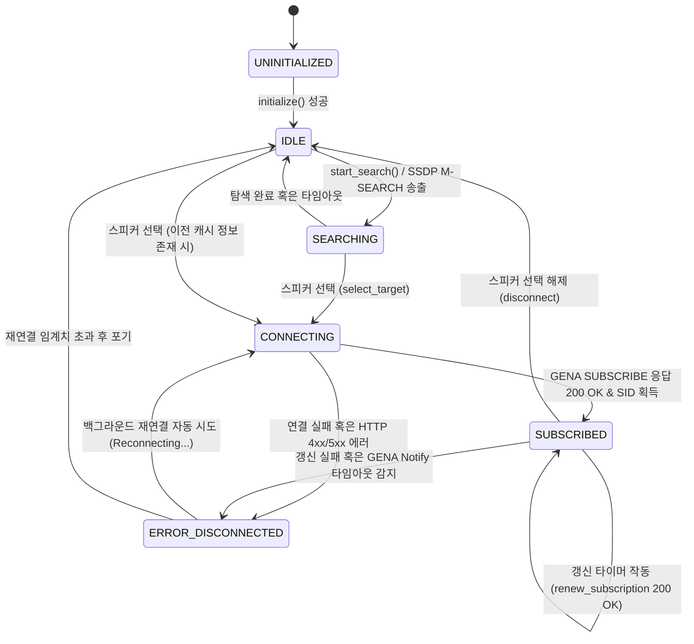

# DLNA/UPnP 미디어 렌더러 원격 제어 기능 구현 가이드

본 문서는 M5Stack TAB5(ESP32-P4/C6) 기기에서 `esp_media_protocols` 컴포넌트를 활용하여 홈 네트워크 상의 DLNA 미디어 렌더러(DMR, 예: 스마트 오디오, TV 등)를 검색하고, 현재 재생 곡 정보 및 재생/볼륨을 비동기식으로 제어하기 위한 설계 및 구현 사양을 정의합니다.

---

## 1. 아키텍처 개요 (System Architecture)

기기는 사용자가 PC나 스마트폰으로 재생을 시작한 스마트 스피커(DMR)의 상태를 실시간으로 받아오고(Event Subscription), 제어 명령(SOAP Request)을 전송하는 **원격 미디어 컨트롤러** 역할을 수행합니다.

```mermaid
graph TD
    subgraph Local LAN (WiFi)
        DMR[DLNA Media Renderer <br> 스마트 스피커 / TV]
    end

    subgraph M5Stack TAB5 (ESP32-P4)
        direction TB
        subgraph UI Task (LVGL Thread)
            UI[DLNA UI Component <br> 기존 Spotify UI 재활용]
            DispLock[bsp_display_lock / unlock]
        end
        
        subgraph Network Task (FreeRTOS)
            SSDP[SSDP Discovery]
            SOAP[SOAP Control Client]
            GENA[GENA Event Subscriber]
        end
        
        subgraph Decode Task (FreeRTOS)
            Dec[esp_jpeg & libpng Decoders]
        end
    end

    %% Flow
    DMR <-->|SSDP: M-SEARCH / NOTIFY| SSDP
    SOAP -->|SOAP HTTP POST: Control| DMR
    DMR -->|GENA HTTP NOTIFY: Event| GENA
    GENA -->|Album Art URL| SOAP
    SOAP -->|Compressed Image| Dec
    Dec -->|Raw RGB565 Buffer| UI
    GENA -->|Track Info & Progress| UI
    UI -->|bsp_display_lock| DispLock
```

### 핵심 설계 원칙
1. **인증 프리(Authentication-Free)**: 로컬 홈 네트워크 통신을 사용하므로 복잡한 OAuth 2.0 및 토큰 갱신 로직을 완전히 배제합니다.
2. **비동기 통신 격리**: SSDP 탐색 및 SOAP/GENA 메시지 교환, XML 파싱은 전용 네트워크 태스크에서 수행하여 UI 블로킹을 차단합니다.
3. **UI 100% 재사용**: 기존에 설계된 Spotify UI 위젯 및 데이터 갱신 구조를 변형 없이 유지하고 백엔드 인터페이스만 대체합니다.

---

## 2. 세부 구현 사양 (Implementation Specifications)

### 2.1. SSDP 기반 디바이스 탐색 및 선택 (SSDP Discovery)
- **탐색 방법**: `esp_media_protocols`에서 제공하는 SSDP API를 활용하여 로컬 네트워크로 멀티캐스트 탐색 패킷(M-SEARCH)을 송출합니다.
  - Target: `urn:schemas-upnp-org:device:MediaRenderer:1` (미디어 렌더러 기기만 필터링)
- **렌더러 선택기 연동**:
  - 검색된 스피커들의 친숙한 이름(FriendlyName, 예: "거실 오디오", "안방 TV")과 제어 URL(Control URL)을 리스트에 적재합니다.
  - 사용자가 기기를 선택하면, 해당 렌더러의 IP 및 서비스 기술서 정보를 전역 활성 객체로 고정합니다.

### 2.2. 실시간 상태 이벤트 구독 (GENA Subscription)
실시간으로 곡 정보와 재생 진행 시간을 무수히 폴링하지 않고, 렌더러가 상태를 밀어주는 **이벤트 구독(Eventing)** 방식으로 설계합니다.

- **구독 등록**:
  - 선택된 스피커의 `AVTransport` 서비스 이벤트 주소로 `SUBSCRIBE` HTTP 요청을 전송합니다.
  - 구독이 수락되면 렌더러는 상태 변경 시마다 `NOTIFY` HTTP POST 요청을 기기의 로컬 포트(예: 8080/GENA Listener)로 보내옵니다.
- **XML 메타데이터 파싱**:
  - 수신된 NOTIFY XML 페이로드에서 `LastChange` 값을 추출하고, 내장된 DIDL-Lite XML 데이터를 파싱합니다.
  - 파싱 대상 요소:
    * `dc:title` $\rightarrow$ 곡 제목
    * `upnp:artist` $\rightarrow$ 아티스트 이름
    * `upnp:albumArtURI` $\rightarrow$ 앨범 커버 URL
    * `TransportState` $\rightarrow$ 재생 상태 (PLAYING, PAUSED_PLAYBACK, STOPPED 등)

### 2.3. 재생 및 볼륨 원격 제어 (SOAP Control)
기기 화면 터치를 통해 SOAP XML 포맷의 HTTP POST 제어 명령을 스피커로 전달합니다. 하단 터치패드 영역은 볼륨 제어가 아닌 기존의 **HID 트랙패드(PC 제어용) 기능을 그대로 온전히 유지**합니다.

* **재생 제어 (`AVTransport` Service)**:
  - 재생: `Play` 액션
  - 일시정지: `Pause` 액션
  - 이전곡/다음곡: `Previous` / `Next` 액션
* **볼륨 제어 (`RenderingControl` Service)**:
  - 볼륨 변경: `SetVolume` 액션 (`DesiredVolume` 인자 값 전달)
  - 볼륨 상태 변경은 화면 상단 미디어 영역에 새로 배치된 **볼륨 조절 슬라이더 위젯**의 드래그 이벤트를 통해 직접 제어합니다.

### 2.4. 앨범 커버 수신 및 이미지 디코딩 파이프라인 (JPEG/PNG 독립 디코더)
DLNA 미디어 서버가 전달하는 앨범 커버는 JPEG뿐만 아니라 PNG 포맷도 빈번히 섞여 있으므로, 두 가지 포맷을 모두 독립 태스크에서 처리할 수 있는 다중 디코더 파이프라인을 구축합니다.

- **포맷 분기**: HTTP GET 응답의 `Content-Type` 헤더 또는 다운로드 버퍼의 매직 넘버(JPEG: `FF D8`, PNG: `89 50 4E 47`)를 기준으로 디코더를 나눕니다.
- **JPEG 디코딩**: `espressif/esp_jpeg` 컴포넌트의 독립 API를 사용해 백그라운드 태스크에서 바로 RGB565 픽셀 배열로 압축을 풉니다.
- **PNG 디코딩**: `espressif/libpng` 컴포넌트의 독립 API를 활용합니다.
  - libpng가 메모리에 적재된 수신 버퍼에서 데이터를 읽을 수 있도록 커스텀 읽기 콜백 함수(`png_set_read_fn`)를 설정합니다.
  - 에러 처리 시 태스크 패닉이 나지 않도록 `setjmp`/`longjmp` 예외 처리 템플릿을 엄격히 설정합니다.
  - 어떤 PNG 포맷(인덱스 컬러, 그레이스케일 등)이 오더라도 강제로 24비트 RGB/32비트 RGBA 출력으로 정규화하도록 변환 매크로(`png_set_palette_to_rgb` 등)를 지정합니다.
- **RGB565 다운샘플링 및 바인딩**:
  - 디코딩 완료 후 얻은 픽셀 데이터를 백그라운드에서 즉시 16비트 RGB565 배열로 픽셀 포맷 변환을 수행하여 메모리 소모를 최적화합니다.
  - 변환 완료된 픽셀 포인터를 뮤텍스 보호 하에 `lv_image_set_src()`에 바인딩하여 UI를 갱신합니다. (LVGL 내장 디코더의 기기 정렬 제약과 UI 블로킹 이슈를 우회)
- **메모리 제약 극복을 위한 방어적 이미지 제한 설계 (OOM 예방)**:
  네트워크에서 수신한 원시 이미지 데이터를 파일 시스템 저장 없이 힙(Heap) 메모리 상에서 즉시 디코딩할 때, 해상도가 너무 클 경우 힙이 고갈되어 기기가 리셋되는 패닉(Out of Memory) 현상이 발생합니다. 이를 완벽하게 차단하기 위해 3단계 게이트키퍼(Gatekeeper) 필터를 필수로 적용합니다.
  1. *다운로드 용량 필터링*: HTTP GET 응답 수신 시, 헤더의 `Content-Length`를 사전 검사하여 파일 크기가 임계치(예: **1MB**)를 초과하는 고용량 파일인 경우 즉시 연결을 해제(Abort)하여 메모리 적재를 차단합니다.
  2. *가로/세로 해상도 사전 검사*: 다운로드 완료 후 디코딩을 시도하기 전에, 이미지 앞부분(Header) 수십 바이트만 파싱하여 이미지 크기가 최대 크기 임계치(예: **640x640px**)를 하나라도 초과하는지 스캔합니다.
     - JPEG: `SOF0 (Start of Frame)` 마커를 스캔해 Width/Height 분석
     - PNG: `IHDR` 청크를 분석해 Width/Height 분석
     - 만약 제한 크기를 초과할 경우 디코딩 연산을 중단하고, 펌웨어 내장 플레이스홀더 이미지(Default Cover)를 표출하도록 예외 처리합니다.
  3. *JPEG 스케일 다운(Scale-down) 디코딩*: JPEG의 경우 디코더의 `1/2` 또는 `1/4` 자체 비율 축소 디코딩(Scale-down Decoding) 기능을 활성화합니다. 이를 통해 $1024 \times 1024$ 급의 이미지가 유입되더라도 최종 RGB565 raw 버퍼 크기는 $256 \times 256$ 크기(128KB) 수준으로 작게 풀리도록 유도하여 메모리 공간의 절대적인 안전성을 확보합니다. (PNG의 경우 비율 축소 디코딩을 지원하지 않으므로 2단계 해상도 필터링을 타이트하게 적용)

---

## 3. UI 마이그레이션 및 화면 구성 가이드 (Spotify UI 재활용)

기존 [`spotify.cpp`](file:///d:/workspace/embedded_m5stack_tab5/src/009.touchpad/main/display/spotify.cpp) 및 [`spotify.hpp`](file:///d:/workspace/embedded_m5stack_tab5/src/009.touchpad/main/display/spotify.hpp) 코드를 기반으로 하되, 하단 터치패드는 **원본의 HID 트랙패드(PC 마우스/터치 전송) 동작을 온전히 유지**하고, 상단 UI 영역에 **볼륨 및 렌더러 선택 요소를 매끄럽게 추가**하도록 수정합니다.

```
[ 기존 Spotify UI ]                    [ DLNA 마이그레이션 바인딩 및 변경점 ]
1. update_track_info(title, artist)  -->  DLNA XML DIDL-Lite 파싱 텍스트 적용 (100% 동일)
2. update_progress(curr, total)      -->  스피커의 CurrentPlayTime 및 Duration 밀리초 단위 매핑
3. set_album_art(img_src)            -->  esp_jpeg 또는 libpng 디코딩 완료된 RGB565 픽셀 포인터 바인딩
4. btn_shuffle_ (셔플 버튼)           -->  (디자인 대칭 유지 목적으로 배치하되 이벤트는 생략 가능)
5. btn_repeat_  (반복 버튼)           -->  btn_renderer_ (출력 스피커 기기 선택 팝업 호출)로 대체
6. (신규 위젯) 볼륨 조절 슬라이더      -->  곡 진행 슬라이더 아래에 가로형 볼륨 슬라이더(Volume Slider)를 배치하여 RenderingControl 연동
7. 하단 터치패드 영역                 -->  기존 BLE PTP/마우스 트랙패드 기능 100% 그대로 활용 (영역 간섭 없음)
```

### 기기 선택 팝업 UI 추가 방안
- `btn_repeat_` (우측 최하단 버튼)의 아이콘 이미지를 오디오 캐스트(`LV_SYMBOL_AUDIO`) 모양으로 교체합니다.
- 해당 버튼 터치 시, SSDP로 탐색된 스피커 이름 목록을 가지는 모달 팝업 리스트(`lv_dropdown` 또는 `lv_msgbox`)를 동적으로 오버레이 렌더링하여 타겟 스피커를 선택하도록 처리합니다.

### 상단 UI 볼륨 조절 슬라이더 위젯 추가
- 진행률 슬라이더(`prog_slider_`)와 미디어 제어 버튼행(`ctrl_row`) 사이에 얇은 볼륨 슬라이더(`volume_slider_`)와 작은 볼륨 아이콘 레이블을 가로로 길게 배치합니다.
- 사용자가 볼륨 슬라이더를 조작(`LV_EVENT_VALUE_CHANGED`)하면 실시간으로 타겟 스피커(DMR)에 `SetVolume` SOAP 요청이 전송됩니다.

---

## 4. 구현 단계 및 개발 로드맵 (Milestones)

### [Phase 1] 로컬 디바이스 탐색 및 렌더러 타겟팅
- [ ] `esp_media_protocols` 컴포넌트를 이용한 SSDP 렌더러(DMR) 탐색 기능 구현
- [ ] 검색된 장치의 FriendlyName과 Control URL을 획득하는 관리 테이블 구현
- [ ] UI 컨트롤 영역 우측 하단 버튼을 터치할 시 장치 목록 모달 팝업을 띄우는 GUI 통합

### [Phase 2] 이벤트 구독(GENA) 및 메타데이터 파싱
- [ ] 렌더러의 `AVTransport` 상태 알림을 받기 위한 로컬 포트 리스너(GENA HTTP Server) 구현
- [ ] 수신된 XML 데이터로부터 곡 정보, 재생 상태, 앨범 아트 이미지 URL을 읽어내는 초경량 XML 파서 구현
- [ ] 파싱 결과를 LVGL 스레드 락 보호 하에 기존 `update_track_info()` 및 `update_progress()`에 바인딩

### [Phase 3] 원격 제어 및 이미지 파이프라인 결합
- [ ] 터치 이벤트 발생 시 해당 렌더러로 SOAP `Play`/`Pause`/`Next`/`Prev` HTTP POST 요청 발송 연동
- [ ] 상단 UI에 새로 추가된 볼륨 슬라이더(`volume_slider_`)의 값 변경 이벤트와 SOAP `SetVolume` 연동
- [ ] `esp_jpeg` 및 `libpng` 독립 디코더 태스크를 이미지 처리 파이프라인에 결합하여, 다운로드한 앨범 커버(JPEG/PNG)를 RGB565 픽셀로 변환 후 `set_album_art()`에 최종 바인딩

---

## 5. 상세 파일 구조 및 클래스 설계 (File & Class Design)

프로젝트 모듈성과 독립성을 확보하기 위해 DLNA 백엔드 코드는 `main/dlna` 디렉토리 하위에 패키징하고, UI 파트는 `main/display` 내의 기존 레이아웃을 확장 연동합니다.

### 5.1. 파일별 기능 역할 정의

| 파일 경로 | 주요 역할 및 기능 범위 |
| :--- | :--- |
| **`main/dlna/dlna_controller.hpp / .cpp`** | DLNA 코어 컨트롤러 클래스. 장치 검색(SSDP), SOAP 요청 생성, GENA 구독 세션 수명 관리. |
| **`main/dlna/dlna_event_listener.hpp / .cpp`** | 로컬 HTTP 서버 태스크. DMR이 보내오는 GENA `NOTIFY` 이벤트를 8080 포트에서 상시 수청. |
| **`main/dlna/dlna_parser.hpp / .cpp`** | 초경량 XML 스트림/SAX 파서. UPnP `LastChange` 내의 DIDL-Lite 곡 메타데이터 해석. |
| **`main/dlna/image_pipeline.hpp / .cpp`** | 비동기 이미지 획득 모듈. URL 다운로드 및 매직넘버 검증 후 `esp_jpeg` / `libpng` 호출 제어. |
| **`main/display/spotify.hpp / .cpp`** | UI 레이아웃 클래스. `btn_renderer_` 액션 매핑, `volume_slider_` 위젯 관리, UI 리렌더링 바인딩. |

### 5.2. 핵심 클래스 세부 설계

#### ① `DlnaController` 클래스 (싱글톤)
```cpp
namespace Ble::Dlna {

enum class DlnaState : uint8_t {
    UNINITIALIZED,
    IDLE,
    SEARCHING,
    CONNECTING,
    SUBSCRIBED,
    ERROR_DISCONNECTED
};

struct DlnaDevice {
    std::string friendly_name;
    std::string udn;
    std::string control_url;
    std::string event_sub_url;
    std::string rendering_ctrl_url;
};

class DlnaController {
public:
    static DlnaController& instance();

    bool initialize();
    void start_search();
    void select_target(const std::string& udn);
    void send_media_control(const char* action); // "Play", "Pause", "Next", "Previous"
    void set_volume(uint8_t volume);              // 0 ~ 100 범위의 Volume SOAP 
    
    DlnaState get_state() const { return state_; }
    const std::vector<DlnaDevice>& get_devices() const { return devices_; }

private:
    DlnaController() = default;
    
    DlnaState state_ = DlnaState::UNINITIALIZED;
    std::vector<DlnaDevice> devices_;
    DlnaDevice active_target_;
    std::string subscription_sid_;
    uint32_t subscription_timeout_ = 1800; // 초 단위 유효 시간
    
    void handle_ssdp_packet(const char* packet, size_t len);
    void renew_subscription();
};

} // namespace Ble::Dlna
```

#### ② `DlnaEventListener` 및 `DlnaParser` 클래스
```cpp
class DlnaEventListener {
public:
    void start_listener_task(); // FreeRTOS 태스크로 로컬 8080 포트 HTTP 리스너 실행
private:
    static void listener_thread(void* arg);
    void handle_http_notify(struct os_mbuf* req);
};

class DlnaParser {
public:
    // LastChange XML 내부의 DIDL-Lite 데이터를 해석하여 곡 정보를 채웁니다.
    static bool parse_metadata(const std::string& xml, 
                               std::string& out_title, 
                               std::string& out_artist, 
                               std::string& out_art_url);
};

### 5.3. constexpr 기반 상수 모듈화 정의

하드코딩(매직 넘버)을 배제하고 Modern C++의 타입 안정성을 지키기 위해, 모든 튜닝 변수는 전용 헤더 파일(`dlna_constants.hpp`)에 `constexpr` 상수로 집약 관리합니다.

#### 1. 네트워크 및 프로토콜 상수 (`namespace Ble::Dlna::Config`)
```cpp
namespace Ble::Dlna::Config {
    // SSDP 멀티캐스트 네트워크 정보
    constexpr std::string_view kSsdpMulticastIp    = "239.255.255.250";
    constexpr uint16_t         kSsdpMulticastPort  = 1900;
    constexpr std::string_view kSsdpTargetDmr      = "urn:schemas-upnp-org:device:MediaRenderer:1";
    constexpr uint32_t         kSsdpSearchTimeoutS = 3;

    // GENA 수신 HTTP 서버 포트 및 구독 관리
    constexpr uint16_t         kGenaListenerPort       = 8080;
    constexpr float            kGenaRenewalMarginRatio = 0.90f; // 세션 만료 10% 전 리뉴얼 요청

    // 백그라운드 동기화 및 헬스 체크 주기
    constexpr uint32_t         kProgressSyncIntervalMs = 5000;  // 5초 재생바 시간 오차 보정
    constexpr uint32_t         kSpeakerPingIntervalMs  = 10000; // 10초 TCP 생존 확인
    constexpr uint32_t         kVolumeThrottlingMs     = 150;   // 볼륨 갱신 제어 쓰로틀링
}
```

#### 2. 이미지 가공 및 보안 한계 상수 (`namespace Image::Config`)
```cpp
namespace Image::Config {
    constexpr size_t   kMaxDownloadBytes   = 1 * 1024 * 1024; // 이미지 다운로드 최대 1MB 한계
    constexpr uint32_t kMaxResolutionLimit = 640;             // 최대 해상도 640px 한계 (OOM 방지)
}
```

#### 3. UI 조작 상수 (`namespace UI::Mode_MediaRemote`)
```cpp
namespace UI::Mode_MediaRemote {
    constexpr int32_t kVolumeMaxLevel    = 100;
    constexpr int32_t kVolumeMinLevel    = 0;
    constexpr int32_t kVolumeStep        = 5;
}
```
```

---

## 6. 동작 상태머신 정의 (State Machine)

스피커와의 연결, 네트워크 단절, GENA 세션 만료 등의 이벤트를 안정적으로 제어하기 위해 아래의 상태 천이도를 따릅니다.

### 6.1. 상태 천이 흐름 (State Transition Diagram)



### 6.2. 상태별 UI 인터랙션 가이드

* **`IDLE` (미연결)**
  - UI 텍스트: 제목 영역에 *"No Speaker Selected"* 표출.
  - 위젯 제어: 미디어 제어 버튼 및 볼륨 슬라이더를 **비활성화(Disabled/Grey-out)** 처리하여 터치 차단.
* **`SEARCHING` (기기 탐색 중)**
  - 기기 선택 팝업창 내부에 스피너(Spinner) 아이콘을 표출하여 주변 스피커 목록 검색 중임을 시각화.
* **`CONNECTING` (스피커 연결 중)**
  - 메인 앨범 아트 영역에 로딩 스피너 작동.
* **`SUBSCRIBED` (동기화 완료)**
  - 실시간 이벤트 알림을 받아 재생 텍스트, 시간 슬라이더, 앨범 아트를 정상 갱신.
  - 모든 미디어 조작 버튼 및 볼륨 슬라이더 활성화.
* **`ERROR_DISCONNECTED` (재연결 시도 중)**
  - 상단바 영역에 `Reconnecting...` 경고 배너 오버레이 출력.
  - 기존 출력 중이던 곡 메타데이터와 볼륨 수치는 유지하되, 재생 제어 터치는 일시적으로 제한.

---

## 7. 네트워크 예외 처리 및 데이터 동기화 설계 (Network Recovery & Data Synchronization)

로컬 네트워크 무선 환경의 변동성에 대처하고 스피커와 기기 간의 데이터 불일치를 최소화하기 위한 구체적인 동기화 및 복구 메커니즘을 정의합니다.

### 7.1. SSDP 자동/수동 재검색 및 네트워크 이벤트 핸들링
1. **자동 검색 (Auto-Search)**:
   - ESP-IDF의 시스템 이벤트 루프에서 `IP_EVENT_STA_GOT_IP` (WiFi IP 획득 성공) 이벤트를 수신하면, 기기는 백그라운드에서 즉시 최초의 SSDP M-SEARCH 패킷을 로컬 멀티캐스트 주소(`239.255.255.250:1900`)로 송출해 렌더러 목록을 수집합니다.
2. **수동 재검색 (Manual-Search)**:
   - 사용자 기기 선택 팝업창 내에 재검색(Refresh) 버튼을 연동하여, 사용자가 임의로 버튼을 터치할 시 기존 렌더러 리스트를 비우고 SSDP M-SEARCH를 즉각 다시 기동하여 기기를 재탐색합니다.
3. **네트워크 유실 및 하드웨어 예외 처리**:
   - `IP_EVENT_STA_LOST_IP` (WiFi 연결 끊김) 발생 시:
     - 상태를 즉각 `ERROR_DISCONNECTED`로 전이하고, 모든 통신 소켓 및 타이머 리소스를 회수(Clean-up)합니다.
   - `IP_EVENT_STA_GOT_IP` (재연결 완료) 발생 시:
     - 소켓을 재할당하고, 백그라운드 SSDP 탐색을 재시작하여 이전에 선택했던 타겟 스피커(DMR)의 IP 생존 여부를 조회하고 재구독(Re-subscribe)을 자동 시도합니다.
   - **스피커 세션 유실 복구 (Ping 모니터링)**:
     - 스피커 전원이 강제로 꺼지거나 통신이 두절되는 경우, SOAP 전송 실패 또는 GENA 갱신 만료에 따른 에러를 감지하여 즉시 `ERROR_DISCONNECTED` 상태로 빠져나옵니다.
     - 기기는 10초 주기로 해당 스피커 IP에 가벼운 TCP 핑(Ping) 또는 SSDP 타겟 조회를 요청하며 생존 여부를 지속적으로 스캔하는 '자가 치유(Self-healing) 루틴'을 돌려 복구를 수행합니다.

### 7.2. 초경량 XML 핀포인트 파싱 기법
DLNA/UPnP 장치 설명 및 메타데이터는 수십~수백 KB의 거대한 XML 구조입니다. 제한된 ESP32 RAM 내에서 OOM을 방지하기 위해 스트림 기반 핀포인트 문자열 검색 기법을 적용합니다.
- 복잡한 XML 전체를 트리 구조로 메모리에 로드하는 무거운 DOM 파서(예: TinyXML 전체 분석)를 사용하지 않습니다.
- 수신된 raw XML 데이터에서 필요한 핵심 태그만을 지정해 **Substring/인덱스 기반의 핀포인트 문자열 탐색(String Search & Slice)**을 수행하여 메모리 점유율을 **1KB 미만**으로 통제합니다.
- 파싱 추출 타겟 태그 목록:
  * `<dc:title>(.*?)</dc:title>` (곡 제목)
  * `<upnp:artist>(.*?)</upnp:artist>` (가수 이름)
  * `<upnp:albumArtURI>(.*?)</upnp:albumArtURI>` (앨범 이미지 URL)
  * `<TransportState val="(.*?)"/>` (재생 상태 정보)
  * `<Volume val="(.*?)"/>` (스피커 볼륨 수치)

### 7.3. 재생 정보, 재생 시간, 볼륨 데이터 동기화 메커니즘
스피커와 기기 간의 실시간 볼륨/상태 엇갈림을 차단하기 위한 양방향 동기화 사양입니다.

#### ① 재생 정보 및 재생 상태 동기화 (렌더러 주도 실시간 푸시)
- **전달 방식**: 렌더러(스피커)가 기기(M5Stack)로 관련 상태 변화 발생 시 **자동으로 실시간 푸시(Push)**합니다.
- **연동 메커니즘**:
  - **최초 접속 시**: 스피커 선택 직후 1회에 한해 기기가 스피커로 SOAP `GetPositionInfo` 및 `GetTransportInfo` 액션을 명시적으로 요청(Request)하여 화면을 초기 동기화합니다.
  - **이후 런타임**: 기기가 스피커의 `AVTransport` 서비스에 등록해 둔 GENA 이벤트 채널을 통해, 상태 변화가 일어나는 즉시 스피커가 기기 측으로 `NOTIFY` HTTP POST를 쏩니다.
- **갱신 주기 (비주기적 / 즉시)**:
  - 고정된 폴링 주기가 존재하지 않으며, 곡이 변경되거나 사용자가 물리 버튼/타 앱으로 재생 상태(Play, Pause, Stop)를 전환하는 **이벤트 발생 즉시 실시간(Real-time)**으로 기기에 데이터가 전달되어 갱신됩니다.

#### ② 재생 시간(Progress) 동기화 (기기 주도 하이브리드 보정)
- **전달 방식**: 렌더러가 자동으로 갱신해주지 않으므로, **기기가 가상 예측하고 주기적으로 스피커에 요청(Query)하여 보정**합니다.
- **스펙 상의 한계**:
  - 매초 흐르는 경과 시간(RelativeTime)을 렌더러가 실시간 이벤트 알림으로 쏘면 LAN 대역폭 낭비가 매우 크기 때문에, UPnP/DLNA 표준 스펙상 경과 시간은 GENA 푸시 항목에서 원천 제외되어 있습니다. (이벤트로는 오직 전체 곡 길이인 `Duration`만 최초 1회 수신됩니다.)
- **갱신 및 보정 메커니즘**:
  - **로컬 가상 시뮬레이션 (매초 갱신)**: 스피커 재생 상태가 `PLAYING`인 동안, 기기는 외부 요청 없이 내부의 **1초 소프트웨어 타이머**를 가동하여 진행률 슬라이더와 경과 시간을 가상으로 1초씩 누적 갱신합니다. (네트워크 부하 0%)
  - **주기적 오차 보정 (5~10초 폴링)**: 1초 로컬 예측 타이머의 시간 오차를 맞추기 위해, 백그라운드 태스크에서 **5~10초 주기**로 스피커에게 SOAP `GetPositionInfo` 액션을 쏘아 실제 재생 시각과 동기화합니다.
  - **동적 오차 보정 (이벤트 연동)**: 사용자가 일시정지에서 재생으로 전환하는 순간, 혹은 재생 슬라이더를 수동으로 움직인(Seek) 직후에는 즉시 SOAP `GetPositionInfo`를 1회 강제 호출하여 화면 진행 상태를 스피커와 정교하게 일치시킵니다.

#### ③ 볼륨(Volume) 동기화 (렌더러 우선순위 및 터치 릴리즈 제어)
- **렌더러 볼륨 최우선(Master Volume 지정)**:
  - 기기는 자체 로컬 볼륨 값을 마스터로 삼지 않고, 항상 스피커(DMR)의 실제 하드웨어 볼륨 상태(GENA Notify 수신 값)를 절대적인 기준으로 삼아 슬라이더의 위치를 동기화합니다.
- **기기 $\rightarrow$ 스피커 (수동 제어 및 드래그 락)**:
  - 사용자가 화면의 볼륨 슬라이더를 드래그(`LV_EVENT_PRESSING`)하는 동안에는 스피커로의 SOAP `SetVolume` 요청을 전송하지 않고 전면 보류합니다.
  - 동시에, 드래그 중에 스피커로부터 들어오는 GENA `Volume NOTIFY` 이벤트 수신을 통한 슬라이더 눈금 강제 갱신을 **일시 차단(Update Lock)**하여 손가락 드래그 위치와 스피커 피드백 간의 충돌로 인해 발생하는 슬라이더 덜덜거림(Jitter) 현상을 원천 방지합니다.
  - 사용자가 조작을 마치고 슬라이더에서 손을 떼는 순간인 **터치 릴리즈(`LV_EVENT_RELEASED`) 시점에 최종 확정된 단 하나의 볼륨 수치만을 스피커로 전송**하며, 통신 완료 후 피드백 업데이트 락을 해제합니다.
- **스피커 $\rightarrow$ 기기 (타 기기 조작 시 동기화)**:
  - 사용자가 스마트폰 앱이나 스피커 본체의 물리 버튼을 조작하여 볼륨을 변경했을 때도 동기화되어야 합니다.
  - `RenderingControl` 서비스의 GENA 이벤트 알림(`NOTIFY`)을 백그라운드에서 실시간 수신하여 스피커 볼륨과 기기 화면의 볼륨 슬라이더 위치를 일치시킵니다. (단, 기기에서 사용자가 드래그 중인 동안에는 이 갱신이 락으로 격리됩니다.)

---

## 8. 실무 개선 설계 및 피드백 반영 (Technical Optimizations & Feedbacks)

상용 수준의 완결성 높은 기기 동작을 보장하기 위해, 프로토콜 사양 검증 및 데이터/스레드 병목 문제를 처리하는 실무 개선 방안을 정의합니다.

### 8.1. SSDP 유니캐스트 응답 수신 소켓 및 볼륨 비율 매핑 보정
1. **SSDP 유니캐스트 리스너 바인딩**:
   - 기기가 멀티캐스트로 M-SEARCH 패킷을 발송하면 각 DMR(스피커)들은 기기가 패킷을 보낸 송신 소켓(Ephemeral Port)으로 **유니캐스트 UDP 응답**을 보냅니다.
   - 따라서 `DlnaController`는 M-SEARCH를 발송하는 UDP 소켓 포트를 즉시 닫지 않고 응답 리스닝 모드로 열어두어 스피커의 Location 정보를 정상 수신하도록 소켓 수명주기를 제어합니다.
2. **볼륨 범위(레벨) 파악 및 스케일링 보정**:
   - **표준 스펙상 확인**: UPnP `RenderingControl` 서비스의 SCPD(Service Control Protocol Description) XML을 다운로드하여 `<allowedValueRange>` 노드의 `minimum`, `maximum`, `step` 값을 파싱하면 렌더러가 지원하는 볼륨 범위를 사전에 얻어올 수 있습니다.
   - **실무 최적화 설계 (SCPD 파싱 배제)**:
     - SCPD XML은 수십 KB에 달하는 큰 용량으로 임베디드 단에서 실시간 파싱하기에 힙 리소스 오버헤드가 극심합니다.
     - 실제 대부분의 DLNA 표준 인증 스피커(DMR)는 프로토콜 상에서 볼륨 범위를 **`0 ~ 100`으로 정규화**하여 통신하도록 설계되어 있습니다.
     - 따라서 기기는 `0 ~ 100` 범위를 디폴트로 고정하여 사용하되, 최초 기기 연결 시 `GetVolume` 또는 최초 GENA Notify로 수신되는 수치가 슬라이더의 최대치(100)를 초과해 넘치거나 에러를 유발하지 않도록 **Clamp 처리 방어 코드**(`volume = volume > 100 ? 100 : volume;`)를 적용하여 무거운 XML 파싱 없이 런타임 안정성을 확보합니다.

### 8.2. GENA NOTIFY 스레드 병목 방지 (비동기 Message Queue 처리)
- 렌더러에서 이벤트가 몰릴 때 8080 로컬 HTTP 서버 스레드가 블로킹되면 스피커와의 GENA 세션 구독이 강제 종료될 위험이 있습니다.
- **워커 태스크 분리**:
  - `DlnaEventListener` 태스크는 NOTIFY 패킷 수신 즉시 XML 페이로드 스트링만 복사하여 **FreeRTOS Message Queue**에 던져두고, 스피커로 즉시 `200 OK` 응답을 리턴한 뒤 소켓을 클로즈합니다.
  - 실제 무거운 XML 핀포인트 파싱 및 이미지 다운로드/디코딩 트리거링은 큐(Queue)를 실시간 모니터링하는 별도의 **비동기 워커 태스크(Worker Task)**가 가동하여 전담 처리합니다.

### 8.3. 다국어 텍스트 및 유니코드 TTF 폰트 연동
- **UTF-8 인코딩 기본 적용**: DLNA 미디어 서버와 스피커로부터 수신하는 XML 내 모든 문자 데이터(제목, 아티스트명)는 표준 `UTF-8` 형식을 강제 적용해 문자열을 가공합니다.
- **유니코드 TTF 폰트 엔진 활용**:
  - 다국어(한글, 일어, 한자 등) 글자가 깨지는 현상(Tofu 현상)을 방지하기 위해 기기에는 **유니코드 지원 TTF(TrueType Font) 파일**을 탑재하여 폰트 렌더링에 사용합니다.
  - 이를 통해 로컬 서버의 어떠한 다국어 메타데이터가 들어오더라도 기기 화면 상에 완벽하게 텍스트가 표현됩니다.

### 8.4. SSDP NOTIFY 리스닝 및 GENA 리뉴얼 타이머
1. **SSDP NOTIFY 백그라운드 리스너**:
   - 기기가 백그라운드에서 스피커들이 켜지고 꺼질 때마다 주기적으로 브로드캐스팅하는 `ssdp:alive` 및 `ssdp:byebye` 멀티캐스트 알림을 청취하여, 수동 재검색 없이도 장치 목록 내 활성 스피커 상태를 실시간 동적으로 갱신합니다.
2. **GENA 구독 정밀 갱신 (Renewal Timer)**:
   - 최초 구독(`SUBSCRIBE`) 성공 시 수신한 헤더 내 `Timeout` 시간(예: Second-1800)을 파싱하여, 세션 만료 10% 전 시점(예: 27분 시점)에 자동으로 재구독(SUBSCRIBE Renewal) 요청을 백그라운드에서 쏘아주도록 타이머를 구체화해 세션 영속성을 보장합니다.

---

## 9. Spotify UI 리네임 및 리팩토링 가이드 (Migration to MediaRemote)

원격 미디어 모니터링 및 제어 기기라는 본질을 명확히 하고 코드 의미론의 왜곡을 방지하기 위해, 기존의 `Spotify` 관련 파일명 및 클래스명을 **`MediaRemote`**로 일괄 리팩토링합니다.

### 9.1. 신규/이름 변경 파일 및 디렉토리 구조
리팩토링 완료 후 최종적인 디렉토리 및 파일 맵핑은 다음과 같습니다.

```text
main/
├── dlna/
│   ├── dlna_controller.hpp/.cpp   ──► [핵심] SSDP 장치 검색, SOAP 요청 및 전체 생명주기 관리
│   ├── dlna_event_listener.hpp/.cpp ──► [GENA 서버] 스피커가 밀어주는 알림 수신 (8080 포트)
│   ├── dlna_parser.hpp/.cpp        ──► [XML 해석] 수신된 XML에서 필요한 텍스트 정보만 고속 추출
│   └── image_pipeline.hpp/.cpp     ──► [이미지 처리] 앨범 커버 다운로드 및 JPEG/PNG 비동기 디코딩
│
└── display/
    ├── media_remote.hpp/.cpp       ──► [NEW] (기존 spotify.hpp/.cpp) 미디어 제어 UI 화면 렌더링
    └── context.hpp/.cpp            ──► 모드 전환 스위칭 및 트랙패드 데이터 라우팅
```

### 9.2. 파일별 리팩토링 및 수정 가이드

이름 변경 및 기존 코드를 마이그레이션하기 위해 반드시 수정해야 하는 파일 목록과 수정 사항 정의입니다.

#### 1. [`main/CMakeLists.txt`](file:///d:/workspace/embedded_m5stack_tab5/src/009.touchpad/main/CMakeLists.txt) (수정)
- 빌드할 소스 파일 리스트(`SRCS`) 중 기존 `display/spotify.cpp` 항목을 삭제하고, 변경된 파일명인 **`display/media_remote.cpp`**를 추가합니다.

#### 2. [`main/app_state.hpp`](file:///d:/workspace/embedded_m5stack_tab5/src/009.touchpad/main/app_state.hpp) (수정)
- 모드 전환을 관리하는 `enum class AppMode` 내의 값을 변경합니다.
  - `AppMode::SPOTIFY_PLAYER` $\rightarrow$ **`AppMode::MEDIA_REMOTE`**

#### 3. [`main/display/media_remote.hpp` & `.cpp` (이름 변경 및 수정)](file:///d:/workspace/embedded_m5stack_tab5/src/009.touchpad/main/display/spotify.hpp)
- 파일명을 `spotify.hpp/.cpp`에서 **`media_remote.hpp/.cpp`**로 바꿉니다.
- 내부 C++ 명칭 치환:
  - 클래스명: `class Spotify` $\rightarrow$ **`class MediaRemote`**
  - 네임스페이스 상수: `UI::Mode_Spotify` $\rightarrow$ **`UI::Mode_MediaRemote`**
  - 스코프 연산자: `Spotify::` $\rightarrow$ **`MediaRemote::`**
- 볼륨 슬라이더(`volume_slider_`) 및 스피커 선택용 버튼(`btn_renderer_`) 생성 코드 및 이벤트 콜백 추가 구현.

#### 4. [`main/display/context.hpp` & `.cpp` (수정)](file:///d:/workspace/embedded_m5stack_tab5/src/009.touchpad/main/display/context.hpp)
- 헤더 포함문 수정: `#include "spotify.hpp"` $\rightarrow$ **`#include "media_remote.hpp"`**
- 클래스 멤버 변수 타입 수정: `Spotify spotify_player_;` $\rightarrow$ **`MediaRemote media_remote_;`**
- 내부 모드 연동 코드 수정:
  - `AppMode::SPOTIFY_PLAYER` 관련 Switch-Case 분기를 **`AppMode::MEDIA_REMOTE`**로 치환하고, 내부 변수 및 메서드 호출을 `media_remote_`에 맞게 바인딩합니다.

### 9.3. 코드 수준 키워드 일괄 치환(Renaming) 규칙
빌드 에러를 방지하고 일관성을 보장하기 위해 기존의 `spotify` 명칭들을 C++ 식별자 대소문자 표기 규칙에 맞추어 일제히 아래 표와 같이 치환합니다.

| 변경 대상 구분 | 기존 명칭 (Spotify 기준) | 신규 치환 명칭 (MediaRemote 기준) |
| :--- | :--- | :--- |
| **파일 이름 (소문자)** | `spotify.hpp / spotify.cpp` | `media_remote.hpp / media_remote.cpp` |
| **클래스 이름 (PascalCase)**| `class Spotify` | `class MediaRemote` |
| **Enum 필드명 (UPPER_SNAKE)**| `AppMode::SPOTIFY_PLAYER` | `AppMode::MEDIA_REMOTE` |
| **네임스페이스 상수 (PascalCase)**| `UI::Mode_Spotify` | `UI::Mode_MediaRemote` |
| **컨텍스트 멤버 객체** | `spotify_player_` | `media_remote_` |
| **바인딩 API 함수명** | `update_spotify_track()` | `update_media_track()` |
| **바인딩 API 함수명** | `update_spotify_progress()` | `update_media_progress()` |
| **바인딩 API 함수명** | `set_spotify_album_art()` | `set_media_album_art()` |

---

## 10. 기존 소스코드 교차 분석 및 사이드 이펙트 방지 가이드 (Side-Effect Prevention & Code Safety)

기존 소스코드(`context.cpp`, `spotify.cpp` 등)의 구조적 제약과 DLNA 백엔드 스레드 간의 결합에서 발생할 수 있는 잠재적 크래시 및 메모리 누수를 차단하기 위한 필수 안전 규격입니다.

### 10.1. LVGL 스레드 락 보호 강제화 (bsp_display_lock 누락 크래시 예방)
- **현상**: WiFi 및 DLNA 백그라운드 태스크에서 메타데이터 상태 변화를 감지하여 UI 갱신 함수(`update_media_track()`, `set_media_album_art()` 등)를 직접 호출할 때 스레드 세이프 장치가 없으면 LVGL 메모리 오염으로 기기가 임의 재부팅되는 크래시가 유발됩니다.
- **해결 방안**: 외부 스레드가 접근하는 `Context` 클래스의 모든 UI 상태 반영 API에는 아래와 같이 **반드시 `bsp_display_lock(0)` / `bsp_display_unlock()`을 래핑**하여 스레드 안전성을 원천 보장합니다.
  ```cpp
  void Context::update_media_track(const char* title, const char* artist) {
      bsp_display_lock(0);
      media_remote_.update_track_info(title, artist);
      bsp_display_unlock();
  }
  ```

### 10.2. 동적 앨범 아트 버퍼 라이프사이클 관리 (메모리 누수 차단)
- **현상**: 매 곡이 바뀔 때마다 이미지 파이프라인에서 동적으로 할당한 RGB565 픽셀 버퍼를 `lv_image_set_src()`에 넘기지만, 이전 곡의 이미지 버퍼를 해제(Free)하는 소유권 로직이 결여되면 가동 수 시간 내에 힙 메모리가 완전히 고갈(OOM)됩니다.
- **해결 방안**:
  - `MediaRemote` 클래스는 현재 출력 중인 앨범 아트의 힙 메모리 주소(`void* current_art_buffer_ = nullptr;`)를 멤버 변수로 철저히 관리합니다.
  - 신규 앨범 아트 버퍼를 주입받아 바인딩하기 직전에, 기존 버퍼가 `nullptr`이 아닐 경우 안전하게 **`free()` 또는 `heap_caps_free()`를 수행한 뒤 새 버퍼의 주소로 갱신**하는 명시적 해제 프로세스를 구축합니다.

### 10.3. 비동기 메시지 기반의 UI 제어 루프 설계 (UI 프리징 방지)
- **현상**: 볼륨 슬라이더 조작 완료(`LV_EVENT_RELEASED`) 시점이나 재생/일시정지 터치 순간에 SOAP HTTP POST 통신을 UI 메인 루프에서 직접 동기(Blocking) 소켓으로 쏘면, 스피커 응답 지연 시간 동안 UI가 0.1~0.5초간 얼어버리는(Freeze) 병목 현상이 생깁니다.
- **해결 방안**:
  - UI 이벤트 핸들러(LVGL)는 네트워크 처리를 직접 하지 않고, 백그라운드 `DlnaController` 스레드로 전송될 **FreeRTOS Message Queue**에 제어 요청 메시지(예: 볼륨 값, 재생 커맨드)를 가볍게 던지고 즉시 LVGL 제어권을 반환(0ms)하여 화면 부드러움을 항상 보장합니다.
