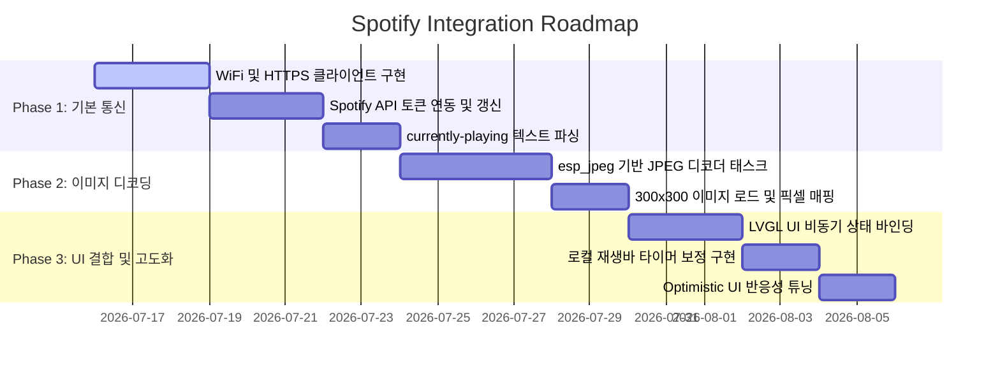

# Spotify API 연동 및 제어 기능 구현 가이드

본 문서는 M5Stack TAB5(ESP32-P4/C6) 기기에서 Spotify의 실시간 재생 정보(앨범 커버, 곡 제목, 아티스트 이름, 재생 진행 시간)를 가져오고, 재생 상태를 제어하기 위한 설계 및 구현 사양을 정의합니다.

---

## 1. 아키텍처 개요 (System Architecture)

네트워크 요청(HTTP/HTTPS) 및 이미지 디코딩 작업은 수백 밀리초에서 수 초의 시간이 소요되므로, 화면 프레임 드랍(Blocking)을 방지하기 위해 **비동기 멀티태스크 아키텍처**로 설계합니다.

```mermaid
graph TD
    subgraph Spotify Cloud
        API[Spotify Web API Server]
    end

    subgraph M5Stack TAB5 (ESP32-P4)
        direction TB
        subgraph UI Task (LVGL Thread)
            UI[Spotify UI Component]
            DispLock[bsp_display_lock / unlock]
        end
        
        subgraph Network Task (FreeRTOS)
            Net[esp_http_client / HTTPS]
            Parser[cJSON Parser]
        end
        
        subgraph Decode Task (FreeRTOS)
            Dec[esp_jpeg Decoder]
        end
        
        NVS[(NVS Flash)]
    end

    %% Flow
    API <-->|HTTPS REST API| Net
    Net -->|JSON Data| Parser
    Parser -->|Track Info & Progress| UI
    Parser -->|Album Art URL| Net
    Net -->|Compressed JPEG| Dec
    Dec -->|Raw RGB565 Pixel Array| UI
    UI -->|bsp_display_lock| DispLock
    NVS <-->|Token Read/Write| Net
```

### 핵심 설계 원칙
1. **비동기 처리**: HTTP 요청, JSON 파싱, JPEG 디코딩은 별도의 FreeRTOS 태스크에서 수행합니다.
2. **스레드 안전(Thread Safety)**: 백그라운드 태스크에서 LVGL 오브젝트를 조작할 때는 반드시 `bsp_display_lock()` 및 `bsp_display_unlock()` 뮤텍스 락을 사용합니다.
3. **메모리 제약 극복**: 대형 이미지 데이터를 저장할 PSRAM 동적 버퍼 할당 및 해제 주기를 엄격히 제어하여 메모리 누수를 방지합니다.

---

## 2. 세부 구현 사양 (Implementation Specifications)

### 2.1. OAuth 2.0 인증 및 토큰 관리
Spotify API 제어를 위해 `user-read-playback-state` 및 `user-modify-playback-state` 스코프가 부여된 토큰 세션이 필요합니다.

* **인증 플로우 (Authorization Code Flow)**:
  1. 사용자 웹 브라우저를 통해 Spotify 로그인 및 인증 코드(Authorization Code) 획득.
  2. 인증 코드를 기기에 전달하여 `Access Token` 및 `Refresh Token` 발급.
  3. 기기 초기화 시 또는 BLE 통신 등을 통해 스마트폰 Companion 앱에서 기기의 NVS 영역에 최초 토큰 데이터를 기록합니다.
* **토큰 자동 갱신 (Token Refresh)**:
  - Access Token은 약 1시간의 유효 기간을 가집니다.
  - 백그라운드 태스크에서 API 호출 시 `401 Unauthorized` 에러가 발생하거나 50분 주기로 타이머를 가동하여, `Refresh Token`을 사용해 새로운 `Access Token`을 재발급받는 갱신 루틴(`POST https://accounts.spotify.com/api/token`)을 실행합니다.
  - 갱신된 토큰은 즉시 NVS에 업데이트하여 재부팅 시에도 세션이 유지되도록 합니다.

### 2.2. HTTPS/REST 통신 및 JSON 파싱
스포티파이는 클라이언트로의 강제 이벤트 푸시(WebSocket/SSE 등)를 공식 제공하지 않으므로 주기적인 **HTTP Polling** 방식으로 동작 상태를 동기화합니다.

* **HTTPS 클라이언트 구성**:
  - `esp_http_client`를 사용하며, TLS 핸드셰이크를 위해 Spotify API 서버의 Root CA 인증서(`GlobalSign Root CA` 등)를 펌웨어에 내장(Embed)하여 제공합니다.
  - 헤더 추가: `Authorization: Bearer <Access_Token>`
* **주요 API 엔드포인트**:
  - **현재 재생 정보 폴링 (3~5초 주기)**:
    `GET https://api.spotify.com/v1/me/player/currently-playing`
  - **곡 제어**:
    * 재생/일시정지: `PUT https://api.spotify.com/v1/me/player/play` 또는 `/pause`
    * 이전 곡/다음 곡: `POST https://api.spotify.com/v1/me/player/previous` 또는 `/next`
    * 셔플/반복 토글: `PUT https://api.spotify.com/v1/me/player/shuffle?state=true` 또는 `/repeat?state=track`
* **cJSON 파싱**:
  - `currently-playing` 응답 결과의 큰 JSON 트리 중에서 필요한 노드만 탐색하여 파싱 오버헤드를 낮춥니다.
  ```cpp
  // 예시 의사코드
  cJSON* root = cJSON_Parse(response_data);
  cJSON* item = cJSON_GetObjectItem(root, "item");
  cJSON* title = cJSON_GetObjectItem(item, "name");
  cJSON* artists = cJSON_GetObjectItem(item, "artists");
  cJSON* artist_0 = cJSON_GetArrayItem(artists, 0);
  cJSON* artist_name = cJSON_GetObjectItem(artist_0, "name");
  ```

### 2.3. 앨범 아트 다운로드 및 디코딩 (`espressif/esp_jpeg` 활용)
720x640 크기의 화면 배경 렌더링에 적합하면서도 네트워크 대역폭 및 디코딩 연산량을 줄이기 위해 **300x300 크기의 JPEG 이미지**를 다운로드한 후 스케일링하여 사용합니다.

* **이미지 수집**:
  - 현재 재생 정보 응답 JSON의 `item.album.images` 배열에서 중간 해상도(300x300)의 URL을 골라 HTTP GET 요청을 보내 binary 데이터를 수신합니다.
* **비동기 JPEG 디코딩**:
  - 수신된 compressed JPEG 스트림을 램 버퍼에 유지합니다.
  - `esp_jpeg` 디코더 API를 호출하여 raw 픽셀(RGB565 또는 RGBA8888) 데이터로 변환합니다.
  - 디코딩은 CPU 연산량이 크므로, 별도의 디코딩 전용 FreeRTOS 태스크로 분리하여 수행하고, 완료 후 LVGL 이미지 소스로 변환합니다.
* **디스플레이 갱신**:
  ```cpp
  // LVGL 이미지 구조체 생성 및 바인딩 (Display Lock 필수)
  bsp_display_lock(portMAX_DELAY);
  static lv_image_dsc_t my_album_dsc = {
      .header = {.cf = LV_COLOR_FORMAT_RGB565, .w = 300, .h = 300, .stride = 300 * 2},
      .data_size = 300 * 300 * 2,
      .data = raw_decoded_buffer,
  };
  lv_image_set_src(album_art_img_, &my_album_dsc);
  bsp_display_unlock();
  ```

### 2.4. 동적 UI 제어 및 동기화 (UX 개선)
* **재생 바 시간 시뮬레이션**:
  - 스포티파이 서버로의 빈번한 트래픽 요청을 방지하기 위해, 곡 재생 중에는 ESP32 내부의 100ms/1000ms 타이머를 통해 슬라이더와 재생 시간 텍스트를 로컬에서 가상으로 전진시킵니다.
  - 주기적인 API 폴링 응답을 받을 때, 실제 스포티파이 서버가 가지고 있는 `progress_ms` 값과 비교하여 차이가 크다면 동기화 보정을 가해 자연스럽게 보정합니다.
* **선제적 UI 상태 반영 (Optimistic UI Update)**:
  - 플레이/일시정지, 다음 곡 등의 버튼을 터치했을 때, 네트워크 응답이 올 때까지(최대 수 초) 화면이 멈춰 있는 느낌을 주지 않아야 합니다.
  - 버튼을 누른 즉시 UI 상의 아이콘 상태를 변경(예: 플레이 아이콘 $\rightarrow$ 일시정지 아이콘)하여 즉각적인 피드백을 주고, 이후 백그라운드에서 실제 API 요청 처리를 진행합니다.

---

## 3. 구현 단계 (Milestones)



### [Phase 1] HTTPS REST API 클라이언트 및 세션 매니저 연동
- [ ] ESP-IDF `esp_http_client` 및 mbedTLS CA 인증서 검증 환경 구축
- [ ] NVS Flash 기반 Access/Refresh Token 입출력 라이브러리 및 백그라운드 갱신 태스크 작성
- [ ] `cJSON`을 활용한 재생 정보 텍스트 메타데이터 파싱 로직 구현 및 동작 검증

### [Phase 2] `espressif/esp_jpeg` 연동 및 앨범 아트 수신
- [ ] 이미지 URL을 다운로드하여 메모리 버퍼(PSRAM)에 적재하는 다운로더 태스크 작성
- [ ] `esp_jpeg` API를 사용해 JPEG 바이너리를 RGB565 픽셀 배열로 변환하는 디코딩 태스크 구현
- [ ] 해제 주기(Garbage Collection) 및 힙 메모리 누수 방지 예외 처리 구현

### [Phase 3] LVGL UI 연동 및 동적 타이머 튜닝
- [ ] 백그라운드 태스크의 메타데이터 및 이미지 픽셀 버퍼를 LVGL UI 위젯으로 전달하는 뮤텍스 보호 연동 코드 작성
- [ ] 재생 버튼 터치 시 비동기로 API를 실행하는 UI Event Handler 매핑
- [ ] 재생 진행 슬라이더의 1초 주기 타이머 시뮬레이션 및 폴링 오차 보정 로직 구현
